# Лабораторна робота №2

Тема: Індексування, вибір, редагування набору даних

Мета: навчитися швидко та ефективно вибирати необхідні дані з набору даних з використанням структур даних та інструментів
бібліотеки Pandas.

## Теоретичні відомості

### Як Python працює

Python — це високорівнева мова програмування загального призначення, яка була розроблена з акцентом на читабельність коду та простоту синтаксису. Це робить її ідеальною для початківців, а також потужною для професійного використання. Однією з ключових особливостей Python є те, що він є інтерпретованою мовою програмування, тобто код Python виконується рядок за рядком, а не компілюється у машинний код, як це робиться з мовами на зразок C або C++.

Інтерпретатором Python є програма, яка виконує Python-код. Найпоширенішим інтерпретатором для Python є CPython — стандартна реалізація мови Python, яка написана на C. CPython використовує байт-код, що є проміжним представленням вихідного коду. При запуску Python-програми, код спочатку компілюється в байт-код (файли з розширенням `.pyc` або `.pyo`), після чого цей байт-код виконується віртуальною машиною (VM) Python. Це означає, що код не компілюється до машинного коду безпосередньо, а замість цього виконується через проміжний рівень.

#### Інтерпретація та виконання Python-коду

1. Підготовка: Коли ви запускаєте файл Python, вихідний код компілюється у байт-код. Цей байт-код зберігається для подальшого виконання і може використовуватися для прискорення запуску програм.

2. Віртуальна машина: Після того як код був зкомпільований у байт-код, він виконується на віртуальній машині Python (PVM), яка є частиною інтерпретатора. Віртуальна машина, по суті, є середовищем, яке виконує команди байт-коду і надає інтерфейс між вашим кодом і апаратними ресурсами вашої системи.

3. Garbage Collection (Збирання сміття): Python автоматично керує пам'яттю за допомогою механізму під назвою збірка сміття (garbage collection). Це означає, що не використані об'єкти видаляються з пам'яті автоматично, коли вони більше не потрібні. Python використовує лічильник посилань (reference counting) для відстеження кількості посилань на об'єкти. Коли кількість посилань на об'єкт зменшується до нуля, він стає "сміттям", і його пам'ять може бути повернена системі. Крім того, для виявлення циклічних посилань (коли об'єкти посилаються один на одного) Python використовує циклічний збирач сміття.

#### Особливості інтерпретатора

- Кросплатформеність: Python можна запускати на різних платформах, таких як Windows, macOS, Linux та інші Unix-подібні системи. Завдяки своїй кросплатформеній природі, Python дозволяє створювати код, який може працювати на різних операційних системах без суттєвих змін. Однак, деякі відмінності все ж можуть існувати, зокрема у доступі до файлів або використанні системних ресурсів.
  
- Динамічна типізація: Python є динамічно типізованою мовою, що означає, що тип змінної визначається під час виконання програми, а не на етапі компіляції. Це надає розробникам більше гнучкості, але водночас може зробити програми менш продуктивними, оскільки типи змінних не фіксуються заздалегідь.

- Інтерактивний режим: Одна з особливостей Python полягає у можливості працювати в інтерактивному режимі. Це дозволяє програмістам вводити команди Python безпосередньо у терміналі або інтерпретаторі і бачити результати негайно, що є дуже корисним для тестування невеликих фрагментів коду або для навчання.

#### Як Python працює на різних системах

- Windows: На Windows Python зазвичай працює через стандартний інтерпретатор, який можна встановити з офіційного сайту Python. Однак важливо враховувати, що у Windows є певні відмінності у доступі до файлів і шляхи до них, тому код, написаний для Linux або macOS, може вимагати невеликих змін для коректного виконання на Windows.

- macOS: Python часто вже попередньо встановлений на macOS, оскільки використовується для деяких системних завдань. Однак версія Python, що постачається з macOS, може бути застарілою, тому рекомендується встановити актуальну версію через менеджери пакетів на зразок Homebrew.

- Linux: На більшості дистрибутивів Linux Python встановлений за замовчуванням, оскільки багато системних утиліт використовують його для автоматизації. Крім того, користувачі Linux мають легкий доступ до інструментів для встановлення додаткових бібліотек через менеджери пакетів, такі як `apt` або `yum`.

#### Системи управління пам'яттю в Python

Python використовує комбіновану стратегію управління пам'яттю, яка складається з двох основних механізмів:

1. Лічильник посилань (Reference Counting): Python відстежує кількість посилань на кожен об'єкт у програмі. Якщо об'єкт більше не використовується (немає активних посилань на нього), він видаляється з пам'яті.
2. Збирання циклів (Cycle Detection): Python також має вбудований механізм для виявлення циклічних посилань. Це ситуації, коли два або більше об'єктів посилаються один на одного, що заважає їх видаленню стандартним лічильником посилань. Для таких випадків використовується спеціальний збирач циклів, який шукає і видаляє ці цикли.

#### Python та модулі

Python має широку екосистему модулів та бібліотек, які значно розширюють його функціональні можливості. Система управління пакетами Python (PIP) дозволяє легко встановлювати додаткові модулі для роботи з мережею, базами даних, математичними обчисленнями, розробкою інтерфейсів тощо.

### Як працює мова С

Мова програмування С була створена в 1970-х роках Денісом Рітчі у лабораторії Bell Labs для розробки операційної системи UNIX. Головною метою створення С було забезпечити просту і ефективну мову, що дозволить програмістам працювати з апаратним забезпеченням на низькому рівні, забезпечуючи високу продуктивність і контроль над пам'яттю.

#### Основні характеристики мови С

1. Низькорівнева мова: С дозволяє безпосередньо працювати з пам'яттю і апаратними ресурсами, надаючи програмісту доступ до таких низькорівневих функцій, як робота з адресами, маніпулювання регістрами процесора, а також безпосереднє управління пам'яттю.

2. Статична типізація: Всі змінні в С мають фіксовані типи, які визначаються під час компіляції. Це дозволяє компілятору точно знати, скільки пам'яті потрібно виділити під кожну змінну та яку операцію виконувати над нею.

3. Ефективність: С була створена для максимального використання ресурсів системи. Програми на С можуть працювати дуже швидко і використовувати менше пам'яті порівняно з програмами, написаними на високорівневих мовах.

4. Ручне управління пам'яттю: На відміну від багатьох сучасних мов, в С програміст самостійно відповідає за управління пам'яттю. Це забезпечує більший контроль, але вимагає уважності, щоб уникнути витоків пам'яті або інших помилок.

#### Використання С

Мова С активно використовується для системного програмування, розробки драйверів пристроїв, операційних систем, вбудованих систем та інших завдань, що потребують високої продуктивності або доступу до апаратних ресурсів. Також вона є основою для багатьох інших мов програмування, таких як C++, Java, Objective-C, C#.

#### Управління пам'яттю в С

В С пам'ять розділена на кілька ключових областей:

1. Стек (stack): Використовується для зберігання локальних змінних і викликів функцій. Пам'ять на стеку автоматично виділяється і звільняється при вході та виході з функцій.
2. Купа (heap): Використовується для динамічного виділення пам'яті під час виконання програми. Купа контролюється програмістом через функції виділення та звільнення пам'яті, такі як `malloc`, `calloc`, `realloc`, і `free`.

##### Як працює `malloc`?

`malloc` (скорочено від "memory allocation") — це функція, яка використовується для динамічного виділення пам'яті в С. Її синтаксис виглядає так: `void* malloc(size_t size);`

- size — це кількість байтів, яку потрібно виділити.
- void\* — повертається вказівник на виділену область пам'яті.

Коли викликається `malloc`, операційна система виконує наступні дії:

1. Системний виклик: `malloc` викликає системний виклик `brk()` або `mmap()` для запиту пам'яті в операційної системи. Ці системні виклики дозволяють програмі розширювати або зменшувати свою область пам'яті, яка виділена для купи.

   - `brk()` змінює розмір сегмента даних процесу, зокрема розширює чи скорочує його область купи.
   - `mmap()` дозволяє відображати файли або інші об'єкти у віртуальну пам'ять програми і також може використовуватися для виділення великих обсягів пам'яті.

2. Виділення пам'яті: Операційна система виділяє область пам'яті з купи і повертає вказівник на початок цієї області.

3. Управління пам'яттю: `malloc` не ініціалізує виділену пам'ять — тобто вона може містити "сміттєві" дані, залишки від попередніх операцій. Якщо потрібно отримати пам'ять, ініціалізовану нулями, використовують функцію `calloc`.

##### Де знаходиться виділена пам'ять?

Пам'ять, яка виділяється через `malloc`, знаходиться в купі (heap), яка є частиною адресного простору процесу. На відміну від стека, який має обмежену ємність і використовується для локальних змінних, купа є набагато більш гнучкою і може розширюватися за потреби.

##### Чому С такий швидкий?

Мова С є дуже швидкою з кількох причин:

1. Безпосередній доступ до пам'яті: Мова дозволяє працювати з пам'яттю напряму за допомогою вказівників, що значно пришвидшує операції введення/виведення, доступ до даних та маніпуляції ними.

2. Ручне управління пам'яттю: Оскільки пам'ять керується вручну через `malloc` і `free`, це дозволяє уникати накладних витрат, пов'язаних з автоматичним збиранням сміття, що є в таких мовах, як Python або Java.

3. Простий набір інструкцій: Мова С близька до асемблерного рівня, що дозволяє їй працювати без значних накладних витрат, притаманних мовам вищого рівня. Компілятори можуть ефективно оптимізувати код для конкретної архітектури.

4. Статична типізація: Оскільки типи даних відомі під час компіляції, компілятор може краще оптимізувати код і перевіряти його на наявність помилок ще до виконання програми.

#### Як компілюється програма на С

Процес компіляції програми на С відбувається в кілька етапів:

1. Препроцесинг (Preprocessing): На цьому етапі виконується обробка директив препроцесора, таких як `#include`, `#define` та інші. Препроцесор вставляє в програму відповідні заголовкові файли та замінює макроси на їхні визначення. Результат цього етапу — розширений вихідний код, який готовий до компіляції.

2. Компіляція (Compilation): На цьому етапі компілятор перетворює вихідний код на С у проміжний асемблерний код, специфічний для цільової архітектури. Цей код є більш низькорівневим і близьким до інструкцій процесора.

3. Асемблювання (Assembly): Асемблер перетворює проміжний асемблерний код у машинний код — бінарні інструкції, зрозумілі процесору.

4. Лінкування (Linking): Після асемблювання, лінкер збирає всі об'єктні файли, а також підключає необхідні зовнішні бібліотеки (наприклад, стандартну бібліотеку С). Лінкер також забезпечує правильне розташування всіх функцій та змінних у пам'яті і генерує виконуваний файл.

##### Детальний огляд кожного етапу

- Препроцесор: Виконує заміну макросів, вставку заголовкових файлів та інші операції на рівні тексту. Наприклад, рядок `#include <stdio.h>` замінюється на повний вміст файлу `stdio.h`.
  
- Компілятор: Перетворює розширений код С у проміжний код, близький до асемблера. Цей код ще не є виконуваним, але вже містить низькорівневі операції, які відповідають інструкціям процесора.

- Асемблер: Генерує об'єктний файл з машинними інструкціями. Цей файл ще не є самостійним виконуваним фай

лом, оскільки він може залежати від інших об'єктних файлів та бібліотек.

- Лінкер: Об'єднує всі об'єктні файли та підключає бібліотеки, щоб створити єдиний виконуваний файл. Лінкер також займається розв'язанням символів (функцій і змінних), які можуть бути визначені в різних об'єктних файлах.

Таким чином, програма на С проходить через багатоетапний процес компіляції, що дозволяє оптимізувати її продуктивність і забезпечити максимальну ефективність.

### Foreign Function Interface (FFI)

Foreign Function Interface (FFI) — це механізм, який дозволяє програмам, написаним на одній мові програмування, викликати функції або використовувати бібліотеки, написані на іншій мові. Цей інтерфейс особливо корисний для інтеграції високорівневих мов програмування з мовами на зразок С, які надають доступ до низькорівневих функцій, дозволяють керувати пам’яттю вручну або мають високу продуктивність.

FFI дозволяє програмістам використовувати вже існуючі бібліотеки або специфічні можливості іншої мови без необхідності переписувати їх заново. Наприклад, за допомогою FFI можна викликати функції на С з мов програмування, таких як Python, Java, Rust, Ruby, або навіть інших мов.

#### Як це працює

FFI полягає в наступному:

1. Підготовка коду на С: Спочатку, функції на С пишуться, компілюються та зберігаються у вигляді об’єктного файлу або динамічної бібліотеки (наприклад, `.dll` на Windows або `.so` на Linux). Цей код містить функції або процедури, які будуть викликатися з іншої мови.
  
2. Визначення інтерфейсу: У високорівневій мові потрібно визначити інтерфейс, через який викликатимуться ці функції. Це означає, що потрібно оголосити прототипи функцій на іншій мові, щоб відповідали типи аргументів і результатів. FFI підтримує автоматичне перетворення типів даних між мовами, щоб обидві системи правильно обробляли ці дані.

3. Завантаження бібліотеки: Під час виконання програми потрібно завантажити скомпільовану бібліотеку С і викликати потрібні функції. Бібліотеки можуть бути завантажені статично або динамічно:
   - Статичне завантаження: Програма компілюється разом із об’єктними файлами на С, і всі функції включаються у фінальний виконуваний файл.
   - Динамічне завантаження: Програма завантажує функції під час виконання з динамічної бібліотеки (наприклад, `.dll` або `.so`).

#### Основні етапи використання FFI

1. Написання коду на С:
   Код на С пишеться, як зазвичай, але з урахуванням того, що він буде викликаний з іншої мови. Функції на С мають бути оголошені з експортованими прототипами, щоб вони були доступними для іншої мови.

   Приклад простої функції на С:

   ```c
   #include <stdio.h>
   
   void say_hello() {
       printf("Hello from C!\n");
   }
   
   int add_numbers(int a, int b) {
       return a + b;
   }
   ```

2. Компіляція коду на С:
   Для того щоб використовувати функції з іншої мови, їх потрібно зкомпілювати в бібліотеку або об’єктний файл. Залежно від цілей програми можна створити статичну бібліотеку (.a або .lib) або динамічну бібліотеку (.so або .dll).

   - Статична бібліотека: Усі об'єктні файли збираються в єдиний файл, який потім включається у фінальний виконуваний файл програми під час компіляції.
   - Динамічна бібліотека: Функції збираються в бібліотеку, яка завантажується під час виконання програми. Це зменшує розмір виконуваного файлу і дозволяє динамічно змінювати функціонал.

   Приклад створення динамічної бібліотеки на Linux: `gcc -shared -o libexample.so -fPIC example.c`

   Пояснення:
   - `-shared` — створює динамічну бібліотеку.
   - `-fPIC` — генерує код, який буде незалежним від позиції у пам’яті (необхідно для динамічних бібліотек).
   - `libexample.so` — це файл бібліотеки, який буде використовуватись іншою мовою.

3. Оголошення функцій у високорівневій мові:
   Після того як бібліотека створена, функції потрібно оголосити у вихідному коді високорівневої мови, щоб вони були доступні для виклику. Зазвичай це оголошення включає вказівку, який тип повертається, які типи аргументів приймаються, і, в деяких випадках, яка бібліотека повинна бути завантажена.

4. Виклик функцій:
   Як тільки функції оголошені та бібліотека завантажена, вони можуть бути викликані безпосередньо з високорівневої мови, ніби це функції рідної мови.

#### Особливості компіляції для FFI

Для того щоб функції С були доступні через FFI, потрібно дотримуватися деяких специфічних правил під час компіляції та написання коду:

- Експорт функцій: Щоб функції С могли бути викликані з іншої мови, вони повинні бути "експортовані". Це означає, що їх потрібно зробити видимими для зовнішніх програм. У С і C++ це робиться за допомогою ключових слів `extern "C"`. Використання цього ключового слова дозволяє функціям мати сумісне іменування на рівні об'єктного коду, що є необхідним для того, щоб інші мови могли знаходити ці функції.

   Приклад:

   ```c
   #ifdef __cplusplus
   extern "C" {
   #endif

   void my_function();  // експорт функції для FFI

   #ifdef __cplusplus
   }
   #endif
   ```

   Примітка: `extern "C"` особливо важливий при використанні C++ для забезпечення того, що компілятор не "переназиває" функції (name mangling), що може ускладнити їх виклик з інших мов.

- ABI (Application Binary Interface): ABI — це угода між різними програмними компонентами про те, як функції та дані мають бути представлені в машинному коді. FFI працює завдяки тому, що мови мають спільний ABI, тобто функції на С мають відповідати певним правилам (зокрема, як передаються параметри і як повертаються значення), щоб бути сумісними з викликами з іншої мови.

- Стек та регістри: Коли функція викликається через FFI, її аргументи зазвичай передаються через стек або через регістри, залежно від архітектури процесора і конкретного ABI. Важливо дотримуватися сумісності між викликом функції на обох сторонах — в мовах С і високорівневій мові.

#### Виклики з інших мов

Виклики з високорівневих мов, таких як Python, Java або Rust, за допомогою FFI зазвичай потребують спеціальних модулів або інструментів, що спрощують цей процес. Наприклад, у Java можна використовувати Java Native Interface (JNI), у Python — модуль ctypes або CFFI, а в Rust — нативні FFI-функції через оголошення `extern`.

Отже, FFI забезпечує зручний спосіб взаємодії між мовами програмування і надає можливість використовувати переваги низькорівневих функцій на С, комбінуючи їх з високорівневими програмами для створення потужних та продуктивних систем.

### Як побудовано NumPy

NumPy — це бібліотека для Python, яка забезпечує підтримку великих багатовимірних масивів та матриць, а також має велику кількість математичних функцій для швидких операцій над ними. Однією з головних особливостей NumPy є його висока продуктивність, яка досягається завдяки використанню модуля на мові С для базових обчислень та ефективного управління пам'яттю.

#### Взаємодія NumPy з С

NumPy був розроблений так, щоб забезпечити швидкість і ефективність за допомогою використання мови С для низькорівневих операцій з масивами. Саме завдяки цьому досягається висока продуктивність бібліотеки порівняно з чистим Python.

1. Основна структура — ndarray:
   У центрі NumPy знаходиться об'єкт ndarray — це багатовимірний масив, який дозволяє зберігати однорідні дані одного типу (наприклад, всі елементи масиву можуть бути типу `float64`). Цей об'єкт має спеціальну внутрішню структуру, яка управляється на мові С для ефективного зберігання та доступу до даних. Він включає в себе:
   - buffer (буфер): Це суцільний блок пам'яті, який виділяється для зберігання даних. Уся пам'ять для елементів масиву знаходиться в одному блоці, що дозволяє оптимізувати доступ до неї і уникнути накладних витрат, пов'язаних із динамічним розподілом пам'яті.
   - інформація про розміри: NumPy зберігає розміри масиву, кількість вимірів та відступи для кожного виміру, що дозволяє легко індексувати багатовимірні масиви.

2. Компіляція на C:
   Основна частина обчислювальних функцій NumPy написана на мові С для досягнення високої продуктивності. Коли ви викликаєте операцію над масивом у Python (наприклад, додавання чи множення), ці операції передаються у функції на мові С, які вже безпосередньо працюють з даними масиву на рівні машинного коду.

   Наприклад, при виконанні операції додавання двох масивів: `result = array1 + array2`
   Python передає ці операції у низькорівневу функцію на С, яка виконує арифметичну операцію для кожного елемента масиву на рівні байтів у буфері пам'яті.

3. BLAS та LAPACK:
   NumPy активно використовує низькорівневі бібліотеки, такі як BLAS (Basic Linear Algebra Subprograms) та LAPACK (Linear Algebra Package), для виконання складних математичних операцій, таких як множення матриць, обертання матриць, вирішення лінійних систем та інші задачі лінійної алгебри. Ці бібліотеки написані на мові С і надають дуже швидкі реалізації основних операцій лінійної алгебри.

   Виклики BLAS/LAPACK викликаються з Python через NumPy, дозволяючи використовувати вже існуючі оптимізовані бібліотеки для числових обчислень. У результаті, навіть складні операції можуть бути виконані з великою швидкістю.

4. Cython:
   NumPy також використовує Cython — це надбудова над Python, яка дозволяє писати код, схожий на Python, але з можливістю вставляти C-типи даних і викликати функції на С напряму. Багато внутрішнього коду NumPy написано саме на Cython, оскільки це дозволяє поєднувати простоту написання Python-коду з швидкістю та ефективністю C.

5. Інтерфейс Python-C API:
   NumPy використовує Python C API для взаємодії між Python і C. Це API дозволяє викликати функції на С з Python та працювати з об'єктами Python на низькому рівні. NumPy використовує це API для створення і керування своїми об'єктами на основі масивів, які можна використовувати у Python.

#### Алгоритм доступу до пам'яті

У NumPy пам'ять організована так, щоб дані зберігалися в суцільному блоці, без розривів, що дозволяє ефективно працювати з масивами в операціях типу векторизації. Коли NumPy виконує операцію над масивом, він має безпосередній доступ до цього блоку пам'яті і використовує індекси для доступу до окремих елементів.

Це можливо завдяки тому, що:

- дані вирівняні: Елементи масиву зберігаються в пам'яті так, щоб максимізувати швидкість доступу до них, зокрема враховуючи архітектуру процесора і кешування.
- массиви індексуються: В NumPy кожен масив має структуру індексації, яка дозволяє швидко отримувати доступ до елементів. Індексація багатовимірних масивів здійснюється за допомогою збереження відступів (strides), які вказують, як переходити до наступного елемента в кожному вимірі.

#### Чому NumPy швидший за чистий Python

1. Векторизація: NumPy дозволяє виконувати операції над масивами векторами, уникаючи використання циклів у Python. Це означає, що операції виконуються для всіх елементів масиву одночасно, без необхідності ітерацій через кожен елемент за допомогою інтерпретатора Python. Ця векторизація досягається завдяки C-функціям, що працюють на низькому рівні.

2. Менше накладних витрат: Оскільки Python є інтерпретованою мовою, для кожної операції витрачаються додаткові ресурси на її обробку інтерпретатором. NumPy використовує низькорівневий код на С, який виконує операції безпосередньо на машинному рівні без накладних витрат, притаманних інтерпретованим мовам.

3. Ефективне управління пам'яттю: NumPy працює з пам'яттю напряму, виділяючи суцільні блоки для зберігання масивів. Це забезпечує швидкий доступ до даних і мінімізацію фрагментації пам'яті, що підвищує продуктивність.

Отже, NumPy побудований таким чином, щоб поєднувати зручність використання Python з швидкістю та ефективністю C, надаючи користувачам інструменти для швидких числових обчислень і роботи з великими наборами даних.

### Як Pandas використовує NumPy

Pandas — це потужна бібліотека для обробки та аналізу даних, побудована на основі NumPy. Вона надає інтуїтивний інтерфейс для роботи з табличними даними (DataFrames), дозволяючи виконувати складні операції з великими наборами даних швидко та ефективно. Pandas використовує NumPy для зберігання та обробки даних у пам'яті на рівні низькорівневих масивів, що забезпечує високу продуктивність завдяки використанню ефективного коду на мові С, яким управляє NumPy.

#### Основні аспекти використання NumPy в Pandas

1. ndarray у центрі Pandas: В основі кожного об'єкта Series або DataFrame у Pandas лежить ndarray з NumPy. Це означає, що дані в Pandas зберігаються у форматі багатовимірних масивів NumPy, які дозволяють швидкий доступ до даних, виконання операцій і обчислень. Pandas використовує NumPy для роботи з табличними даними у вигляді блоків, кожен з яких є масивом NumPy.

2. Типи даних: Оскільки NumPy підтримує тільки однорідні типи даних (всі елементи масиву мають бути одного типу), Pandas також використовує цей підхід, обробляючи різні типи даних як окремі блоки. Наприклад, якщо DataFrame містить стовпці з числами, рядками і датами, кожен стовпець (або група стовпців одного типу) буде зберігатися як окремий масив NumPy.

3. Операції векторизації: Подібно до NumPy, Pandas виконує векторизовані операції над даними. Це означає, що замість того щоб виконувати цикл для кожного елемента вручну (як це робиться у чистому Python), Pandas передає операції на рівень NumPy, де вони виконуються одночасно для всього масиву за допомогою оптимізованого C-коду.

#### Як працює операція `iloc`

`iloc` — це індексаційний метод у Pandas, який дозволяє отримувати доступ до рядків і стовпців за індексами. Він працює виключно з позиціями індексів, подібно до того, як працюють індекси в масивах NumPy. Операція `iloc` у Pandas повністю покладається на функціональність NumPy для роботи з масивами.

##### Внутрішня робота `iloc`

1. Виклик `iloc`: Коли ви викликаєте `iloc`, наприклад:

   ```python
   data.iloc[0, 1]
   ```

   Pandas інтерпретує це як запит на отримання елемента з першого рядка і другого стовпця. Цей виклик обробляється Pandas як індексація масиву NumPy.

2. Зв'язок з масивом NumPy: Оскільки DataFrame або Series в основі містять масив NumPy, `iloc` використовує цей масив для доступу до даних. Коли ви вказуєте індекс, Pandas виконує запит до масиву ndarray на відповідну позицію. Це дозволяє швидко отримати доступ до даних, оскільки NumPy організує пам'ять послідовно і забезпечує прямий доступ до елементів за індексами.

3. Передача в NumPy: Коли ви викликаєте `iloc`, Pandas переводить цей запит у виклик функцій NumPy для індексації масиву. NumPy обробляє цей запит за допомогою внутрішніх функцій, написаних на C, які працюють безпосередньо з даними в пам'яті. Наприклад, для двовимірного масиву, NumPy індексує відповідний рядок і стовпець, використовуючи відступи (strides), щоб знайти правильну позицію в пам'яті.

4. Оптимізація через C: Операції індексації в NumPy написані на C, що дозволяє виконувати їх з високою швидкістю. Коли ви індексуєте елемент масиву через `iloc`, код на C обчислює офсет у пам'яті, де зберігається цей елемент, і швидко його витягує. Це забезпечує мінімальні накладні витрати і максимальну продуктивність. Таким чином, Pandas використовує продуктивність NumPy для забезпечення швидкого доступу до даних.

##### Як NumPy виконує індексацію в `iloc`

Коли викликається індексація через `iloc`, NumPy виконує наступні дії:

1. Визначення координат: NumPy обчислює відступи (strides) для кожного виміру масиву. Strides — це кількість байтів, яку потрібно пройти в пам'яті, щоб перейти до наступного елемента в цьому вимірі. Для двовимірних масивів, як у DataFrame, strides обчислюються для рядків і стовпців.

2. Розрахунок позиції в пам'яті: NumPy бере базову адресу масиву (адресу першого елемента) і додає до неї індекс, помножений на stride для кожного виміру. Це дозволяє NumPy знайти точну позицію елемента в пам'яті без необхідності проходити по всіх попередніх елементах.

3. Доступ до елемента: Після обчислення правильної позиції, NumPy звертається безпосередньо до цієї області пам'яті, щоб отримати або змінити значення.

4. Ефективне використання кешу процесора: Оскільки дані зберігаються послідовно в пам'яті, індексація дозволяє ефективно використовувати кеш процесора. Коли NumPy звертається до одного елемента, він зазвичай завантажує кілька сусідніх елементів у кеш, що робить наступні операції доступу швидшими.

#### Чому `iloc` працює швидко

`iloc` працює швидко завдяки тому, що:

1. Він напряму використовує можливості NumPy для індексації та обчислення позицій елементів у масиві.
2. Всі операції виконуються на рівні С з мінімальними накладними витратами на виклики Python.
3. Пам'ять в NumPy організована послідовно, що дозволяє швидко переходити до необхідних елементів без великих накладних витрат на пошук.

Таким чином, Pandas використовує всю потужність NumPy для ефективної індексації, векторизації та виконання обчислень над великими наборами даних. Завдяки використанню C-коду в NumPy, операції, такі як `iloc`, можуть виконуватися з максимальною швидкістю.

### Необхідні функції для виконання роботи

#### Читання через атрибут об'єкта

`data.MouseID` — це зручний спосіб доступу до стовпця MouseID через атрибут об'єкта DataFrame. Важливо розуміти, що це використання є особливістю Pandas, що дозволяє звертатися до стовпців DataFrame за їхніми іменами без необхідності використовувати ключі, як у словниках.

##### Як це працює

1. Доступ через атрибути: У Python можна звертатися до полів об'єктів через крапку (наприклад, `data.MouseID`). В даному випадку `MouseID` інтерпретується як ім'я атрибута об'єкта `data`, який є DataFrame. Pandas дозволяє робити це для стовпців, якщо назва стовпця відповідає правилам іменування змінних у Python (без пробілів, спецсимволів тощо).

2. Реалізація в Pandas: Коли викликається доступ до стовпця через крапку, Pandas перевіряє, чи є ім'я атрибута (у нашому випадку `MouseID`) стовпцем в DataFrame. Це виконується через метод `__getattr__` у Python, який перевіряє, чи існує відповідне поле або метод у об'єкті, а якщо ні, то шукає його серед стовпців DataFrame.

3. Під капотом NumPy: Після того, як Pandas ідентифікує `MouseID` як стовпець, він повертає його як Series, який фактично є масивом NumPy. Коли цей масив повертається, NumPy вже готовий до обробки, і будь-які подальші операції над цим стовпцем виконуватимуться на рівні масивів ndarray. Це дозволяє здійснювати швидкий доступ до даних завдяки організації даних у пам'яті, що підтримується NumPy на низькому рівні.

4. Ефективність: Доступ до стовпця через крапку є ефективним, оскільки він не вимагає додаткових операцій для індексації чи перевірки даних (як у випадку з використанням ключів або складніших механізмів). Однак варто зазначити, що такий спосіб працює тільки для стовпців, які мають імена, що відповідають правилам ідентифікаторів у Python.

5. Ключові моменти роботи з NumPy:
   - Після виклику атрибуту `MouseID` ви працюєте з Series, що використовує NumPy для обробки даних на низькому рівні.
   - ndarray зберігає всі дані послідовно в пам'яті, що робить подальші операції над стовпцем (наприклад, фільтрацію або математичні операції) швидкими та ефективними.

Таким чином, використання `data.MouseID` забезпечує простий синтаксис для доступу до стовпця, але під капотом це насправді складна операція, яка використовує потужності Pandas для обробки даних на основі NumPy.

#### Доступ за ключем словника

`data['MouseID']`: Доступ до стовпця `MouseID` за ключем словника є стандартним способом отримання стовпця в Pandas. Це базовий метод індексації, який використовує синтаксис, подібний до доступу до елементів словника Python. У випадку DataFrame, цей метод надає доступ до стовпців за їхніми іменами як до ключів.

##### Як це працює

1. Доступ через ключ словника: DataFrame в Pandas підтримує інтерфейс словника, що дозволяє звертатися до стовпців за їхніми іменами, як до ключів словника. Коли ви використовуєте синтаксис `data['MouseID']`, Pandas інтерпретує `MouseID` як ім'я стовпця і виконує операцію пошуку цього імені серед усіх стовпців DataFrame.

2. Переваги доступу через ключ:
   - Доступ через ключ словника є найбільш загальним і гнучким способом доступу до стовпців, оскільки він працює незалежно від того, чи відповідає ім'я стовпця правилам ідентифікаторів Python. Наприклад, ви можете звертатися до стовпців, які мають пробіли або спеціальні символи у назві, що неможливо зробити через крапку.
   - Цей спосіб також дозволяє використовувати індексацію на основі змінних або виразів. Наприклад, ви можете динамічно підставляти ім'я стовпця, зберігаючи його в змінній:

     ```python
     col_name = 'MouseID'
     data[col_name]
     ```

3. Реалізація в Pandas: Під капотом, коли ви використовуєте індексацію за ключем, Pandas викликає свій внутрішній метод `__getitem__`, який відповідає за обробку запитів до DataFrame за ключами. Цей метод шукає стовпець з відповідним ім'ям і повертає його як об'єкт Series.

4. Підключення до NumPy: Коли Pandas повертає стовпець як Series, цей Series містить дані у форматі ndarray з NumPy. Фактично, при зверненні до стовпця через ключ словника, ви отримуєте доступ до масиву NumPy, який зберігається в пам'яті як послідовний блок даних.

5. Швидкість і продуктивність:
   - Оскільки дані зберігаються як масив ndarray, операція доступу до стовпця є дуже швидкою. NumPy дозволяє ефективно організовувати дані в пам'яті, і Pandas використовує ці можливості для швидкого доступу до потрібного стовпця.
   - Доступ за ключем є трохи гнучкішим у порівнянні з доступом через крапку (як у випадку `data.MouseID`), оскільки дозволяє працювати з будь-якими назвами стовпців, незалежно від їх формату.

##### Як це працює на рівні NumPy

Коли ви отримуєте доступ до стовпця через ключ, Pandas передає цей запит до NumPy для виконання наступних дій:

1. Пошук у буфері пам'яті: NumPy визначає, де саме у буфері зберігається даний стовпець (або його частина), і знаходить відповідний блок пам'яті.
2. Обчислення позиції даних: За допомогою механізму strides, який використовується для індексації багатовимірних масивів, NumPy обчислює, де знаходиться початок масиву і кожен елемент у ньому.
3. Повернення даних: Після обчислення потрібного блоку пам'яті, NumPy повертає дані у вигляді об'єкта ndarray, що забезпечує швидкий доступ до елементів.

Таким чином, доступ до стовпця за допомогою синтаксису ключів словника є стандартним і дуже ефективним способом отримати потрібні дані з DataFrame в Pandas, оскільки він напряму пов'язаний із потужним механізмом NumPy для роботи з масивами даних на рівні C.

#### Доступ за індексом

`data['MouseID'][3]`: Доступ до елемента стовпця `MouseID` за індексом дозволяє звернутися до конкретного значення у стовпці DataFrame, використовуючи як індекс відповідний рядок. У цьому випадку Pandas поєднує два механізми: спочатку відбувається доступ до стовпця, як у випадку з ключем словника, а потім — доступ до конкретного елемента за індексом цього стовпця.

##### Як це працює

1. Поетапний доступ:
   - Спочатку виконується доступ до стовпця за допомогою ключа словника `data['MouseID']`. Цей процес ідентичний тому, який ми розглянули раніше: Pandas шукає стовпець з іменем `MouseID` і повертає його як об'єкт Series, що фактично є одновимірним масивом NumPy.

   - Після того, як Pandas повертає Series, ви отримуєте доступ до окремого елемента цього Series за допомогою стандартної індексації, як у масиві Python або NumPy, тобто за індексом `[3]`.

2. Індексація на рівні Series:
   - Після звернення до Series Pandas викликає індексаційний механізм, який у Series є подібним до механізму індексації в масивах NumPy. Коли ви вказуєте індекс `[3]`, Pandas передає цей запит NumPy для отримання даних з масиву ndarray.

   - Series містить вказівку на масив NumPy, який лежить у його основі. Індекс `3` означає, що Pandas звертається до четвертого (нульова індексація) елемента масиву ndarray.

3. Виклик NumPy:
   - Коли викликається індексація за індексом `[3]`, NumPy використовує свій механізм для доступу до конкретного елемента в пам'яті. Всі дані у Series зберігаються у вигляді суцільного блоку пам'яті в масиві ndarray, тому NumPy може швидко отримати доступ до елемента, просто обчисливши його позицію в пам'яті.
   - NumPy використовує відступи (strides) і базову адресу масиву для обчислення конкретної позиції, де знаходиться потрібний елемент.

4. Ефективність операції:
   - Використання індексації на рівні Series працює дуже швидко завдяки ефективній реалізації в C. Як тільки Pandas отримує масив NumPy, будь-які подальші операції над масивом виконуються за допомогою низькорівневих механізмів NumPy, що забезпечує мінімальні накладні витрати.
   - Після обчислення позиції в масиві, NumPy звертається до потрібної області пам'яті і повертає значення.

5. Продуктивність і пам'ять:
   - Оскільки NumPy організовує пам'ять послідовно, звернення за індексом `[3]` не потребує повного сканування масиву. Це дозволяє швидко знайти і повернути значення з конкретної позиції.
   - Масив ndarray в Series зберігається у вигляді послідовного блоку в оперативній пам'яті, що дозволяє використовувати кеш процесора для швидкого доступу до елементів.

##### Важливі деталі

- Залежність від індексів DataFrame: У цьому випадку індекс `3` відноситься до позиції рядка, але варто враховувати, що це може не збігатися з індексом DataFrame, якщо індекси DataFrame нестандартні або були змінені. Індексація `[3]` тут ґрунтується на порядковому індексі, а не на значенні індексу DataFrame.

Таким чином, доступ до елемента стовпця через індекс є потужним і швидким завдяки тісній інтеграції Pandas з NumPy. Спочатку виконується доступ до стовпця як Series, потім — індексація елемента за допомогою ефективного механізму NumPy, що дозволяє виконувати операції з мінімальними накладними витратами і максимальною продуктивністю.

#### Використання `iloc`

`data.iloc[0]`: Використання `iloc` дозволяє отримати доступ до рядків або стовпців DataFrame, базуючись виключно на позиційній індексації. У цьому випадку `data.iloc[0]` звертається до першого рядка DataFrame, незалежно від того, яке значення має індекс рядка в самому DataFrame.

##### Як це працює

1. Принцип позиційної індексації:
   - `iloc` працює за принципом позиційної індексації, що означає, що всі доступи до даних базуються на їх позиції в DataFrame, а не на фактичних значеннях індексу. Наприклад, коли ви викликаєте `data.iloc[0]`, Pandas звертається до першого (індекс 0) рядка DataFrame, незалежно від того, яке значення індексу встановлено для цього рядка (це може бути будь-яке значення або навіть нечисловий індекс).

2. Процес вибору рядка:
   - Спочатку Pandas обробляє команду `iloc`, розуміючи, що ви хочете отримати рядок за його позицією. Використовуючи внутрішній метод `__getitem__`, Pandas ідентифікує перший рядок (з позиційним індексом 0) і передає запит на витягування всіх даних цього рядка.

   - DataFrame організований як набір стовпців (які фактично є об'єктами Series, що базуються на масивах NumPy). Тому для кожного стовпця Pandas отримує відповідне значення в рядку 0 і збирає ці дані разом у результат.

3. Використання NumPy:
   - Після ідентифікації потрібного рядка, Pandas звертається до внутрішніх масивів NumPy, які відповідають за зберігання даних у кожному стовпці. Кожен стовпець DataFrame фактично зберігається як масив ndarray, і для того, щоб отримати значення для певного рядка, Pandas викликає NumPy для вибору відповідних елементів у кожному масиві на основі позиції.

   - Для першого рядка (позиція 0) NumPy використовує стандартний механізм індексації: обчислює зсув від початку масиву і повертає значення, яке знаходиться на цій позиції. Оскільки всі дані в масиві організовані послідовно, операція вибору елементів є дуже швидкою.

4. Повернення результату:
   - Після вибору всіх елементів з кожного стовпця, Pandas повертає їх у вигляді Series, де кожен елемент відповідає значенню у відповідному стовпці для цього рядка. Series, зібраний у результаті, має індекси, які відповідають назвам стовпців DataFrame, що дозволяє легко маніпулювати даними цього рядка або виконувати подальші операції.

5. Оптимізація через NumPy:
   - Використання C-кодів NumPy дозволяє виконувати операції вибору рядка дуже швидко. Оскільки NumPy організовує всі дані послідовно у великих масивах, доступ до елементів через позиційні індекси є дуже ефективним.
   - Вибір першого рядка (або будь-якого іншого) вимагає мінімальних витрат часу, оскільки NumPy просто розраховує зсув для кожного масиву і витягує потрібні елементи.

6. Робота з неоднорідними даними:
   - Якщо у DataFrame є стовпці з різними типами даних, Pandas створює окремі блоки для кожного типу (наприклад, числові дані, рядкові дані тощо). Для кожного блоку Pandas використовує свій масив ndarray. При виклику `iloc`, Pandas витягує дані з кожного блоку окремо і комбінує їх у Series для рядка.

#### Особливості роботи

- Простота індексації: `iloc` дозволяє швидко і зручно отримувати дані, базуючись лише на позиціях. Це особливо корисно, коли потрібно працювати з рядками чи стовпцями незалежно від їх індексів або якщо індекси не є числовими.
  
- Швидкість: Оскільки `iloc` використовує низькорівневу індексацію, засновану на масивах NumPy, всі операції виконуються швидко і ефективно, навіть для великих наборів даних.

Таким чином, операція `data.iloc[0]` є прикладом ефективного механізму доступу до даних у Pandas, який використовує низькорівневі можливості NumPy для забезпечення максимальної продуктивності при виборі рядків за індексом.

#### Вибір стовпця за позицією

`data.iloc[:, 1]`: Ця операція використовується для вибору другого стовпця DataFrame, базуючись виключно на його позиції в наборі даних. Синтаксис `:` вказує на вибір усіх рядків, тоді як `1` визначає другий стовпець (оскільки індексація починається з 0).

##### Як це працює

1. Позиційна індексація `iloc`:
   - `iloc` дозволяє звертатися до стовпців і рядків DataFrame за їхньою позицією, а не за ім'ям чи значенням індексу. У випадку `data.iloc[:, 1]`, Pandas вибирає всі рядки (`:`) другого стовпця (`1`).
   - Цей механізм є суто позиційним, тому він не залежить від фактичних назв стовпців або індексів рядків. Ви отримуєте доступ до елемента на основі його фізичного розташування в масиві даних.

2. Підключення до NumPy:
   - Після обробки запиту на вибір стовпця, Pandas звертається до відповідного масиву ndarray з NumPy, в якому зберігаються дані для всіх стовпців DataFrame. Оскільки кожен стовпець у DataFrame фактично є Series, який базується на масиві NumPy, операція вибору стовпця — це насправді операція доступу до одного з одновимірних масивів у пам'яті.

3. Алгоритм вибору стовпця:
   - Коли ви викликаєте `data.iloc[:, 1]`, Pandas передає NumPy інструкцію вибору другого стовпця. NumPy використовує свої внутрішні механізми для обчислення зсуву від базової адреси масиву (блок даних для стовпців) і витягує всі елементи, які належать до цього стовпця.
   - NumPy використовує strides (відступи) для навігації по масиву. Stride визначає, скільки байтів потрібно пропустити для переходу до наступного елемента в масиві.

4. Переваги позиційної індексації:
   - Використання `iloc` для вибору стовпців дозволяє працювати з даними навіть у тих випадках, коли назви стовпців можуть бути складними, довгими або некоректними з точки зору синтаксису Python.
   - Позиційна індексація корисна, коли індекси або назви стовпців можуть змінюватися або бути неунікальними. Це забезпечує гнучкість при виборі даних.

5. Швидкість і ефективність:
   - Оскільки стовпці DataFrame базуються на одновимірних масивах NumPy, операція вибору стовпця працює дуже швидко завдяки ефективному використанню пам'яті та низькорівневих функцій NumPy. Кожен стовпець у DataFrame є окремим блоком даних у пам'яті, тому доступ до всіх рядків конкретного стовпця виконується з мінімальними накладними витратами.

6. Повернення результату:
   - Після вибору другого стовпця всі елементи цього стовпця повертаються у вигляді Series, де кожен елемент відповідає значенню у відповідному рядку. Ця Series зберігає посилання на масив NumPy, що дозволяє виконувати подальші операції над цими даними так само швидко і ефективно.

Таким чином, `data.iloc[:, 1]` є потужним і швидким способом вибору стовпця на основі його позиції в DataFrame. Використовуючи механізм NumPy для роботи з масивами, Pandas забезпечує ефективне виконання операції, що робить її особливо корисною при роботі з великими наборами даних.

#### Вибір підмножини рядків та стовпця

`data.iloc[:3, 1]`: Ця операція дозволяє вибрати перші три рядки другого стовпця в DataFrame. За допомогою позиційної індексації `iloc`, Pandas вибирає частину набору даних, базуючись виключно на індексах рядків і стовпців, а не на значеннях або іменах.

##### Як це працює

1. Позиційна індексація:
   - `iloc` працює з індексацією на основі позицій. У випадку з `data.iloc[:3, 1]`, `:3` вказує на вибір перших трьох рядків (індекси 0, 1, 2), а `1` вказує на другий стовпець (індексація починається з нуля).

   - Це означає, що Pandas вибирає значення з усіх рядків від першого до третього (виключаючи четвертий) для другого стовпця.

2. Підключення до NumPy:
   - Pandas представляє кожен стовпець як Series, який базується на масиві ndarray з NumPy. Коли ви вказуєте `iloc[:3, 1]`, Pandas спочатку звертається до другого стовпця (який є одновимірним масивом NumPy), а потім вибирає перші три елементи цього масиву.

   - NumPy виконує цю операцію через механізм слайсингу масивів: викликається стандартний процес слайсингу масивів, який обчислює потрібні елементи на основі зсуву і кількості елементів, які потрібно вибрати.

3. Алгоритм вибору підмножини:
   - Коли викликається `data.iloc[:3, 1]`, спочатку Pandas отримує доступ до другого стовпця за його позиційним індексом. Це викликає стандартну операцію вибору стовпця, як ми розглядали раніше.
   - Далі, Pandas використовує слайсинг для вибору підмножини рядків. У випадку `:3`, Pandas обчислює позиції перших трьох рядків (0, 1, 2) і витягує відповідні елементи з масиву.

4. Швидкість і ефективність:
   - Використання слайсингу в NumPy є дуже ефективним, оскільки це базова операція, яка виконується з мінімальними накладними витратами. NumPy просто обчислює діапазон зсувів у пам'яті і повертає частину масиву без необхідності копіювання даних або виконання додаткових операцій.

   - Оскільки NumPy працює напряму з блоками пам'яті, доступ до перших трьох елементів другого стовпця виконується дуже швидко завдяки тому, що дані зберігаються послідовно у пам'яті.

5. Повернення результату:
   - Після вибору перших трьох елементів другого стовпця, Pandas повертає їх у вигляді Series. Цей об'єкт Series містить три значення, які відповідають першим трьом рядкам у другому стовпці.

   - Як і завжди у випадку з Pandas, цей Series зберігає структуру з індексами, що відповідають номерам рядків (0, 1, 2) і може використовуватися для подальших операцій.

##### Висновок

Операція `data.iloc[:3, 1]` є прикладом ефективного слайсингу даних у DataFrame через механізм позиційної індексації. Використовуючи можливості NumPy для швидкого доступу до масивів даних і операцій слайсингу, Pandas забезпечує високопродуктивний механізм для вибору частин масиву. Завдяки тісній інтеграції з низькорівневими C-алгоритмами NumPy, операції слайсингу виконуються дуже швидко навіть для великих наборів даних.

#### Вибір конкретних елементів і підмножин даних через `loc`

`data.loc[0, 'MouseID']`: Вибір конкретного елемента з DataFrame за мітками рядків і стовпців.
`data.loc[:5, ['Genotype', 'Treatment', 'Behavior']]`: Вибір певних стовпців для перших шести рядків (оскільки індекс 5 включений).

Операції `loc` використовуються для індексації на основі міток або значень індексів у DataFrame, що надає гнучкість і дозволяє вибирати елементи або підмножини даних за іменами стовпців і значеннями індексів рядків.

##### Як це працює

1. Індексація за мітками з `loc`:
   - `loc` дозволяє вибирати дані на основі міток, а не за позиційними індексами. Це відрізняється від `iloc`, який працює з позиційною індексацією.
   - У випадку `data.loc[0, 'MouseID']`, операція вибирає конкретний елемент у перетині першого рядка (мітка індексу `0`) і стовпця `MouseID`. Тут не важливо, де фактично знаходиться цей елемент у пам'яті — важливо те, що він відповідає конкретній мітці.

   - У випадку `data.loc[:5, ['Genotype', 'Treatment', 'Behavior']]`, Pandas вибирає перші шість рядків (0, 1, 2, 3, 4, 5) і стовпці `Genotype`, `Treatment` та `Behavior`. Інтервал `:5` вказує на вибір рядків з індексами від 0 до 5 включно, а список стовпців вказує на те, які саме стовпці потрібно вибрати.

2. Поєднання доступу до одного елемента і підмножини:
   - `data.loc[0, 'MouseID']` повертає один конкретний елемент, а саме значення у першому рядку для стовпця `MouseID`. Pandas звертається до даних за мітками, знаходячи правильний рядок та стовпець у DataFrame.

   - `data.loc[:5, ['Genotype', 'Treatment', 'Behavior']]` повертає підмножину DataFrame, що включає перші шість рядків і три зазначені стовпці. У цьому випадку Pandas робить доступ до кількох рядків і кількох стовпців одночасно.

3. Як це працює з NumPy:
   - Після того, як мітки для рядків і стовпців визначені, Pandas звертається до внутрішніх структур NumPy, які містять дані у вигляді масивів. Оскільки `loc` використовує імена (мітки) для доступу до даних, Pandas спочатку знаходить індекси відповідних рядків і стовпців у масивах NumPy, після чого виконує операцію над конкретними ділянками пам'яті.

   - Для вибору одного елемента (`data.loc[0, 'MouseID']`), NumPy отримує доступ до конкретної комірки у масиві, що представляє стовпець `MouseID`, використовуючи індекс рядка.

   - Для вибору кількох рядків і стовпців (`data.loc[:5, ['Genotype', 'Treatment', 'Behavior']]`), Pandas організовує запит на обробку кількох масивів одночасно і повертає необхідну підмножину як новий DataFrame.

4. Ефективність:
   - Навіть якщо `loc` базується на мітках, а не на позиціях, операції залишаються швидкими завдяки використанню масивів NumPy. Після того, як Pandas виконує перетворення міток у відповідні індекси, вона використовує ефективні механізми доступу до даних, що забезпечують швидке отримання результату.

5. Гнучкість:
   - `loc` дозволяє працювати з індексами, які можуть бути нечисловими (наприклад, рядковими), що робить його надзвичайно зручним для роботи з табличними даними, де важливо використовувати логічні імена стовпців і значення індексів.

##### Висновок

Операції `loc` у Pandas є гнучким і потужним інструментом для доступу до даних за мітками індексів і назвами стовпців. Використовуючи комбінацію доступу до окремих елементів і вибору підмножин даних, Pandas забезпечує можливість швидкого і зручного маніпулювання табличними даними, при цьому використовуючи низькорівневі можливості NumPy для зберігання та обробки даних.

#### Умовна індексація: Фільтрація даних за умовою через `loc`

`data_above_mean_bdnf = data.loc[data.BDNF_N > mean_bdnf]`: Ця операція виконує фільтрацію рядків DataFrame на основі умови. Вона дозволяє вибрати тільки ті рядки, де значення у стовпці `BDNF_N` перевищує певний поріг — середнє значення `mean_bdnf`. Умовна індексація через `loc` використовується для вибору підмножини даних, яка задовольняє заданій умові, і є однією з найпоширеніших операцій у Pandas.

##### Як це працює

1. Умова в основі фільтрації:
   - Спочатку виконується логічна операція порівняння `data.BDNF_N > mean_bdnf`. Ця операція створює булеву маску, де кожен елемент у стовпці `BDNF_N` порівнюється з середнім значенням `mean_bdnf`. Результатом є новий масив, що складається з True або False, де True означає, що значення у відповідному рядку більше за середнє, а False — що менше або дорівнює.

   Наприклад, якщо значення у стовпці `BDNF_N` виглядають так:

   ```
   [0.5, 0.7, 0.6, 1.2, 0.3]
   ```

   І середнє значення `mean_bdnf` дорівнює 0.6, тоді результатом операції порівняння буде булевий масив:

   ```
   [False, True, False, True, False]
   ```

2. Булева маска:
   - Булева маска — це масив True/False значень, який має такий самий розмір, як і вихідний стовпець `BDNF_N`. Вона використовується для визначення, які рядки DataFrame повинні бути включені у результат.

3. Фільтрація через `loc`:
   - Після створення булевої маски вона передається в `data.loc[]` для фільтрації рядків DataFrame. У Pandas булевий масив може бути використаний для умовної індексації, що означає вибір тільки тих рядків, де відповідний елемент булевої маски є True.

   - Pandas перевіряє булеву маску і залишає тільки ті рядки, де значення маски — True. Усі рядки, де маска має значення False, виключаються з результату.

   Наприклад, якщо булева маска виглядає так:

   ```
   [False, True, False, True, False]
   ```

   Це означає, що у результаті будуть включені тільки другий і четвертий рядки DataFrame.

4. Взаємодія з NumPy:
   - Фільтрація через булеву маску тісно пов'язана з можливостями NumPy, оскільки внутрішньо всі дані DataFrame зберігаються як масиви ndarray. Коли булева маска використовується для фільтрації, Pandas звертається до відповідних масивів NumPy і передає їм булевий масив для обчислення.

   - NumPy перевіряє кожен елемент булевої маски і виконує селекцію значень з масивів, залишаючи тільки ті елементи, які відповідають True у масці. Це працює дуже швидко, оскільки NumPy оптимізований для роботи з масивами у пам'яті і може швидко обробляти великі булеві маски.

5. Повернення результату:
   - Після того, як фільтрація завершена, Pandas повертає новий DataFrame, що містить тільки ті рядки, які відповідають умові. Всі інші рядки вилучаються з результату. У нашому прикладі, у результаті буде DataFrame, що містить лише рядки, де значення у стовпці `BDNF_N` більше за середнє `mean_bdnf`.

6. Гнучкість умовної індексації:
   - Умовна індексація за допомогою булевих масок дозволяє створювати складні умови фільтрації. Можна комбінувати кілька умов за допомогою логічних операторів (`&`, `|`, `~`) для побудови більш складних булевих масок. Наприклад, можна поєднати умови для кількох стовпців або інтервалів значень.

##### Приклад комбінованої фільтрації

   ```python
   data_above_mean_bdnf = data.loc[(data.BDNF_N > mean_bdnf) & (data.Genotype == 'Control')]
   ```

##### Висновок

Операція `data.loc[data.BDNF_N > mean_bdnf]` є прикладом умовної індексації в Pandas, що дозволяє ефективно фільтрувати дані за допомогою булевих масок. Використовуючи логічні операції, Pandas створює булевий масив і використовує його для фільтрації рядків. Ця функція дуже потужна і гнучка, особливо у великих наборах даних, оскільки Pandas, базуючись на NumPy, забезпечує швидке і ефективне виконання умовної індексації завдяки низькорівневому доступу до даних у масивах.

#### Фільтрація даних на основі належності до набору значень

`data_selected = data.loc[data.Treatment.isin(['Memantine', 'Saline'])]`: Ця операція використовується для фільтрації рядків DataFrame на основі перевірки, чи значення у стовпці `Treatment` належать до певного набору значень. У цьому випадку перевіряється, чи значення у стовпці `Treatment` відповідають одному з двох можливих варіантів: `'Memantine'` або `'Saline'`. Функція `isin` — це інструмент для перевірки належності значення до певного списку або множини.

##### Як це працює

1. Функція `isin`:
   - `isin` — це метод Pandas, який використовується для порівняння значень у стовпці або Series з набором елементів (списком, множиною, або іншою колекцією). Він повертає булеву маску, де для кожного елемента в стовпці зазначається, чи входить це значення до заданого списку.

   - У випадку `data.Treatment.isin(['Memantine', 'Saline'])`, для кожного значення у стовпці `Treatment` перевіряється, чи є це значення одним із елементів списку `['Memantine', 'Saline']`. Результатом є булевий масив:

     ```python
     [True, False, True, ..., True, False]
     ```

     Тут True означає, що відповідне значення стовпця є або `'Memantine'`, або `'Saline'`.

2. Булева маска:
   - Після виконання операції `isin`, створюється булева маска — це масив True/False значень, який відповідає розміру стовпця. Кожне значення в масці вказує, чи належить відповідне значення у стовпці `Treatment` до списку дозволених значень.

   Наприклад, якщо значення у стовпці `Treatment` виглядають так:

   ```python
   ['Memantine', 'Placebo', 'Saline', 'Memantine', 'Control']
   ```

   То результат `isin(['Memantine', 'Saline'])` виглядатиме так:

   ```python
   [True, False, True, True, False]
   ```

3. Фільтрація через `loc`:
   - Після створення булевої маски вона передається в метод `loc` для вибору тих рядків DataFrame, де значення маски є True. Це процес умовної індексації, при якому Pandas залишає тільки ті рядки, де значення стовпця відповідає одному із заданих варіантів (у даному випадку `'Memantine'` або `'Saline'`).

   - У результаті вибору будуть включені тільки ті рядки, де значення у стовпці `Treatment` належить до списку. Всі інші рядки будуть вилучені.

4. Робота з NumPy:
   - Як і у випадку з іншими операціями фільтрації, булева маска використовується для доступу до даних, що зберігаються у масивах NumPy. Після того, як булева маска створена, Pandas передає її NumPy для застосування до відповідних масивів даних, що дозволяє швидко і ефективно вибрати необхідні рядки.

   - NumPy обробляє булеву маску, залишаючи тільки ті рядки масиву, де маска відповідає True. Це працює дуже швидко завдяки низькорівневим можливостям NumPy для обробки масивів.

5. Повернення результату:
   - Після фільтрації Pandas повертає новий DataFrame, який містить тільки ті рядки, де значення у стовпці `Treatment` є `'Memantine'` або `'Saline'`. Всі інші рядки вилучаються з результату.

6. Гнучкість `isin`:
   - `isin` є надзвичайно гнучким методом, який можна використовувати для порівняння значень із будь-якими наборами, включаючи списки, множини, або навіть інші стовпці. Ця функція дозволяє легко створювати складні умови фільтрації на основі кількох значень.

##### Приклад складнішої умови

Ось приклад того, як можна використовувати `isin` для фільтрації даних на основі кількох стовпців:

   ```python
   data_selected = data.loc[data.Treatment.isin(['Memantine', 'Saline']) & (data.Genotype == 'Control')]
   ```

   У цьому прикладі вибираються тільки ті рядки, де значення у стовпці `Treatment` відповідає `'Memantine'` або `'Saline'`, і одночасно значення у стовпці `Genotype` є `'Control'`.

##### Висновок

Операція `isin` в Pandas дозволяє легко виконувати фільтрацію даних на основі належності до певного списку значень. Після створення булевої маски за допомогою `isin`, Pandas використовує її для умовної індексації за допомогою `loc`, що дозволяє швидко та ефективно відфільтрувати необхідні рядки. Завдяки тісній інтеграції з NumPy, процес фільтрації виконується дуже швидко, навіть на великих наборах даних, забезпечуючи високу продуктивність і гнучкість при роботі з табличними даними.

#### Створення нових стовпців: Алокація даних при додаванні стовпця в DataFrame

`data['New'] = 'Experiment'`: Ця операція створює новий стовпець у DataFrame під назвою `New` і заповнює його заданим значенням — у цьому випадку рядком `'Experiment'` для кожного рядка. Створення нового стовпця в Pandas відбувається динамічно, і Pandas автоматично керує виділенням пам'яті для збереження нових даних.

##### Як це працює

1. Додавання нового стовпця:
   - Коли ви присвоюєте значення за допомогою `data['New'] = 'Experiment'`, Pandas інтерпретує це як додавання нового стовпця з назвою `New` у DataFrame.

   - Оскільки значенням, що присвоюється, є один рядок `'Experiment'`, це значення буде автоматично розширене для всіх рядків у DataFrame. Це означає, що кожен рядок у стовпці `New` отримає однакове значення — `'Experiment'`.

2. Алокація пам'яті:
   - При створенні нового стовпця Pandas виділяє пам'ять для зберігання даних у вигляді масиву NumPy. Оскільки дані в стовпці будуть однотипними (рядки), Pandas створює масив з типом `object`, який може зберігати строкові дані.

   - Під капотом Pandas викликає функцію NumPy для створення нового масиву з довжиною, що дорівнює кількості рядків у DataFrame. Усі елементи цього масиву ініціалізуються значенням `'Experiment'`. Масив є частиною структури ndarray, що забезпечує ефективне зберігання і доступ до даних.

3. Автоматичне заповнення:
   - Оскільки присвоєне значення є скалярним (тобто один рядок `'Experiment'`), Pandas автоматично заповнює всі рядки цього нового стовпця одним і тим же значенням. Це зручність, оскільки не потрібно явно вказувати, яке значення має бути в кожному рядку — Pandas сам виконає повторення.

   - Наприклад, якщо DataFrame має 100 рядків, Pandas створює масив з 100 елементів і заповнює їх значенням `'Experiment'`.

4. Алокація та ефективність:
   - Оскільки Pandas базується на NumPy, процес створення нового стовпця та алокації пам'яті є дуже швидким і ефективним. NumPy використовує суцільні блоки пам'яті для масивів, що дозволяє уникати фрагментації пам'яті і забезпечує швидкий доступ до даних.

   - Після створення стовпця Pandas додає його до DataFrame, і всі подальші операції над цим стовпцем виконуються так само, як і над будь-яким іншим стовпцем DataFrame.

5. Динамічне розширення DataFrame:
   - Pandas дозволяє динамічно додавати нові стовпці без необхідності попередньої декларації структури даних. DataFrame автоматично оновлює свою внутрішню структуру, щоб включити новий стовпець і забезпечити інтеграцію з існуючими стовпцями.

6. Робота з іншими типами даних:
   - Якщо замість скалярного значення (одного значення для всіх рядків) ви присвоюєте список, масив або інший об'єкт з кількома значеннями, Pandas автоматично виконає перевірку на відповідність розміру та створить стовпець на основі цих значень. Наприклад:

     ```python
     data['New'] = ['Exp1', 'Exp2', 'Exp3', 'Exp4']  # Якщо DataFrame має 4 рядки
     ```

     У цьому випадку кожен рядок отримає своє унікальне значення.

##### Висновок

Операція `data['New'] = 'Experiment'` створює новий стовпець у DataFrame і заповнює його однаковими значеннями для кожного рядка. Pandas автоматично виконує виділення пам'яті, створюючи новий масив на основі NumPy, який зберігає дані стовпця. Завдяки інтеграції з NumPy, цей процес є дуже ефективним, забезпечуючи швидке і зручне додавання нових стовпців до DataFrame з мінімальними накладними витратами.

## Завдання до лабораторної роботи №2

1. Детально розглянути наведені теоретичні відомості до даної лабораторної роботи.
2. Ознайомитися з кодом, що наведений у Jupyter notebook DD_lab2.ipynb.
3. Застосувати до вибраного набору всі методи індексування, вибору та редагування набору даних.
4. Виберіть набір даних відповідно до номеру у списку з таблиці 2.
5. Результат виконання лабораторної роботи має містити:
   - А) Звіт про виконання лабораторної роботи. Звіт обов’язково має містити обґрунтоване пояснення конкретної дії методів індексування, вибору та редагування.
   - Б) Jupyter notebook файл з кодом та результатами обробки даних.

## Хід роботи

### Завантаження та ознайомлення з датасетом

У цьому розділі буде детально описано процес завантаження та первинного аналізу датасету за допомогою бібліотеки Pandas.

#### Кроки завантаження

1. Імпорт бібліотеки Pandas  

   ```python
   import pandas as pd
   ```

   Для роботи з табличними даними у Python широко використовується бібліотека Pandas, яка дозволяє ефективно маніпулювати та аналізувати дані. У цьому рядку ми імпортуємо бібліотеку Pandas з коротким псевдонімом `pd`, щоб надалі використовувати функції бібліотеки.

2. Завантаження даних із CSV-файлу  

   ```python
   file_path = 'data/Data_Cortex_Nuclear.csv'
   data = pd.read_csv(file_path)
   ```

   - У змінній `file_path` зберігається шлях до файлу CSV, який містить табличні дані для аналізу.
   - Використовується функція `pd.read_csv()` для завантаження даних з файлу у структуру DataFrame — спеціальну структуру даних у Pandas, що дозволяє зберігати та обробляти табличні дані, аналогічно до таблиць у базах даних або електронних таблиць (наприклад, Excel). Це універсальний метод для зчитування даних з різних форматів файлів, а CSV — це один із найпоширеніших форматів для зберігання табличних даних.

3. Перегляд перших рядків датасету  

   ```python
   data.head()
   ```

   Для швидкого огляду структури даних використовується функція `head()`, яка повертає перші 5 рядків DataFrame за замовчуванням. Цей метод дає змогу швидко оцінити структуру таблиці, назви стовпців і типи даних у ній. Це особливо корисно при первинному ознайомленні з датасетом.

   Таким чином, ці три кроки дозволяють завантажити дані з файлу і виконати початковий огляд для подальшого аналізу.

#### Виконання дій на прикладі (Рисунок 1)

На Рисунку 1 зображено процес завантаження та первинного огляду датасету, де було виконано команди для імпорту Pandas, завантаження CSV-файлу та перегляду перших рядків. Ці дії допомагають отримати уявлення про структуру та зміст датасету, зокрема про імена стовпців та початкові значення.

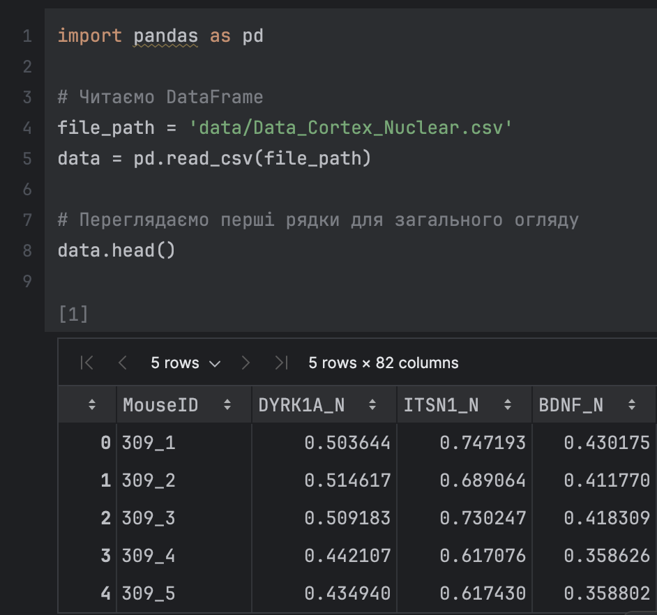

#### Аналіз даних

З огляду на результат виконання команди `head()`, можемо побачити, що датасет складається з багатьох стовпців (82 стовпці), де кожен рядок відповідає певному запису. Наприклад, стовпець `MouseID` містить ідентифікатори мишей, а інші стовпці, такі як `DYRK1A_N`, `ITSN1_N`, і `BDNF_N`, містять числові значення, які, ймовірно, представляють біологічні показники.

Таким чином, цей огляд дозволяє нам зрозуміти загальну структуру та зміст датасету і підготувати його для подальших етапів аналізу та обробки.

### Доступ до стовпця за допомогою атрибута

Цей приклад демонструє доступ до стовпця `MouseID` у DataFrame через атрибут `data.MouseID`.

```python
data.MouseID
```

#### Опис

1. Атрибутний доступ до стовпця:  
   У Pandas, якщо назва стовпця не містить пробілів і відповідає стандартам іменування ідентифікаторів Python (без спеціальних символів), до нього можна звернутися через атрибут об'єкта. У цьому випадку стовпець `MouseID` доступний як атрибут DataFrame `data`.

2. Отримання серії:  
   Виклик `data.MouseID` повертає стовпець у вигляді об'єкта Series. Series є одновимірною структурою даних у Pandas, яка зберігає всі значення стовпця `MouseID`.

3. Інформація про дані:  
   - Як видно на прикладі, стовпець містить 1080 значень.
   - Кожен елемент — це ідентифікатор миші у вигляді рядка, наприклад, `309_1`, `J3295_11` тощо.
   - Оскільки всі значення є рядками, тип даних (dtype) цього стовпця визначений як `object`.

#### Виконання на прикладі (Рисунок 2)

На Рисунку 2 показано виконання команди для доступу до стовпця `MouseID`. Як видно, результатом є список ідентифікаторів мишей, де кожен рядок містить відповідний унікальний ідентифікатор.

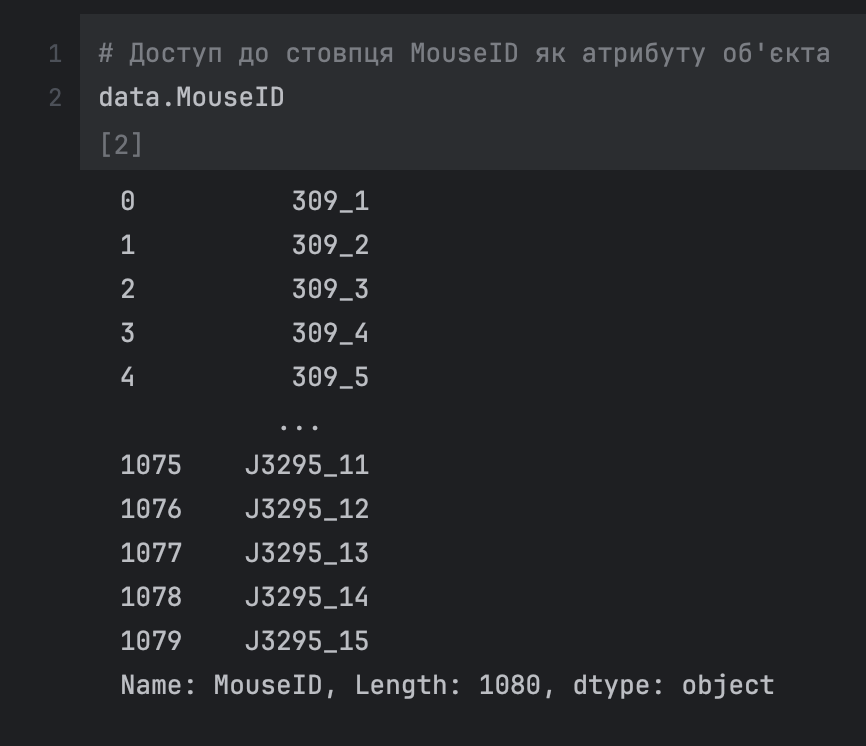

Цей метод доступу зручний для роботи з даними, коли необхідно швидко отримати доступ до конкретного стовпця за його назвою, але варто зазначити, що цей метод не підходить для назв стовпців із пробілами або спеціальними символами.

### Доступ до стовпця через ключ словника

Цей приклад демонструє доступ до стовпця `MouseID` у DataFrame за допомогою індексації через ключ словника.

```python
data['MouseID']
```

#### Опис

1. Доступ через ключ словника:  
   У Pandas кожен стовпець DataFrame можна розглядати як елемент словника, де ім'я стовпця є ключем, а його значенням є відповідні дані. Використання синтаксису `data['MouseID']` дозволяє звертатися до стовпця за його назвою, як до ключа словника. Це гнучкий спосіб доступу до стовпців, який працює з будь-якими назвами стовпців, навіть якщо вони містять пробіли чи спеціальні символи.

2. Отримання серії:  
   Результатом виклику `data['MouseID']` є об'єкт Series, який містить дані зі стовпця `MouseID`. В даному випадку, це список ідентифікаторів мишей, аналогічно до попереднього прикладу, де використовувався атрибутний доступ.

3. Інформація про дані:  
   - Стовпець `MouseID` має 1080 значень.
   - Всі значення є рядками, що представляють ідентифікатори мишей, наприклад, `309_1`, `J3295_11` тощо.
   - Тип даних стовпця — `object`, оскільки він містить строкові значення.

#### Виконання на прикладі (Рисунок 3)

На Рисунку 3 показано використання індексації через ключ словника для доступу до стовпця `MouseID`. Як і в попередньому прикладі, результатом є список ідентифікаторів мишей, проте використання цього методу є більш універсальним, оскільки він дозволяє працювати з будь-якими назвами стовпців.

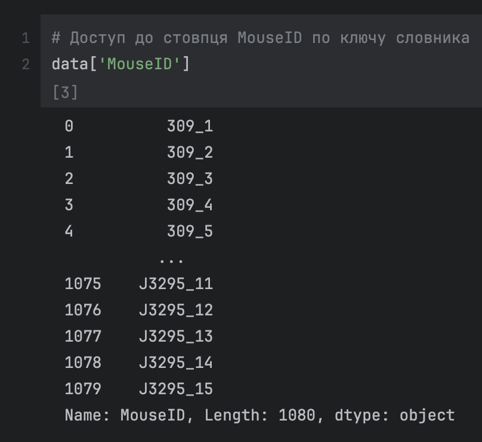

#### Переваги методу

- Гнучкість: Доступ через ключ словника працює навіть для стовпців з нестандартними назвами (наприклад, з пробілами або спеціальними символами), що робить його більш універсальним, ніж доступ через атрибути.
- Звичний синтаксис: Цей метод використовує загальноприйнятий синтаксис словників Python, що може бути зручним для користувачів, які знайомі з цією структурою даних.

### Доступ до елемента стовпця за індексом

Цей приклад демонструє, як отримати конкретний елемент зі стовпця `MouseID` на основі індексу.

```python
data['MouseID'][3]
```

#### Опис

1. Поетапний доступ:
   - Спочатку виконується доступ до стовпця `MouseID` за допомогою ключа словника, тобто `data['MouseID']`. Як ми вже знаємо, це повертає об'єкт Series, який містить дані зі стовпця.

   - Після цього до цього об'єкта Series застосовується індексація через квадратні дужки, тобто `[3]`. Це означає, що ми вибираємо четвертий елемент у цьому стовпці (індексація починається з 0). У даному прикладі значенням на індексі 3 є `'309_4'`.

2. Результат:
   - Результатом цієї операції є конкретний елемент стовпця `MouseID`, який розташований на четвертій позиції (індекс 3). У цьому випадку це рядок `'309_4'`, який представляє ідентифікатор миші.

3. Тип даних:
   - Значення, що повертається, є елементом типу string (рядок), оскільки стовпець `MouseID` містить текстові ідентифікатори.

#### Виконання на прикладі (Рисунок 4)

На Рисунку 4 показано результат виконання команди `data['MouseID'][3]`, де було отримано значення `'309_4'` — четвертий елемент у стовпці MouseID.

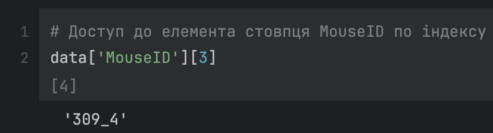

#### Висновок

Ця операція дозволяє вибрати конкретне значення з DataFrame за допомогою індексації. Доступ до окремого елемента через поєднання індексації стовпця і доступу за індексом рядка є зручним і ефективним способом вибору конкретних даних для подальшого аналізу.

### Вибір рядка за позицією

Цей приклад демонструє, як вибрати перший рядок у DataFrame за допомогою методу `iloc`, що використовується для позиційної індексації.

```python
data.iloc[0]
```

#### Опис

1. Позиційна індексація через `iloc`:  
   Використовуючи `iloc[0]`, ми звертаємося до першого рядка в DataFrame. Метод `iloc` дозволяє вибирати дані на основі їхньої позиції в таблиці, незалежно від фактичних значень індексу. У даному випадку ми вибираємо перший рядок, який має позицію 0.

2. Результат:
   - Повертається об'єкт Series, який містить усі значення першого рядка DataFrame. Для кожного стовпця в цьому рядку буде виведено його значення.
   - У прикладі, перший рядок містить ідентифікатор миші `309_1`, а також числові та текстові значення, що відповідають різним характеристикам (наприклад, `DYRK1A_N`, `BDNF_N`, `Genotype`, `Treatment` тощо).

3. Тип даних:
   - Отриманий об'єкт Series має 82 елементи (відповідає кількості стовпців у DataFrame).
   - Кожен елемент має відповідний тип даних: числові значення представлені як float, а текстові — як object.

#### Виконання на прикладі (Рисунок 5)

На Рисунку 5 показано результат вибору першого рядка у DataFrame за допомогою `iloc[0]`. Виведений результат містить значення для всіх 82 стовпців першого рядка, починаючи з `MouseID: 309_1` і закінчуючи іншими характеристиками, такими як `Genotype` та `Treatment`.

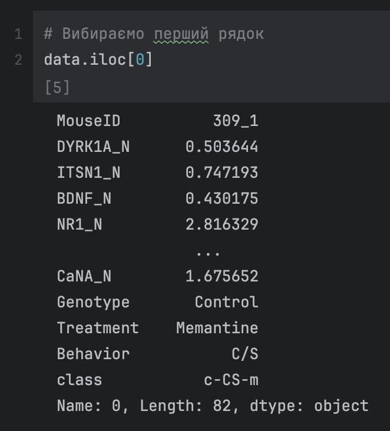

#### Висновок

Метод `iloc` дозволяє ефективно вибирати рядки або стовпці на основі їх позицій у DataFrame. Це особливо корисно, коли потрібно отримати дані з конкретної позиції, незалежно від міток індексів. У прикладі вибору першого рядка ми отримуємо повний набір характеристик першого елемента нашого набору даних, що дозволяє далі аналізувати або обробляти його значення.

### Вибір стовпця за позицією

Цей приклад демонструє, як вибрати другий стовпець у DataFrame за допомогою позиційної індексації через метод `iloc`.

```python
data.iloc[:, 1]
```

#### Опис

1. Позиційна індексація через `iloc`:
   - Використовуючи `iloc[:, 1]`, ми звертаємося до всіх рядків (`:`) другого стовпця (`1`) у DataFrame.
   - Метод `iloc` дозволяє вибирати стовпці або рядки за їхньою позицією в таблиці. В даному випадку вибирається стовпець із позицією 1, що є другим стовпцем, оскільки індексація починається з 0.

2. Результат:
   - Повертається об'єкт Series, що містить усі значення другого стовпця DataFrame.
   - У прикладі, другий стовпець містить числові значення, що відображають показники, представлені у стовпці `DYRK1A_N`.

3. Тип даних:
   - Отриманий об'єкт Series має 1080 елементів (відповідає кількості рядків у DataFrame).
   - Всі елементи представлені як float64, оскільки стовпець містить числові значення.

#### Виконання на прикладі (Рисунок 6)

На Рисунку 6 показано результат вибору другого стовпця у DataFrame за допомогою `iloc[:, 1]`. Виведений результат містить числові значення для всіх 1080 рядків другого стовпця, починаючи з `0.503644` і закінчуючи `0.302626`.

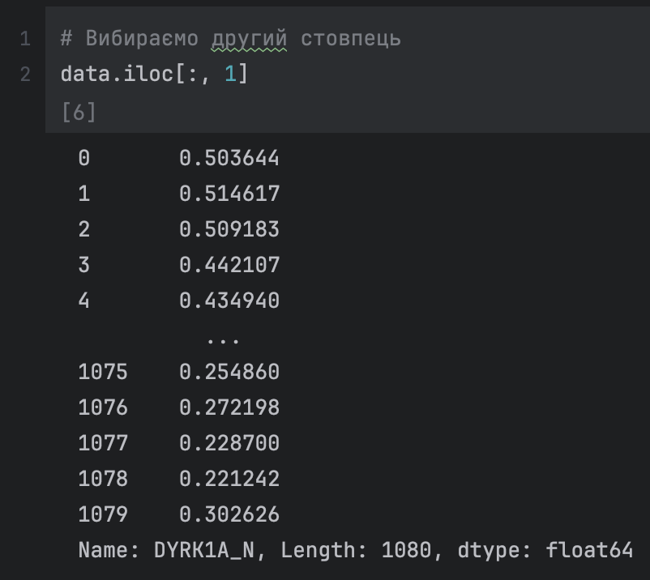

#### Висновок

Метод `iloc` дозволяє ефективно вибирати стовпці або рядки на основі їхньої позиції в DataFrame. Це зручний і швидкий спосіб доступу до конкретних даних у таблиці, що дозволяє вибирати всі рядки для певного стовпця. У даному прикладі ми отримали числові значення з другого стовпця нашого набору даних для подальшого аналізу.

### Вибір частини рядків зі стовпця

Цей приклад демонструє, як вибрати перші три рядки другого стовпця у DataFrame за допомогою позиційної індексації через метод `iloc`.

```python
data.iloc[:3, 1]
```

#### Опис

1. Позиційна індексація через `iloc`:
   - Використовуючи `iloc[:3, 1]`, ми вибираємо перші три рядки (`:3`) із другого стовпця (`1`). Метод `iloc` дозволяє вибирати діапазони рядків і стовпців за їхньою позицією в таблиці.

   - У цьому випадку перші три значення з другого стовпця вибрані для подальшого аналізу. Позиція 1 відповідає другому стовпцю DataFrame.

2. Результат:
   - Повертається об'єкт Series, що містить три числові значення зі стовпця `DYRK1A_N`.
   - У прикладі, перші три значення у стовпці `DYRK1A_N` є `0.503644`, `0.514617`, і `0.509183`.

3. Тип даних:
   - Об'єкт Series має тип даних float64, оскільки вибрані значення є числовими.

#### Виконання на прикладі (Рисунок 7)

На Рисунку 7 показано результат вибору перших трьох рядків другого стовпця у DataFrame за допомогою `iloc[:3, 1]. Ми отримуємо перші три значення зі стовпця`DYRK1A_N`, що дозволяє сконцентруватися на частині даних для подальшого аналізу.

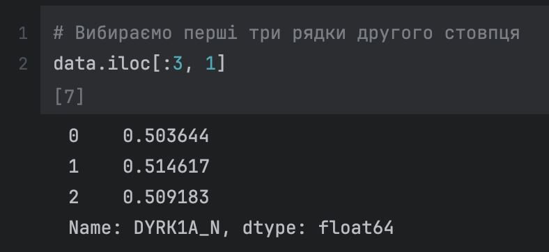

#### Висновок

Метод `iloc` дозволяє ефективно вибирати як окремі стовпці, так і певні підмножини рядків у DataFrame. У даному прикладі ми отримали перші три рядки другого стовпця, що є корисним для аналізу невеликих частин набору даних або для попередньої обробки даних.

### Вибір елемента за мітками через `loc`

Цей приклад демонструє, як вибрати конкретний елемент у DataFrame за мітками рядка та стовпця за допомогою методу `loc`.

```python
data.loc[0, 'MouseID']
```

#### Опис

1. Індексація за мітками через `loc`:
   - Метод `loc` використовується для індексації за мітками індексів рядків і стовпців. У цьому прикладі ми вибираємо елемент, що знаходиться на перетині рядка з міткою 0 і стовпця з назвою 'MouseID'.

   - У порівнянні з `iloc`, який використовує позиційну індексацію, `loc` звертається до даних на основі їхніх міток. Мітки можуть бути не лише числовими, але й строковими значеннями, залежно від структури DataFrame.

2. Результат:
   - Результатом операції є конкретний елемент, що знаходиться в рядку з міткою 0 та стовпці `MouseID`. У даному випадку це значення `'309_1'`, що є ідентифікатором миші в першому рядку DataFrame.

3. Тип даних:
   - Повертається рядкове значення `'309_1'`, оскільки стовпець `MouseID` містить текстові ідентифікатори.

#### Виконання на прикладі (Рисунок 8)

На Рисунку 8 показано, як за допомогою методу `loc` було отримано конкретний елемент зі стовпця `MouseID` у першому рядку (рядок з міткою 0). В результаті було отримано значення `'309_1'`.

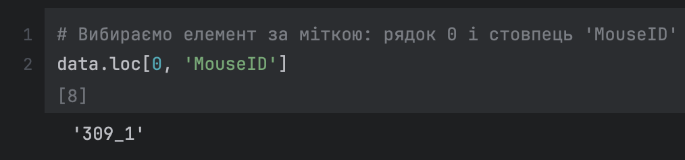

#### Висновок

Метод `loc` дозволяє вибирати дані за мітками індексів і є дуже корисним, коли необхідно отримати значення на основі іменованих міток рядків і стовпців. Це робить його зручним для роботи з датасетами, де індекси можуть бути нечисловими, або коли необхідно працювати з мітками стовпців, як у прикладі з вибором ідентифікатора миші.

### Вибір кількох стовпців і рядків за мітками через `loc`

Цей приклад демонструє, як вибрати кілька стовпців та рядків у DataFrame за допомогою методу `loc`, використовуючи мітки.

```python
data.loc[:5, ['Genotype', 'Treatment', 'Behavior']]
```

#### Опис

1. Індексація за мітками через `loc`:
   - Метод `loc` дозволяє вибирати дані за мітками, як для рядків, так і для стовпців. У цьому прикладі ми вибираємо перші шість рядків (мітки 0–5) та три стовпці: `Genotype`, `Treatment`, і `Behavior`.

   - `:5` означає вибір рядків з мітками від 0 до 5 включно (всього 6 рядків).
   - `['Genotype', 'Treatment', 'Behavior']` означає вибір трьох стовпців з іменами `Genotype`, `Treatment`, і `Behavior`.

2. Результат:
   - Повертається DataFrame, що містить 6 рядків та 3 стовпці, кожен з яких представляє певну категорію даних: генотип миші, тип лікування та поведінка.
   - У цьому прикладі всі значення у стовпцях `Genotype` є `Control`, а значення у стовпці `Treatment` — `Memantine`. Стовпець `Behavior` містить значення `C/S` для всіх вибраних рядків.

3. Тип даних:
   - Повернений об'єкт є DataFrame, що містить три стовпці з текстовими значеннями.

#### Виконання на прикладі (Рисунок 9)

На Рисунку 9 показано, як за допомогою методу `loc` було вибрано перші шість рядків із стовпців `Genotype`, `Treatment`, і `Behavior`. Усі значення в цих стовпцях відповідають категоріям, які використовуються для характеристики мишей у цьому наборі даних.

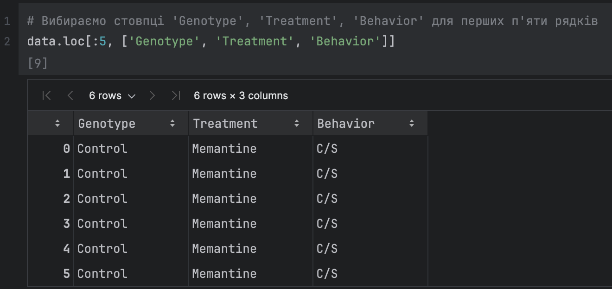

#### Висновок

Метод `loc` дозволяє легко та гнучко вибирати підмножини даних за мітками рядків та іменами стовпців. Це зручний спосіб вибору конкретних частин датасету для подальшого аналізу або відображення. У даному прикладі ми отримали інформацію про генотип, лікування та поведінку для перших шести мишей, що є корисним для аналізу категоріальних даних.

### Вибір за простою умовою

У цьому прикладі продемонстровано, як вибрати рядки з DataFrame за допомогою простої умови — значення у стовпці `BDNF_N` повинні бути більшими за середнє значення цього стовпця.

```python
mean_bdnf = data.BDNF_N.mean()
data_above_mean_bdnf = data.loc[data.BDNF_N > mean_bdnf]
print(mean_bdnf)
data_above_mean_bdnf[['BDNF_N', 'MouseID']]
```

#### Опис

1. Обчислення середнього значення:
   - Спочатку обчислюємо середнє значення для стовпця `BDNF_N` за допомогою методу `mean()`. Результат зберігається у змінну `mean_bdnf`.
   - Це середнє значення використовується як порогове значення для фільтрації рядків.

2. Фільтрація рядків за умовою:
   - За допомогою методу `loc` виконується умовна індексація: вибираються лише ті рядки, де значення у стовпці `BDNF_N` більше за середнє. Умовна індексація створює булеву маску, яка застосовується до DataFrame для вибору рядків.
   - Результат фільтрації зберігається в нову змінну `data_above_mean_bdnf`.

3. Виведення результатів:
   - Для наочності спочатку виводиться обчислене середнє значення.
   - Потім виводяться лише два стовпці з відфільтрованого DataFrame: `BDNF_N` і `MouseID`, що дозволяє бачити як значення `BDNF_N`, так і ідентифікатори мишей, для яких ці значення перевищують середнє.

#### Виконання на прикладі (Рисунок 10)

На Рисунку 10 показано, як за допомогою умовної індексації були вибрані всі рядки, де значення у стовпці `BDNF_N` перевищують середнє значення, яке складає `0.3191`. Виведено лише два стовпці: `BDNF_N` і `MouseID`. Було відібрано 507 рядків із 1080, де значення `BDNF_N` більше за середнє.

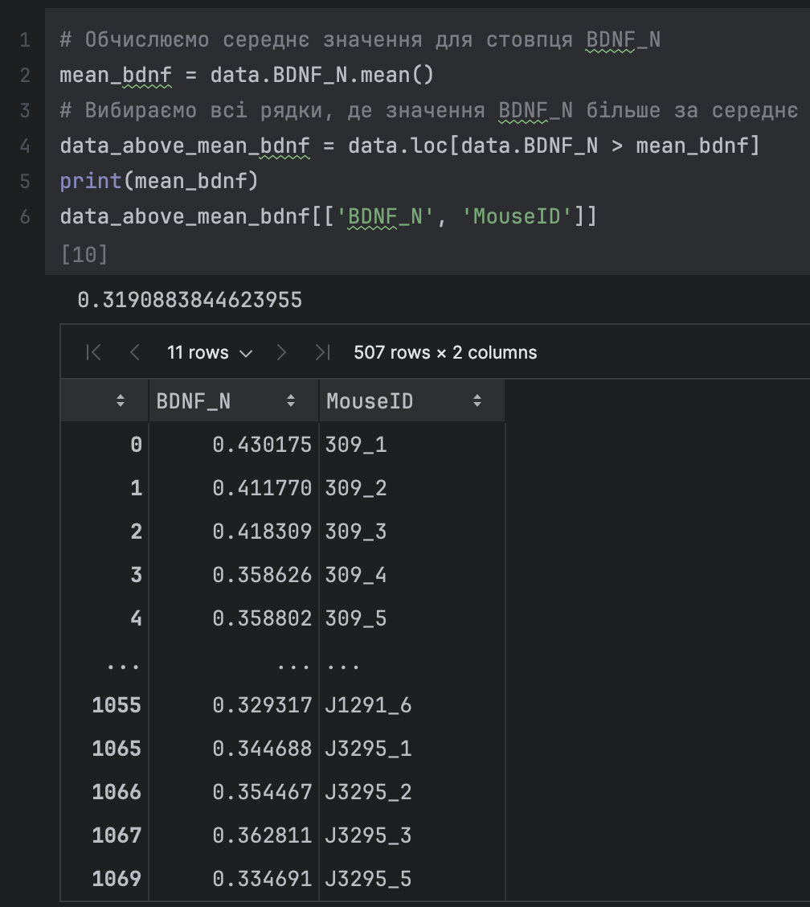

#### Висновок

Метод умовної індексації через `loc` є потужним інструментом для фільтрації рядків у DataFrame на основі умов. У цьому прикладі була використана проста умова — значення у стовпці `BDNF_N` повинні бути більшими за середнє. Це дозволяє легко вибирати підмножини даних для подальшого аналізу або виведення.

### Вибір за складною умовою

Цей приклад демонструє, як вибрати рядки з DataFrame за допомогою складної умови, що включає дві умови: значення у стовпці `BDNF_N` менше за середнє, а значення у стовпці `Genotype` повинно дорівнювати `'Control'`.

```python
data_filtered = data.loc[(data.BDNF_N < mean_bdnf) & (data.Genotype == 'Control')]
data_filtered
```

#### Опис

1. Фільтрація за кількома умовами:
   - За допомогою методу `loc` виконується умовна індексація, яка використовує дві умови:
     - `data.BDNF_N < mean_bdnf` — вибираються рядки, де значення в стовпці `BDNF_N` менше за середнє значення.
     - `data.Genotype == 'Control'` — вибираються тільки ті рядки, де генотип мишей вказаний як `'Control'`.

   - Оператор `&` використовується для поєднання цих двох умов, що означає, що обидві умови мають виконуватися одночасно.

2. Результат:
   - Повертається DataFrame, який містить лише ті рядки, де обидві умови виконані. У цьому випадку ми отримуємо 295 рядків із 82 стовпцями, що відповідають фільтраційним умовам.
   - Як видно з результату, значення у стовпці `BDNF_N` для цих мишей менше за середнє, і всі миші мають генотип `Control`.

3. Тип даних:
   - Повернений об'єкт є DataFrame, який містить усі стовпці початкової таблиці, але лише ті рядки, які задовольняють зазначені умови.

#### Виконання на прикладі (Рисунок 11)

На Рисунку 11 показано, як за допомогою методу `loc` були вибрані рядки, де значення у стовпці `BDNF_N` менше за середнє, а значення у стовпці `Genotype` дорівнює `Control`. У результаті було відібрано 295 рядків, кожен з яких задовольняє обидві умови.

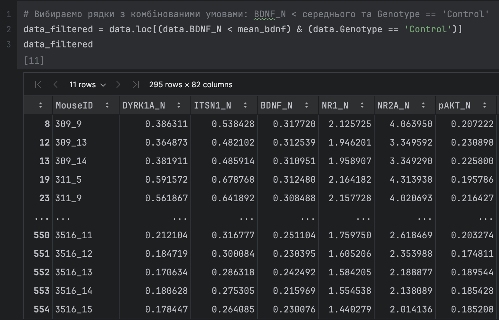

#### Висновок

Метод `loc` дозволяє поєднувати кілька умов для вибору підмножин даних на основі складніших критеріїв. У даному прикладі ми вибрали ті рядки, де значення `BDNF_N` менше за середнє, а генотип мишей дорівнює `Control`. Це корисний інструмент для відбору специфічних даних у великих наборах інформації, що дозволяє зосередитися на підмножинах, які відповідають певним критеріям.

### Умовні селектори

Цей приклад демонструє, як вибрати рядки DataFrame, де значення у стовпці `Treatment` дорівнює `'Memantine'` або `'Saline'`, за допомогою методу `isin()`.

```python
data_selected = data.loc[data.Treatment.isin(['Memantine', 'Saline'])]
data_selected
```

#### Опис

1. Фільтрація за списком значень:
   - Метод `isin()` використовується для перевірки, чи міститься значення у стовпці `Treatment` у вказаному списку значень. У нашому випадку цей список містить два значення: `'Memantine'` і `'Saline'`.
   - За допомогою методу `loc` виконується умовна індексація для вибору тільки тих рядків, де значення стовпця `Treatment` відповідає одному з елементів списку.

2. Результат:
   - Повертається DataFrame, який містить лише ті рядки, де значення у стовпці `Treatment` є або `Memantine`, або `Saline`.
   - У цьому випадку було відібрано 1080 рядків з 82 стовпцями, що відповідають умові.

3. Тип даних:
   - Повернений об'єкт є DataFrame, який містить усі початкові стовпці, але лише ті рядки, де умова виконана.

#### Виконання на прикладі (Рисунок 12)

На Рисунку 12 показано, як за допомогою методу `loc` та функції `isin()` були вибрані рядки, де значення у стовпці `Treatment` дорівнюють `Memantine` або `Saline`. У результаті було відібрано 1080 рядків, де ці умови виконуються.

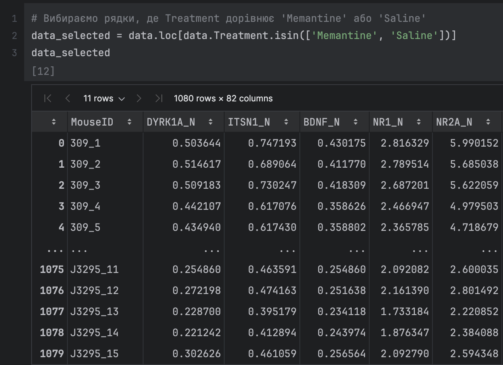

#### Висновок

Метод `isin()` є потужним інструментом для умовного відбору рядків на основі списку значень. У даному прикладі ми вибрали всі рядки, де значення у стовпці `Treatment` дорівнює `Memantine` або `Saline`, що дозволяє легко фільтрувати дані за заздалегідь визначеним набором критеріїв. Цей метод зручний для відбору рядків за кількома можливими значеннями в одному стовпці.

### Створення нового стовпця та його заповнення

Цей приклад демонструє, як створити новий стовпець у DataFrame та заповнити його значенням, а також відобразити новий стовпець разом з іншим стовпцем.

```python
data['New'] = 'Experiment'
data[['New', 'MouseID']]
```

#### Опис

1. Створення нового стовпця:
   - У першому рядку створюється новий стовпець `New` у DataFrame і всі його значення заповнюються рядком `Experiment`. Це стосується всіх рядків у DataFrame (1080 рядків).
   - У Pandas це робиться дуже легко шляхом присвоєння скалярного значення до нового стовпця, який автоматично створюється, якщо його ще не було.

2. Виведення кількох стовпців:
   - У другому рядку вибираються стовпці `New` та `MouseID` для відображення. Це дозволяє побачити новий стовпець у контексті з уже існуючим стовпцем `MouseID`.

3. Результат:
   - Повертається DataFrame, що містить два стовпці: `New` та `MouseID`. Усі значення в стовпці `New` однакові і дорівнюють `Experiment`, а стовпець `MouseID` містить ідентифікатори мишей.

#### Виконання на прикладі (Рисунок 13)

На Рисунку 14 показано результат створення нового стовпця `New` і його заповнення значенням `Experiment`. Виведено два стовпці: `New` та `MouseID`, де видно, що кожен рядок має відповідне значення у стовпці `MouseID` та однакове значення у стовпці `New`.

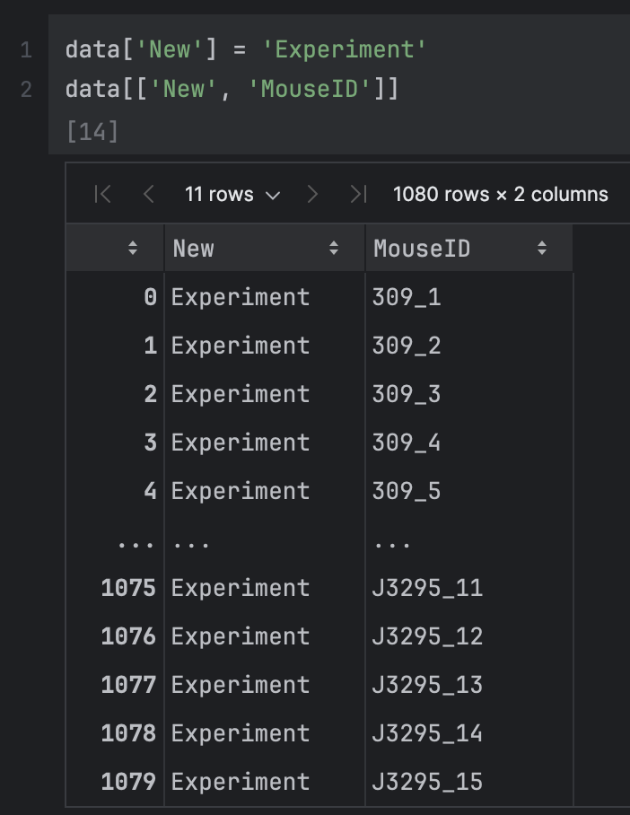

#### Висновок

Створення нового стовпця у DataFrame — це проста та ефективна операція в Pandas. У цьому прикладі ми створили стовпець `New` і заповнили його однаковими значеннями для всіх рядків. Використання такої операції може бути корисним для додавання нових категорій або маркувань до вже існуючого набору даних.

## Висновок

У ході виконання даної лабораторної роботи ми детально розглянули та застосували різноманітні методи обробки і маніпуляції з табличними даними за допомогою бібліотеки Pandas у Python. Використовуючи цей потужний інструмент, ми мали змогу не лише ознайомитися з основними можливостями Pandas, але й реалізувати ефективні підходи до роботи з даними, що можуть бути застосовані у різних сферах аналітики, науки та досліджень.

Ми почали з базових операцій: завантаження даних із CSV-файлу, що є стандартним форматом для зберігання табличних даних. Після цього ми виконали первинний огляд набору даних, використовуючи методи, які дозволили переглянути перші кілька рядків і зрозуміти структуру датасету. Це дозволило швидко ознайомитися з іменами стовпців, типами даних та їх початковими значеннями.

Наступним кроком ми дослідили різні підходи до індексації та вибору даних із DataFrame:

- Ми навчилися звертатися до стовпців за допомогою як атрибута об'єкта, так і через ключ словника. Це дозволяє швидко й ефективно працювати зі стовпцями даних в різних умовах.
- Використовували індексацію за індексами рядків для отримання окремих елементів та рядків із таблиці, що забезпечує гнучкість у роботі з великими наборами даних.

Окрім того, особливу увагу було приділено операціям фільтрації та вибору даних за умовами. Ми розглянули різноманітні способи вибору рядків на основі певних критеріїв:

- Використовуючи умовну індексацію, ми вибирали рядки, де значення одного або кількох стовпців відповідали заданим умовам. Це дозволило виділити окремі підмножини даних для подальшого аналізу.
- Також ми застосовували комбінації умов, що дозволяє створювати складні фільтраційні запити, коли необхідно вибрати дані на основі кількох критеріїв одночасно.

Однією з важливих частин роботи було створення нового стовпця та його заповнення. Ми побачили, наскільки легко додавати нові стовпці в DataFrame, наповнювати їх значеннями і комбінувати з іншими стовпцями для відображення та аналізу. Це є критичним моментом у випадках, коли потрібно збагачувати існуючий набір даних новими категоріями або розрахунковими значеннями.

Окремо слід відзначити використання методу `loc`, який дозволяє вибирати дані на основі міток рядків і стовпців, а також методу `iloc`, що забезпечує вибір даних на основі їхньої позиції в таблиці. Ці два методи надзвичайно зручні та універсальні, дозволяючи ефективно працювати з даними незалежно від їх структури чи кількості рядків.

Таким чином, у рамках цієї лабораторної роботи ми навчилися швидко та ефективно вибирати необхідні дані з набору даних, використовуючи структуровані можливості та інструменти бібліотеки Pandas. Це дозволяє працювати з великими наборами даних з високою ефективністю, фільтруючи, сортувавши та аналізуючи інформацію відповідно до вимог задачі. Навички, отримані в результаті виконання цієї роботи, можуть бути застосовані для різноманітних завдань у галузях науки, бізнесу, фінансів, де аналіз даних грає ключову роль.

Опановані нами методи і техніки роботи з Pandas є основою для будь-якої аналітичної діяльності, пов'язаної з обробкою табличних даних, і значно полегшують виконання складних аналітичних завдань за мінімальний час.
