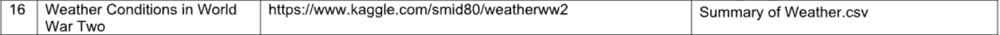

# Лабораторна робота №3

Тема: Робота з пропущеними даними

Мета: навчитися працювати з наборами даних, які містять відсутні або помилкові дані.

## Теоретичні відомості

У даній лабораторній роботі основна увага приділяється обробці пропущених даних у наборах даних. Для цього використовуються інструменти бібліотек Python, таких як Pandas і NumPy. Нижче наведено опис основних функцій, які застосовуються для аналізу та обробки пропущених даних.

### `isnull()`

Функція `isnull()` використовується для перевірки наявності пропущених значень у наборі даних. Вона повертає DataFrame або Series такого ж розміру, як і вхідний, де кожен елемент позначений як `True`, якщо це пропущене значення (`NaN`), або `False`, якщо значення присутнє.  

Застосування:  
Ця функція дозволяє швидко визначити, які саме дані у наборі є пропущеними, і створює основу для подальшого аналізу. Її можна комбінувати з іншими методами для підрахунку або візуалізації пропусків.  

Приклад:  

```python
missing_values = nfl_data.isnull()
```

У цьому прикладі `missing_values` – це DataFrame, який показує, де знаходяться пропущені дані.

### `sum()`

Функція `sum()` підраховує загальну кількість пропущених значень у кожному стовпці DataFrame. Вона часто використовується у поєднанні з функцією `isnull()` для підсумовування результатів.  

Застосування:  
Ця функція дозволяє швидко оцінити масштаб проблеми пропусків у кожному стовпці та визначити, які з них потребують уваги.  

Приклад:  

```python
missing_values_count = nfl_data.isnull().sum()
```

Результат `missing_values_count` – це Series, де кожен елемент відповідає кількості пропущених значень у відповідному стовпці.

### `dropna()`

Функція `dropna()` дозволяє видаляти рядки або стовпці з пропущеними значеннями. Вона має кілька параметрів, які дозволяють налаштовувати поведінку:  

- `axis=0` – видалення рядків (за замовчуванням).  
- `axis=1` – видалення стовпців.  

Застосування:  
Ця функція корисна, якщо потрібно позбутися пропущених значень, проте її використання може призвести до втрати важливої інформації, тому її слід застосовувати з обережністю.  

Приклад:  

```python
cleaned_data = nfl_data.dropna(axis=1)
```

У цьому прикладі всі стовпці, які містять хоча б одне пропущене значення, будуть видалені.

### `fillna()`

Функція `fillna()` дозволяє заповнювати пропущені значення заданими значеннями або методами. Вона забезпечує гнучкий підхід до обробки пропусків.  

- `value` – заповнення конкретним значенням (наприклад, `0`, `100`).  
- `method='bfill'` – заповнення значенням наступного за порядком елемента (backfill).  

Застосування:  
Ця функція використовується для збереження цілісності даних шляхом заміни пропусків на релевантні значення, що не впливають на подальший аналіз.  

Приклади:  
Заповнення нулями:  

```python
nfl_data.fillna(0)
```

Заповнення методом `backfill`:  

```python
nfl_data.fillna(method='bfill', axis=0)
```

### `shape`

Атрибут `shape` повертає кортеж, який містить кількість рядків і стовпців у DataFrame. Це корисно для оцінки розмірів даних, наприклад, під час обчислення загальної кількості елементів.  

Застосування:  
Цей атрибут використовується для визначення масштабу набору даних і пропусків у ньому.  

Приклад:  

```python
total_cells = np.product(nfl_data.shape)
```

У цьому прикладі обчислюється загальна кількість клітинок у DataFrame.

### `np.product()`

Функція `np.product()` обчислює добуток елементів вхідного масиву. У контексті обробки даних її можна використовувати для підрахунку загальної кількості елементів у DataFrame.  

Застосування:  
Використовується для оцінки відсотка пропущених даних у наборі, коли відомо кількість клітинок.  

Приклад:  

```python
total_cells = np.product(nfl_data.shape)
```

Тут визначається загальна кількість клітинок у DataFrame, що необхідно для подальшого розрахунку відсотка пропусків.

### Висновок

Функції, описані вище, є основними інструментами для роботи з пропущеними даними у бібліотеці Pandas. Вони дозволяють ідентифікувати, аналізувати та обробляти пропущені значення, що є важливою частиною підготовки даних для подальшого аналізу чи моделювання.

## Виконання

### Варіант

Варіант №16



### Імпорт бібліотек та завантаження даних


1. Імпорт бібліотек:
   - Імпортовано бібліотеки `pandas` (для роботи з таблицями) та `numpy` (для математичних операцій).
   - Це основні бібліотеки для аналізу та обробки даних у Python.

2. Завантаження даних:
   - Завантажено основний файл даних `Summary_of_Weather.csv` за допомогою функції `pd.read_csv()` з параметром `low_memory=False`. Це усуває попередження про змішані типи даних у стовпцях і забезпечує коректне зчитування.
   - Завантажено додатковий файл `Weather_Station_Locations.csv`, що містить дані про розташування метеостанцій.

3. Встановлення генератора випадкових чисел:
   - Встановлено зерно для генератора випадкових чисел за допомогою `np.random.seed(0)`, що забезпечує відтворюваність результатів у випадкових процесах.

4. Перегляд перших рядків:
   - Використано функцію `head()`, щоб вивести перші 5 рядків з таблиці `weather_data` для ознайомлення зі структурою та вмістом даних.

Чому це зроблено:

- На початковому етапі аналізу даних важливо імпортувати необхідні інструменти, завантажити дані та перевірити їх структуру, щоб розуміти, з якими стовпцями і значеннями ми працюватимемо.

### Аналіз пропущених даних у стовпцях


1. Що зроблено:
   - Використано функцію `isnull()` для виявлення пропущених значень у кожному стовпці. Вона повертає булевий DataFrame, де `True` означає наявність пропущеного значення.
   - Використано метод `sum()` для підрахунку загальної кількості пропущених значень у кожному стовпці.
   - Виведено кількість пропущених значень для перших 10 стовпців за допомогою зрізу `[0:10]`.

2. Результати:
   - У виведеній таблиці видно, що:
     - У стовпцях `STA`, `Date`, `Precip`, `MaxTemp`, `MinTemp`, `MeanTemp`, `YR` відсутні пропущені значення (кількість `NaN` дорівнює 0).
     - У стовпці `WindGustSpd` — 118,508 пропущених значень.
     - У стовпці `Snowfall` — 1,163 пропущених значень.
     - У стовпці `PoorWeather` — 84,803 пропущених значень.
   - Це свідчить про те, що в наборі даних є значна кількість пропущених даних, які необхідно обробити.

3. Чому це зроблено:
   - Визначення кількості пропущених значень допомагає оцінити масштаб проблеми та визначити, які стовпці можуть бути критичними для аналізу.
   - Далі це дозволяє приймати рішення щодо заповнення, видалення або ігнорування пропущених даних у конкретних стовпцях.

### Обчислення відсотка пропущених даних


1. Що зроблено:
   - Використано метод `np.product()` для обчислення загальної кількості клітинок у наборі даних. Це добуток кількості рядків і стовпців (змінна `total_cells`).
   - Обчислено загальну кількість пропущених значень у всіх клітинках набору даних за допомогою методу `sum()` (змінна `total_missing`).
   - Обчислено відсоток пропущених даних за формулою:  

     $\text{percent\_missing} = \frac{\text{total\_missing}}{\text{total\_cells}} \times 100$

2. Результати:
   - Відсоток пропущених даних у наборі дорівнює 49.7%. Це означає, що майже половина клітинок містить пропущені значення.

3. Чому це зроблено:
   - Аналіз масштабу пропущених даних допомагає зрозуміти, чи можна ефективно працювати з наявними даними, чи потрібні більш агресивні методи очищення (наприклад, видалення стовпців або заповнення значень).
   - Високий відсоток пропусків, як у цьому випадку, вказує на необхідність обережного підходу до обробки, щоб не втратити важливу інформацію.

### Аналіз пропущених даних у стовпці `Snowfall`


1. Що зроблено:
   - Використано змінну `missing_values_count` для визначення кількості пропущених значень у конкретному стовпці `Snowfall`.

2. Результати:
   - У стовпці `Snowfall` наявні 1,163 пропущені значення.

3. Чому це зроблено:
   - Такий аналіз дозволяє сфокусуватися на окремих стовпцях, які можуть бути важливими для подальшої роботи. Кількість пропусків у стовпці `Snowfall` вказує на необхідність прийняття рішення: чи заповнювати ці пропуски, чи, можливо, видаляти рядки, що їх містять. Це особливо важливо, якщо стовпець `Snowfall` є ключовим у дослідженні.

### Видалення рядків з пропущеними значеннями


1. Що зроблено:
   - За допомогою функції `dropna()` видалено всі рядки, які містять хоча б одне пропущене значення.
   - Результат збережено у змінній `weather_data_cleaned_rows`.

2. Результати:
   - Після виконання операції набір даних не містить жодного рядка. Це означає, що всі рядки містили хоча б одне пропущене значення.
   - Розмір результату — 0 рядків і 31 стовпець, що свідчить про значну кількість пропусків у наборі даних.

3. Чому це зроблено:
   - Видалення рядків із пропусками може бути прийнятним, якщо набір даних великий і кількість пропусків у рядках невелика.
   - Однак у даному випадку, оскільки всі рядки видалено, це свідчить про те, що такий підхід не підходить. Замість цього потрібно розглянути альтернативні методи обробки пропусків, наприклад, заповнення значень.

### Видалення стовпців з пропущеними значеннями


1. Що зроблено:
   - За допомогою функції `dropna(axis=1)` видалено всі стовпці, які містять хоча б одне пропущене значення.
   - Результат збережено у змінній `weather_data_cleaned_columns`.
   - Виведено перші 5 рядків оновленого набору даних для перевірки результату.

2. Результати:
   - Набір даних тепер містить лише 9 стовпців. Всі стовпці з пропущеними значеннями були видалені.
   - Залишилися лише ті стовпці, які повністю заповнені значеннями, наприклад: `STA`, `Date`, `Precip`, `MaxTemp`, `MinTemp`, `MeanTemp`, `YR`, `MO`, `DA`.

3. Чому це зроблено:
   - Видалення стовпців із пропущеними значеннями може бути доцільним, якщо ці стовпці не є важливими для аналізу або якщо пропущених значень у них забагато.
   - Це забезпечує роботу лише з повністю заповненими даними, що зменшує ризик спотворення результатів аналізу через пропуски.

4. Застереження:
   - Видалення багатьох стовпців може призвести до втрати важливої інформації. Цей метод слід використовувати лише тоді, коли пропущених даних дійсно дуже багато або вони не мають аналітичної цінності.

### Порівняння кількості стовпців до і після видалення


1. Що зроблено:
   - За допомогою методу `shape[1]` визначено кількість стовпців у наборі даних до та після видалення стовпців із пропущеними значеннями.
   - Результати виведено за допомогою функції `print()`.

2. Результати:
   - Кількість стовпців до видалення: 31.
   - Кількість стовпців після видалення: 9.
   - Це свідчить про те, що 22 стовпці було видалено через наявність у них пропущених значень.

3. Чому це зроблено:
   - Порівняння кількості стовпців до і після видалення дозволяє оцінити, наскільки значно скоротився набір даних.
   - Такий аналіз допомагає зрозуміти, наскільки великий вплив має обробка пропущених даних на структуру набору. У цьому випадку більшість стовпців мали пропущені значення, що вказує на необхідність обережного підходу до аналізу.

### Заповнення пропущених значень нулями


1. Що зроблено:
   - Використано метод `fillna(0)` для заміни всіх пропущених значень (`NaN`) у наборі даних на нулі.
   - Перевірено результат за допомогою комбінації `isnull()` і `sum()`, щоб підрахувати кількість залишкових пропусків у кожному стовпці.

2. Результати:
   - Після заповнення всі стовпці мають 0 пропущених значень.
   - Це означає, що всі `NaN` у наборі даних успішно замінені на нулі.

3. Чому це зроблено:
   - Заповнення пропусків нулями є простим і ефективним підходом, якщо відсутні значення не мають особливого значення або якщо нуль можна інтерпретувати як нейтральне значення.
   - Це дозволяє уникнути проблем із подальшим аналізом або моделюванням, які можуть виникнути через наявність пропусків у даних.

4. Застереження:
   - У випадках, коли пропущені значення мають важливий контекст (наприклад, фізичне явище або обчислення), заміна на нулі може спотворити аналіз. Тому цей метод слід застосовувати лише за відповідних умов.

### Вибір піднабору даних


1. Що зроблено:
   - Використано метод `loc` для вибору піднабору даних із початкового DataFrame. Обрано стовпці `MaxTemp` і `MinTemp` із застосуванням зрізу.
   - Виведено перші 5 рядків піднабору даних за допомогою методу `head()`.

2. Результати:
   - Отримано таблицю, що складається лише з двох стовпців:
     - `MaxTemp` (максимальна температура).
     - `MinTemp` (мінімальна температура).
   - Таблиця містить перші 5 рядків цих стовпців.

3. Чому це зроблено:
   - Вибір піднабору даних дозволяє сфокусуватися на аналізі конкретних змінних, які є важливими для дослідження.
   - У даному випадку робота з температурами (`MaxTemp` і `MinTemp`) може бути корисною для аналізу погодних умов або трендів. Це також спрощує подальшу обробку даних, оскільки інші стовпці не впливатимуть на аналіз.

### Заповнення пропущених значень у піднаборі даних


1. Що зроблено:
   - Додавання пропуску: В першому рядку піднабору вручну додано пропущене значення (`NaN`) у стовпець `MaxTemp` для демонстрації роботи з відсутніми даними.
   - Заповнення пропуску: Пропущене значення у піднаборі даних заповнено числом `100` за допомогою методу `fillna(100)`.
   - Перевірка результату: Виведено піднабір до і після заповнення пропущеного значення, щоб показати зміни.

2. Результати:
   - До заповнення: У першому рядку стовпця `MaxTemp` відсутнє значення (`NaN`).
   - Після заповнення: Значення `NaN` замінено на `100`.
   - Інші дані залишилися незмінними.

3. Чому це зроблено:
   - Демонстрація того, як можна замінювати пропущені значення конкретним числом (`100` у цьому випадку), що може бути корисним для подальшого аналізу.
   - Метод `fillna()` дозволяє швидко і просто заповнювати відсутні значення без видалення рядків або стовпців, що зберігає цілісність даних.
   - Це корисно, коли потрібно уникнути спотворення даних і зберегти максимальну кількість інформації для аналізу.

### Використання методу Backfill для заповнення пропущених значень


1. Що зроблено:
   - У таблиці вручну додано два пропущені значення (`NaN`):
     - У стовпці `MaxTemp` для першого рядка.
     - У стовпці `MinTemp` для другого рядка.
   - Використано метод `bfill()` для заповнення пропущених значень. Цей метод заповнює кожен `NaN` значенням із наступного рядка.

2. Результати:
   - Пропущені значення були заповнені наступними доступними значеннями:
     - У рядку 0 стовпець `MaxTemp` отримав значення з рядка 1: 28.888889.
     - У рядку 1 стовпець `MinTemp` отримав значення з рядка 2: 22.222222.
   - Усі інші дані залишилися незмінними.

3. Чому це зроблено:
   - Метод backfill корисний, коли важливо зберегти послідовність даних, особливо якщо значення залежать від порядку. Наприклад, для часових рядів це може означати використання майбутнього значення для заповнення пропусків.

4. Застереження:
   - Backfill може не підходити, якщо немає логічного обґрунтування використання наступного значення для заповнення пропусків, особливо для даних, які не є послідовними.

### Вибіркове заповнення пропущених значень у конкретному стовпці


1. Що зроблено:
   - Вибрано новий піднабір даних зі стовпцями `MaxTemp` і `MinTemp`.
   - Введено пропущені значення (`NaN`) у наступні місця:
     - У стовпець `MaxTemp` для першого рядка.
     - У стовпець `MinTemp` для третього рядка.
   - Використано метод `fillna(999)` для вибіркового заповнення пропусків тільки у стовпці `MaxTemp`, залишаючи інші стовпці незмінними.

2. Результати:
   - Значення `NaN` у стовпці `MaxTemp` для першого рядка було замінено на 999.
   - Пропущене значення в стовпці `MinTemp` залишилося незмінним, оскільки метод було застосовано лише до стовпця `MaxTemp`.

3. Чому це зроблено:
   - Вибіркове заповнення дозволяє точно обробляти пропуски в певних стовпцях, не впливаючи на інші.
   - У даному випадку, заповнення пропусків значенням 999 може використовуватися для позначення пропущених температур, не впливаючи на аналіз мінімальних температур (`MinTemp`).

4. Застереження:
   - Використання вибіркових значень, таких як 999, варто обґрунтувати. Наприклад, це може бути код для подальшого відфільтрування або спеціальне значення, яке не спотворює аналітичні висновки.

### Застарілі параметри в методах

1. Що сталося:
   - Під час використання параметра `method='bfill'` у методі `fillna()` було отримано попередження про його застарілість (deprecated). Згідно з рекомендацією Pandas, у майбутніх версіях цей параметр буде видалено, і необхідно використовувати метод `bfill()` напряму.

2. Як виправлено:
   - Замість використання `fillna(method='bfill')`, було застосовано метод `bfill()` напряму для заповнення пропущених значень:

     ```python
     subset_weather_data_filled_bfill = subset_weather_data.bfill()
     ```

3. Чому це важливо:
   - Використання актуальних методів і функцій забезпечує стабільність коду та його сумісність із майбутніми версіями бібліотеки Pandas.
   - Використання застарілих параметрів може призвести до помилок у майбутньому, особливо при оновленні бібліотеки.

4. Рекомендація:
   - Регулярно перевіряти документацію Pandas для виявлення змін у функціоналі.
   - Уникати використання застарілих методів і параметрів, оновлюючи код згідно з офіційними рекомендаціями. Це допоможе уникнути можливих помилок і покращити підтримку коду.

## Висновок

На цій лабораторній роботі я навчився працювати з наборами даних, які містять відсутні або помилкові дані.
