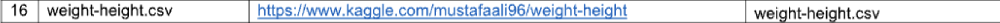
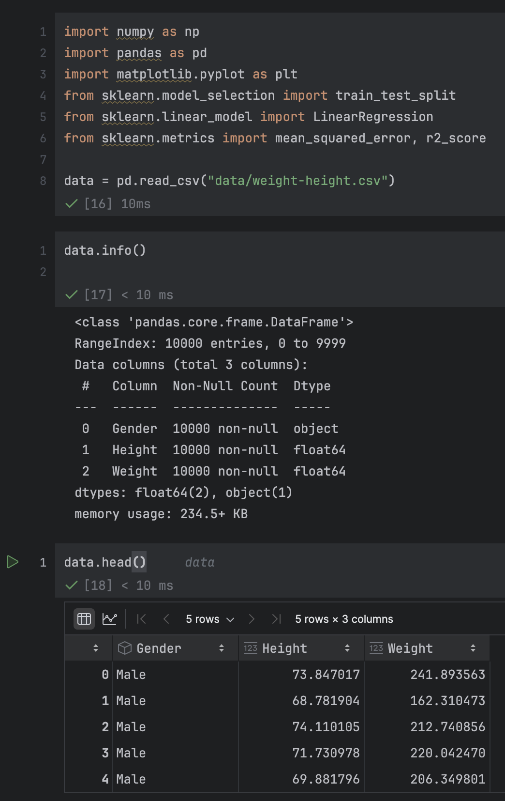
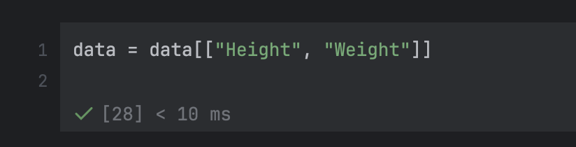
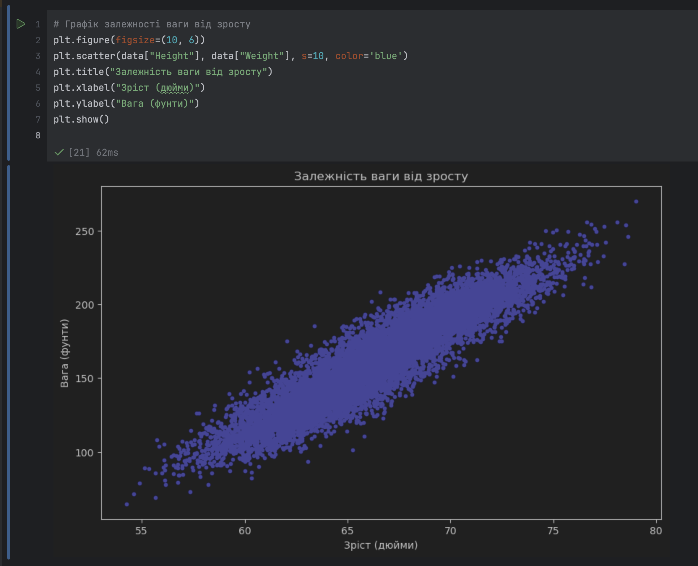
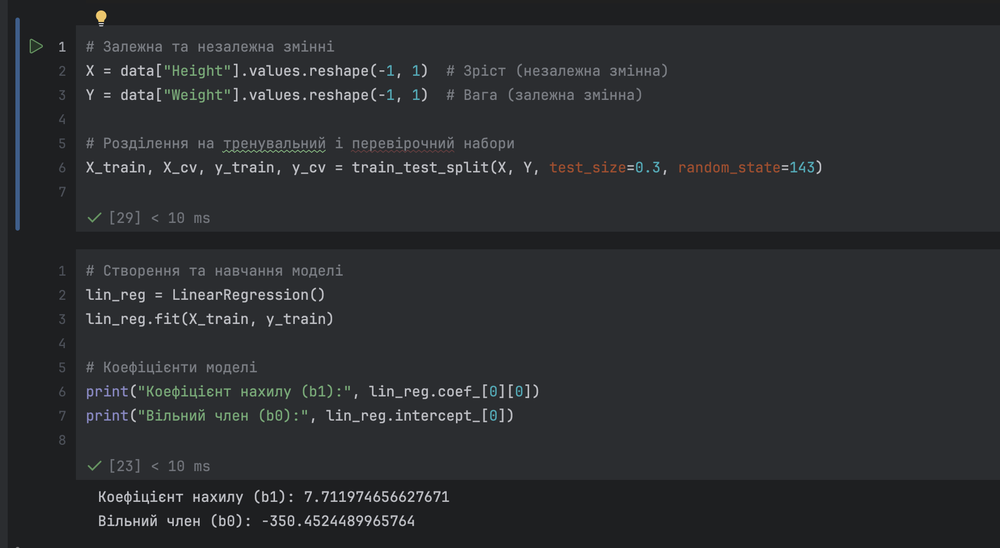
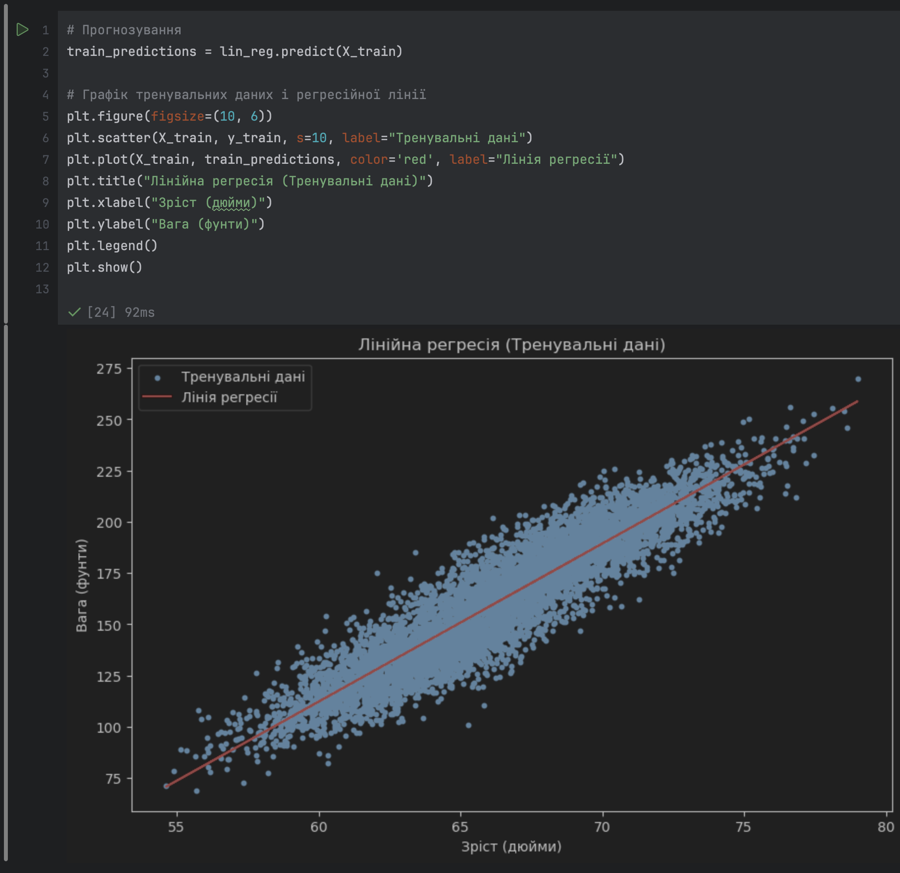
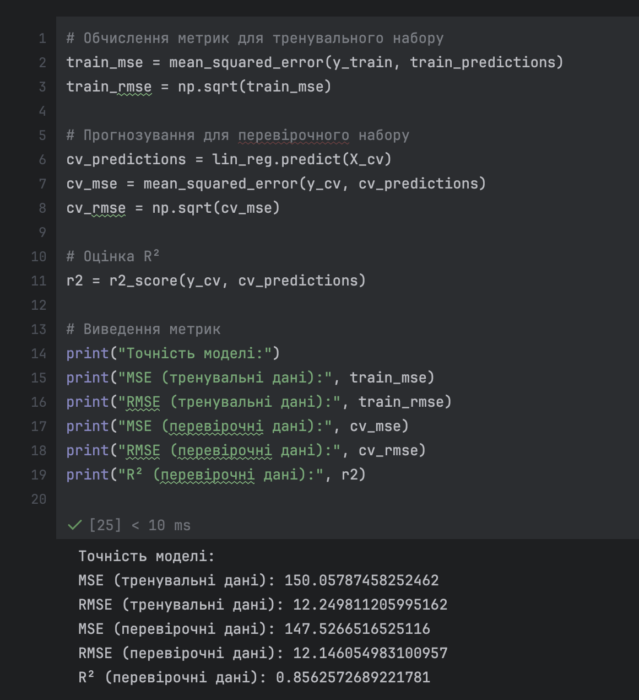
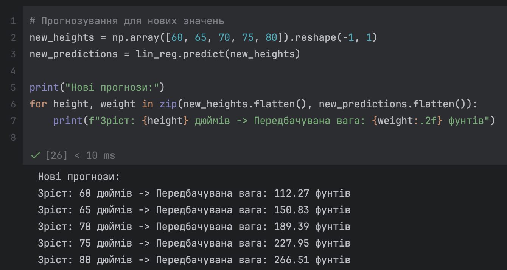

# Лабораторна робота №4

Тема: Розв’язування задачі лінійної регресії

Мета: навчитися працювати з простою моделлю лінійної регресії.

## Теоретичні відомості

### Лінійна регресія

Лінійна регресія є одним із найпоширеніших методів машинного навчання, який використовується для моделювання залежності між змінними. Вона застосовується, коли між незалежними змінними (факторами) та залежною змінною існує лінійний зв’язок.  

#### Основна ідея

Модель лінійної регресії намагається знайти таку пряму лінію, яка найкраще описує взаємозв’язок між змінними. Ця лінія математично виражається рівнянням:  
$y = b_0 + b_1x + \epsilon$
де:  

- $y$ — залежна змінна (цільова мета моделі),  
- $x$ — незалежна змінна (фактор),  
- $b_0$ — вільний член (перетин із віссю $y$),  
- $b_1$ — коефіцієнт регресії (нахил лінії),  
- $\epsilon$ — похибка моделі.  

#### Ключові етапи роботи з лінійною регресією

1. **Підготовка даних:**  
   Перед побудовою моделі необхідно переконатися, що дані не містять пропущених або аномальних значень. Також слід розділити дані на навчальний і перевірочний набори.  

2. **Навчання моделі:**  
   Модель знаходить оптимальні значення коефіцієнтів $b_0$ і $b_1$, які мінімізують суму квадратів різниць між реальними значеннями $y$ та прогнозованими.  

3. **Прогнозування:**  
   За допомогою знайдених коефіцієнтів модель робить прогноз для нових значень $x$.  

4. **Оцінка моделі:**  
   Використовуються різні метрики, наприклад, середньоквадратична помилка (MSE), корінь середньоквадратичної помилки (RMSE) та коефіцієнт детермінації ($R^2$), щоб визначити, наскільки добре модель описує дані.  

#### Практичне застосування

Лінійна регресія широко використовується в різних галузях, таких як економіка, медицина, соціологія та інші. Наприклад, вона може бути корисною для прогнозування продажів, аналізу впливу факторів на ціни, моделювання фізичних явищ тощо.

### Розділення даних на тренувальний і перевірочний набори

У процесі побудови моделі лінійної регресії важливим етапом є розділення даних на тренувальний і перевірочний набори. Для цього використовується метод `train_test_split` з бібліотеки `sklearn`.  

```python
from sklearn.model_selection import train_test_split
X_train, X_cv, y_train, y_cv = train_test_split(X, Y, test_size=0.3, random_state=143)
```

- **`X_train`** і **`y_train`** — дані, що використовуються для навчання моделі.  
- **`X_cv`** і **`y_cv`** — дані, що застосовуються для перевірки моделі.  
- **`test_size=0.3`** — 30% даних виділяється на перевірку, 70% залишається для навчання.  
- **`random_state=143`** — фіксований параметр для відтворюваності результатів.  

Цей підхід дозволяє оцінити якість моделі на даних, які не використовувались під час її навчання.

### Навчання моделі лінійної регресії

Навчання моделі лінійної регресії — це процес, під час якого алгоритм знаходить оптимальні коефіцієнти $b_0$ (вільний член) та $b_1$ (коефіцієнт нахилу), що мінімізують різницю між передбаченими та фактичними значеннями залежної змінної.

#### Як відбувається навчання?

1. **Рівняння моделі:**
   Модель лінійної регресії описується рівнянням:

   $y = b_0 + b_1x + \epsilon$

   де:
   - $b_0$ — перетин лінії регресії з віссю $y$,
   - $b_1$ — коефіцієнт нахилу (вплив $x$ на $y$),
   - $\epsilon$ — похибка, тобто різниця між передбаченим і реальним значенням.

2. **Ціль навчання:**
   Алгоритм шукає такі значення $b_0$ та $b_1$, які мінімізують суму квадратів похибок:

   $\text{MSE} = \frac{1}{n} \sum_{i=1}^n (y_i - \hat{y}_i)^2$

   де:
   - $y_i$ — фактичне значення,
   - $\hat{y}_i = b_0 + b_1x_i$ — передбачене значення,
   - $n$ — кількість спостережень.

3. **Метод оптимізації:**
   У лінійній регресії використовуються аналітичні підходи, зокрема метод найменших квадратів (OLS, Ordinary Least Squares):
   - Розраховується похідна функції помилки по кожному коефіцієнту ($b_0$, $b_1$).
   - Знаходяться значення коефіцієнтів, при яких похідна дорівнює нулю (мінімум помилки).

4. **Ключові формули:**
   Значення коефіцієнтів обчислюються за формулами:

   $b_1 = \frac{\sum (x_i - \bar{x})(y_i - \bar{y})}{\sum (x_i - \bar{x})^2}$

   $b_0 = \bar{y} - b_1\bar{x}$

   де:
   - $\bar{x}$ і $\bar{y}$ — середні значення змінних $x$ і $y$.

5. **Вихідні дані після навчання:**
   Після виконання методу `fit` модель зберігає обчислені коефіцієнти:
   - `lin_reg.intercept_` — значення $b_0$,
   - `lin_reg.coef_` — значення $b_1$.

#### Код

```python
lin_reg = LinearRegression()  # Створення об'єкта моделі
lin_reg.fit(X_train, y_train)  # Навчання моделі
```

- Модель аналізує тренувальні дані (`X_train` і `y_train`), обчислює найкращі коефіцієнти і створює лінійне рівняння.

#### Приклад

Якщо модель знаходить:

- $b_0 = 2$,
- $b_1 = 3$,

то рівняння регресії буде:
$
y = 2 + 3x
$

Таким чином, для нового значення $x = 4$, модель передбачає $y = 2 + 3 \cdot 4 = 14$.

#### Значення навчання

Процес навчання лінійної регресії дозволяє створити модель, яка найбільш точно описує залежність між змінними, і надалі використовувати її для прогнозування.

### Прогнозування за допомогою моделі лінійної регресії

Після навчання моделі лінійної регресії ми можемо використовувати її для прогнозування залежної змінної $y$ на основі нових або наявних значень незалежної змінної $x$. Для цього застосовується метод `predict`.

#### Як працює метод `predict`?

Метод `predict` бере значення $x$ (незалежна змінна) і застосовує рівняння регресії, створене під час навчання, для обчислення передбачуваних значень $y$:
$
\hat{y} = b_0 + b_1x
$
де:

- $\hat{y}$ — передбачене значення залежної змінної,
- $b_0$ і $b_1$ — коефіцієнти, знайдені під час навчання.

#### Використання в лабораторній роботі

```python
predictions = lin_reg.predict(X_train)
```

- **`lin_reg`** — навчена модель лінійної регресії.
- **`X_train`** — тренувальні дані незалежної змінної, для яких ми хочемо передбачити значення залежної змінної.
- **`predictions`** — масив передбачених значень $y$ для відповідних значень $X_train$.

#### Важливість

1. **Оцінка моделі:**  
   Порівнюючи передбачені значення (`predictions`) з фактичними значеннями з тренувального набору (`y_train`), можна визначити, наскільки добре модель описує тренувальні дані.

2. **Використання:**  
   Передбачені значення можуть використовуватись для візуалізації або обчислення помилки моделі, таких як середньоквадратична помилка (MSE) чи корінь середньоквадратичної помилки (RMSE).

#### Приклад

Припустимо, модель має рівняння:
$
y = 2 + 3x
$
Якщо $X_train = [1, 2, 3]$, то:

- Для $x = 1$: $y = 2 + 3 \cdot 1 = 5$,
- Для $x = 2$: $y = 2 + 3 \cdot 2 = 8$,
- Для $x = 3$: $y = 2 + 3 \cdot 3 = 11$.

Отже, `predictions` матиме значення:

```python
[5, 8, 11]
```

#### У висновку

Метод `predict` є ключовим для використання навченої моделі, дозволяючи робити прогнози на основі заданих значень незалежної змінної.

### Оцінка точності моделі

Оцінка точності моделі лінійної регресії є важливим етапом, який дозволяє зрозуміти, наскільки добре модель описує дані і може робити прогнози. Для цього використовуються метрики, які порівнюють передбачені значення ($\hat{y}$) із фактичними ($y$).

#### Основні метрики оцінки моделі

1. **Середньоквадратична помилка (Mean Squared Error, MSE):**
   $
   \text{MSE} = \frac{1}{n} \sum_{i=1}^n (y_i - \hat{y}_i)^2
   $
   - Опис: МSE обчислює середнє значення квадратів різниці між фактичними і передбаченими значеннями.
   - Чим менше значення MSE, тим точніше модель.
   - Використання в лабораторній роботі:

     ```python
     from sklearn.metrics import mean_squared_error
     mse = mean_squared_error(y_train, predictions)
     ```

2. **Корінь середньоквадратичної помилки (Root Mean Squared Error, RMSE):**
   $
   \text{RMSE} = \sqrt{\text{MSE}}
   $
   - Опис: RMSE надає інтерпретацію похибки в одиницях вимірювання залежної змінної.
   - Чим менше RMSE, тим краще модель узгоджується з даними.
   - Використання:

     ```python
     rmse = np.sqrt(mse)
     ```

3. **Коефіцієнт детермінації ($R^2$):**
   $
   R^2 = 1 - \frac{\sum_{i=1}^n (y_i - \hat{y}_i)^2}{\sum_{i=1}^n (y_i - \bar{y})^2}
   $
   - Опис: $R^2$ показує частку варіації залежної змінної, яку модель може пояснити.
   - Значення:
     - $R^2 = 1$: ідеальна модель (повне пояснення варіації даних),
     - $R^2 = 0$: модель не пояснює варіації даних,
     - $R^2 < 0$: модель гірша, ніж просте передбачення середнього значення $\bar{y}$.
   - Використання:

     ```python
     from sklearn.metrics import r2_score
     r2 = r2_score(y_test, final_predictions)
     ```

#### Використання у лабораторній роботі

1. **Обчислення метрик для тренувального набору:**

   ```python
   predictions = lin_reg.predict(X_train)
   mse = mean_squared_error(y_train, predictions)
   rmse = np.sqrt(mse)
   ```

2. **Оцінка на перевірочному наборі:**

   ```python
   cv_predictions = lin_reg.predict(X_cv)
   cv_mse = mean_squared_error(y_cv, cv_predictions)
   cv_rmse = np.sqrt(cv_mse)
   ```

3. **Фінальна оцінка на тестовому наборі:**

   ```python
   final_predictions = lin_reg.predict(X_test)
   final_mse = mean_squared_error(y_test, final_predictions)
   final_rmse = np.sqrt(final_mse)
   score = r2_score(y_test, final_predictions)
   ```

#### Інтерпретація метрик

1. **MSE та RMSE:**
   - Малі значення свідчать про високу точність.
   - RMSE надає результат у тих самих одиницях, що і залежна змінна, що робить її зручною для інтерпретації.

2. **$R^2$:**
   - Значення ближче до 1 означає, що модель добре описує дані.
   - Низьке або від’ємне значення $R^2$ сигналізує про проблеми з моделлю, наприклад, недоузгодження.

#### Важливість оцінки точності

Оцінка моделі гарантує, що побудована модель не лише добре узгоджується з тренувальними даними, але й може узагальнювати свої передбачення на нових даних. Це дозволяє уникнути проблем перенавчання (overfitting) або недоузгодження (underfitting).

## Виконання

### Варіант

Варіант №16



### Завантаження даних та перевірка їхньої структури



1. **Що зроблено:**
   - Імпортовано необхідні бібліотеки (`numpy`, `pandas`, `matplotlib`, а також модулі з `sklearn` для моделювання та оцінки лінійної регресії).
   - Завантажено дані з файлу `weight-height.csv` у DataFrame під назвою `data` за допомогою методу `pd.read_csv`.
   - Виконано початковий огляд структури даних за допомогою методу `data.info()`.
   - Використано метод `data.head()` для перегляду перших 5 записів у таблиці.

2. **Результати:**
   - Метод `data.info()` показав:
     - Датасет складається з 10,000 записів (рядків) і 3 колонок:
       1. `Gender` (стать): текстовий формат даних (`object`).
       2. `Height` (зріст): числовий формат даних (`float64`).
       3. `Weight` (вага): числовий формат даних (`float64`).
     - Всі записи є повними, пропущені значення відсутні.
   - Метод `data.head()` продемонстрував перші 5 записів:
     - Зріст (`Height`) та вага (`Weight`) відображені для чоловіків (`Gender: Male`).
     - Значення зросту варіюються від 68.78 до 74.11 дюймів, а ваги — від 162.31 до 241.89 фунтів.

3. **Чому це зроблено:**
   - Завантаження та початковий огляд даних є необхідними для розуміння їхньої структури, типів, а також наявності пропущених значень.
   - Попередній перегляд дозволяє переконатися, що дані завантажено коректно та готові до подальшого аналізу. Це також допомагає визначити, які змінні є релевантними для задачі лінійної регресії.

### Вибір необхідних колонок



1. **Що зроблено:**
   - Використано вибірку колонок із DataFrame `data` для створення нового DataFrame, що містить лише дві релевантні змінні: `Height` (зріст) та `Weight` (вага).

2. **Результати:**
   - Створено новий DataFrame, у якому залишено тільки колонки, необхідні для подальшого аналізу.
   - Колонка `Gender` була виключена, оскільки для задачі лінійної регресії вона не є потрібною.

3. **Чому це зроблено:**
   - Фокусування на аналізі ключових змінних спрощує подальший процес обробки та моделювання.
   - Зменшення кількості змінних знижує ризик внесення зайвого шуму в модель.

### Візуалізація залежності ваги від зросту



1. **Що зроблено:**
   - Побудовано розсіювальний графік (scatter plot), який ілюструє залежність ваги (`Weight`) від зросту (`Height`) у вибраному датасеті.
   - Для цього:
     - Використано функцію `plt.scatter`, де на осі X відображено значення зросту, а на осі Y — вагу.
     - Вказано колір точок графіка (`blue`) і розмір (`s=10`).
     - Додано підписи осей (`xlabel`, `ylabel`) та заголовок графіка (`title`).

2. **Результати:**
   - Графік демонструє явну позитивну кореляцію між зростом і вагою: зі збільшенням зросту вага також збільшується.
   - Більшість точок розташовані щільно вздовж лінії, що свідчить про сильний зв’язок між цими змінними.

3. **Чому це зроблено:**
   - Побудова графіка дозволяє візуально оцінити залежність між змінними перед побудовою моделі лінійної регресії.
   - Виявлення кореляції допомагає підтвердити доцільність використання лінійної регресії для аналізу цих даних.

4. **Висновок:**
   - Дані демонструють лінійну залежність, тому побудова моделі лінійної регресії є обґрунтованим підходом.

### Розділення даних та навчання моделі

![Рисунок 5 - Розділення даних і навчання моделі]

1. **Що зроблено:**
   - **Залежна та незалежна змінні:**
     - Вибрано колонки `Height` (незалежна змінна) і `Weight` (залежна змінна) для моделювання.
     - Дані були перетворені у формат масиву `reshape(-1, 1)`, необхідний для роботи з алгоритмами машинного навчання.
   - **Розділення даних:**
     - Дані було поділено на тренувальний (`X_train`, `y_train`) та перевірочний (`X_cv`, `y_cv`) набори за допомогою методу `train_test_split`.
     - 70% даних використано для навчання, 30% — для перевірки (`test_size=0.3`).
   - **Навчання моделі:**
     - Створено об'єкт лінійної регресії (`lin_reg = LinearRegression()`).
     - Модель навчено на тренувальних даних за допомогою методу `fit`.

2. **Результати:**
   - **Коефіцієнт нахилу (b1):** 7.711974656627671  
     - Вказує, наскільки змінюється вага при зміні зросту на одну одиницю (дюйм).
   - **Вільний член (b0):** -350.4524489965764  
     - Вказує перетин лінії регресії з віссю Y, тобто вагу, коли зріст дорівнює нулю (теоретичне значення, не застосовується на практиці).

3. **Чому це зроблено:**
   - Розділення даних дозволяє уникнути проблеми перенавчання, забезпечуючи перевірку точності моделі на нових даних.
   - Навчання моделі з подальшим отриманням коефіцієнтів є ключовим етапом у побудові лінійної регресії. Це дозволяє отримати математичне рівняння для прогнозування залежної змінної.

4. **Висновок:**
   - Модель успішно навчена, і отримані коефіцієнти можуть бути використані для прогнозування ваги на основі зросту за рівнянням:
     $
     Weight = 7.711974656627671 \cdot Height - 350.4524489965764
     $

### Побудова графіка тренувальних даних і лінії регресії



1. **Що зроблено:**
   - Виконано прогнозування ваги (`Weight`) для тренувальних даних (`X_train`) за допомогою навченої моделі лінійної регресії. Прогнози збережено у змінній `train_predictions`.
   - Побудовано графік:
     - Сині точки представляють реальні тренувальні дані (`X_train`, `y_train`).
     - Червона лінія представляє лінію регресії, побудовану на основі передбачених значень (`train_predictions`).

2. **Результати:**
   - На графіку видно, що:
     - Лінія регресії добре узгоджується із тренувальними даними, підтверджуючи лінійну залежність між зростом і вагою.
     - Точки (дані) розташовані близько до лінії, що вказує на високу точність моделі для тренувального набору.

3. **Чому це зроблено:**
   - Побудова графіка дозволяє візуально оцінити, наскільки добре модель навчилась відображати залежність між змінними.
   - Лінія регресії є ключовим результатом моделі, яка використовується для прогнозування нових даних.

4. **Висновок:**
   - Модель лінійної регресії успішно описує тренувальні дані. Це підтверджує, що залежність між зростом і вагою має лінійний характер, і модель може використовуватись для прогнозування.

### Оцінка точності моделі



1. **Що зроблено:**
   - **Обчислення метрик для тренувального набору:**
     - Використано середньоквадратичну помилку (MSE) і корінь середньоквадратичної помилки (RMSE) для оцінки точності моделі на тренувальних даних.
   - **Прогнозування для перевірочного набору:**
     - Згенеровано передбачення (`cv_predictions`) для перевірочного набору.
     - Аналогічно обчислено MSE і RMSE для перевірочного набору.
   - **Оцінка R²:**
     - Обчислено коефіцієнт детермінації \(R^2\), який показує, наскільки добре модель пояснює змінність залежної змінної на перевірочних даних.
   - **Виведення результатів:**
     - Виведено значення MSE, RMSE і \(R^2\) для обох наборів.

2. **Результати:**

   **Тренувальний набір:**
   - **MSE (Mean Squared Error):** 150.05787458252462  
     - Оцінює середню величину квадрату відхилення між фактичними значеннями і передбаченнями моделі.
     - Чим менше MSE, тим точніше модель.
   - **RMSE (Root Mean Squared Error):** 12.249811205995162  
     - Корінь з MSE, виражений у тих самих одиницях, що й залежна змінна (вага).  
     - Показує середню абсолютну помилку моделі.  

   **Перевірочний набір:**
   - **MSE:** 147.5266516525116  
     - Схоже значення на MSE для тренувального набору, що свідчить про стабільну роботу моделі.
   - **RMSE:** 12.146054983100957  
     - Низька RMSE також підтверджує високу точність моделі.

   **Оцінка \(R^2\):** 0.8562572689221781  
   - Коефіцієнт детермінації \(R^2\) показує, яка частка варіації залежної змінної (ваги) пояснюється моделлю.
   - Значення близьке до 1 вказує, що модель добре пояснює залежність між змінними.

3. **Чому це зроблено:**
   - **MSE і RMSE:**
     - Використовуються для оцінки точності прогнозів моделі у числових одиницях залежної змінної. Вони допомагають зрозуміти, наскільки передбачення моделі близькі до фактичних значень.
   - **R²:**
     - Показує якість моделі у відсотковому вираженні. Наприклад, \(R^2 = 0.856\) означає, що 85.6% змінності ваги пояснюється зростом.

4. **Висновок:**
   - Низькі значення MSE і RMSE свідчать про те, що модель є точною як для тренувального, так і для перевірочного наборів.
   - Високий \(R^2\) підтверджує, що модель добре пояснює залежність між зростом і вагою.
   - Модель є готовою для прогнозування нових значень.

### Прогнозування для нових значень



1. **Що зроблено:**
   - Задано нові значення зросту у вигляді масиву: `[60, 65, 70, 75, 80]` (в дюймах).
   - Масив перетворено у формат, необхідний для роботи з моделлю, за допомогою `reshape(-1, 1)`.
   - Виконано прогнозування ваги для цих значень зросту за допомогою навченої моделі лінійної регресії (`lin_reg.predict(new_heights)`).
   - Результати прогнозування відформатовано й виведено на екран у вигляді пари "Зріст -> Передбачувана вага".

2. **Результати:**
   - Для кожного заданого значення зросту модель передбачила відповідну вагу:
     - Зріст: 60 дюймів -> Передбачувана вага: 112.27 фунтів
     - Зріст: 65 дюймів -> Передбачувана вага: 150.83 фунтів
     - Зріст: 70 дюймів -> Передбачувана вага: 189.39 фунтів
     - Зріст: 75 дюймів -> Передбачувана вага: 227.95 фунтів
     - Зріст: 80 дюймів -> Передбачувана вага: 266.51 фунтів

3. **Чому це зроблено:**
   - Прогнозування для нових значень дозволяє перевірити практичну цінність моделі. У цьому випадку ми бачимо, що модель може використовуватись для передбачення ваги на основі заданого зросту.
   - Це також дозволяє оцінити, наскільки інтуїтивно й реалістично виглядають результати моделі.

4. **Висновок:**
   - Модель коректно передбачає вагу для нових значень зросту. Передбачення є логічними та відповідають спостережуваній залежності між зростом і вагою.
   - Модель готова до використання в реальних задачах прогнозування.

## Висновок

На цій лабораторній роботі я навчився працювати з простою моделлю лінійної регресії.
