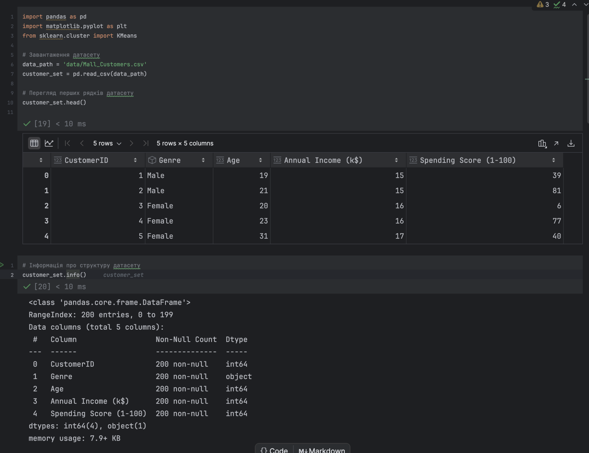
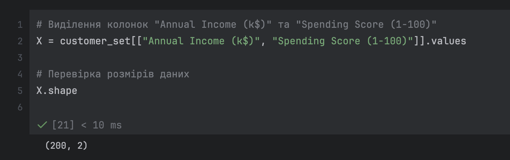
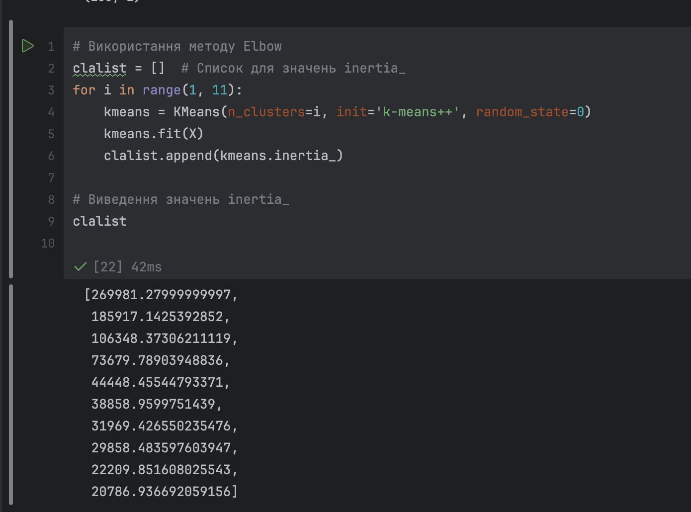
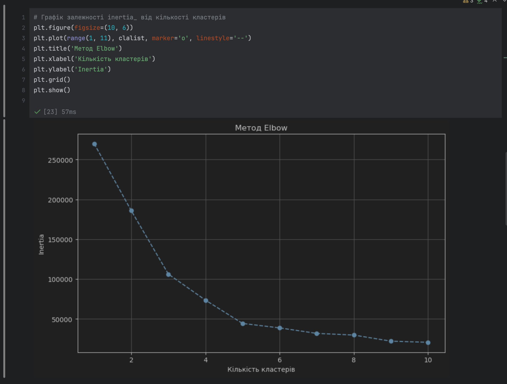
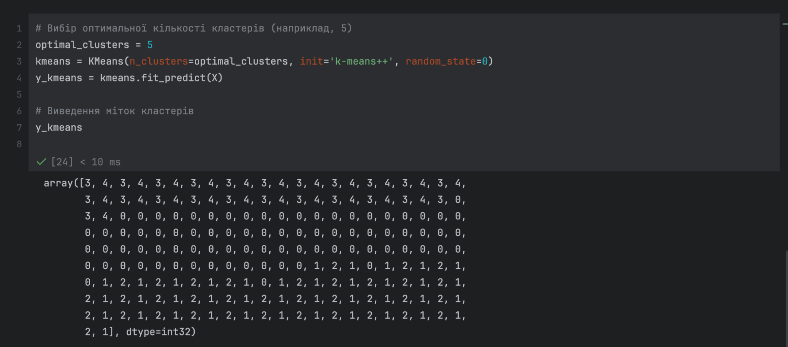
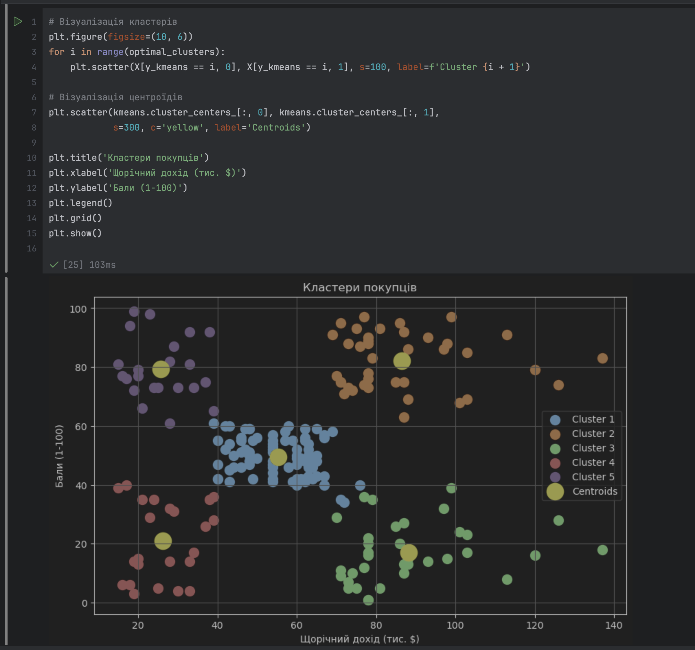

# Лабораторна робота №5

Тема: Розв’язування задачі кластеризації

Мета: навчитися працювати з простим алгоритмом кластеризації, який відносять до алгоритмів аналізу ринкового кошику.

## Теоретичні відомості

### 1. Що таке кластеризація?

**Кластеризація** — це метод аналізу даних, за допомогою якого об'єкти групуються у кластери на основі їх схожості. Вона належить до задач *неконтрольованого навчання*, оскільки не потребує міток (цільових значень) для навчання моделі.  
Метою кластеризації є поділ даних на такі групи, щоб об'єкти в межах одного кластеру були максимально схожими, а об'єкти з різних кластерів — максимально відмінними.

### 2. Алгоритм K-means

**K-means** — це один із найпоширеніших алгоритмів кластеризації. Він заснований на розділенні об'єктів на $k$ кластерів, де $k$ — заздалегідь задана кількість.

#### Принцип роботи K-means

1. **Ініціалізація:**
   - Визначається кількість кластерів $k$.
   - Початкові центроїди (центри кластерів) ініціалізуються випадковим чином або методом `'k-means++'` для оптимізації.

2. **Розподіл об'єктів у кластери:**
   - Для кожної точки даних обчислюється відстань до всіх центроїдів.
   - Точка призначається до кластеру, центр якого знаходиться найближче.

3. **Оновлення центроїдів:**
   - Після розподілу всіх точок обчислюється нове положення центроїда як середнє значення координат точок у кластері.

4. **Ітерації:**
   - Кроки 2 і 3 повторюються до тих пір, поки центроїди перестануть змінювати положення (або до досягнення максимального числа ітерацій).

#### Математичне представлення

Алгоритм мінімізує функцію:
$
J = \sum_{i=1}^k \sum_{j=1}^{n_i} ||x_j^{(i)} - c_i||^2
$
де:

- $x_j^{(i)}$ — точка, що належить кластеру $i$,
- $c_i$ — центроїд кластеру $i$,
- $||x_j^{(i)} - c_i||^2$ — квадрат відстані між точкою $x_j^{(i)}$ і центроїдом $c_i$,
- $k$ — кількість кластерів.

### 3. Метрика **inertia_** і метод Elbow

Метрика **inertia_** вимірює суму квадратів відстаней від кожної точки до центру її кластеру. Ця величина зменшується зі збільшенням кількості кластерів, але після певного моменту зниження стає несуттєвим.

#### Метод Elbow (локтя)

Метод Elbow використовується для визначення оптимальної кількості кластерів.  

1. Обчислюється значення **inertia_** для різної кількості кластерів (наприклад, від 1 до 10).
2. Будується графік залежності **inertia_** від кількості кластерів.
3. Оптимальна кількість кластерів відповідає точці "зламу" графіка, де припиняється суттєве зменшення **inertia_**.

### 4. Основні функції K-means

1. **`fit(X)`**:
   - Виконує кластеризацію на основі вхідних даних $X$.
   - Навчає модель і обчислює координати центроїдів кластерів.

2. **`fit_predict(X)`**:
   - Виконує кластеризацію та одразу повертає мітки кластерів для кожної точки.

3. **`inertia_`**:
   - Вимірює якість кластеризації (сума відстаней від точок до їх центроїдів).

4. **`cluster_centers_`**:
   - Повертає координати центроїдів кластерів.

### 5. Візуалізація кластерів

Після виконання кластеризації результати можна візуалізувати на графіку:

- Кожен кластер відображається як група точок одного кольору.
- Центроїди кластерів позначаються окремо (наприклад, жовтим кольором).

### 6. Застосування K-means у реальному світі

1. **Аналіз ринкового кошика:**
   - Кластеризація покупців на групи за схожістю їхньої поведінки.
   - Наприклад, визначення груп клієнтів за рівнем доходу та витрат.

2. **Сегментація ринку:**
   - Визначення груп клієнтів, які мають схожі характеристики, для таргетованої реклами.

3. **Аналіз даних у медицині:**
   - Групування пацієнтів за схожими симптомами або результатами аналізів.

4. **Рекомендаційні системи:**
   - Кластеризація користувачів для створення персоналізованих рекомендацій.

### 7. Переваги та недоліки K-means

#### Переваги

- Простота реалізації.
- Ефективність для великих наборів даних.
- Добре працює для сфер із чітко вираженими групами.

#### Недоліки

- Необхідність заздалегідь задавати кількість кластерів.
- Чутливість до початкової ініціалізації центроїдів.
- Може працювати гірше для даних із нерівномірними розподілами або некруглими кластерами.

Ці теоретичні знання створюють основу для виконання лабораторної роботи та аналізу результатів кластеризації.

## Виконання

### Аналіз датасету "Mall Customers"



1. **Імпорт бібліотек:**
   - `pandas` — для роботи з таблицями (завантаження та маніпуляція даними).
   - `matplotlib.pyplot` — для побудови графіків і візуалізації кластерів.
   - `KMeans` з `sklearn.cluster` — для виконання кластеризації.

2. **Завантаження датасету:**
   - Використано файл `Mall_Customers.csv`, який містить інформацію про клієнтів торгового центру.
   - Завантаження виконано за допомогою функції `pd.read_csv`, і результат збережено у DataFrame `customer_set`.

3. **Попередній перегляд (метод `head()`):**
   - Виведено перші 5 рядків таблиці для ознайомлення з її структурою:
     - **`CustomerID`** — унікальний ідентифікатор клієнта.
     - **`Genre`** — стать клієнта (`Male` або `Female`).
     - **`Age`** — вік клієнта.
     - **`Annual Income (k$)`** — річний дохід клієнта (в тисячах доларів США).
     - **`Spending Score (1-100)`** — оцінка витрат клієнта (від 1 до 100, де 1 — низька активність, 100 — висока активність).

4. **Інформація про структуру датасету (метод `info()`):**
   - У таблиці 200 записів (рядків) і 5 колонок.
   - Всі дані заповнені, пропущених значень немає.
   - Типи даних:
     - `int64` для числових даних (`CustomerID`, `Age`, `Annual Income (k$)`, `Spending Score (1-100)`).
     - `object` для текстових значень у колонці `Genre`.

### Висновки

- Датасет готовий для подальшого аналізу.
- Колонки **`Annual Income (k$)`** і **`Spending Score (1-100)`** є основними для задачі кластеризації, оскільки вони числові та релевантні для сегментації клієнтів.
- Наступним кроком буде виділення цих колонок і проведення кластеризації.

### Виділення колонок для кластеризації



1. **Що зроблено:**
   - З таблиці було вибрано дві числові колонки:
     - **`Annual Income (k$)`** — річний дохід клієнта (в тисячах доларів США).
     - **`Spending Score (1-100)`** — показник витрат (оцінка активності клієнта).
   - Дані з цих колонок було перетворено у формат `NumPy`-масиву за допомогою атрибуту `.values`.

2. **Результати:**
   - Масив даних має розмірність `(200, 2)`:
     - 200 записів (рядків), які відповідають клієнтам.
     - 2 стовпці, які відповідають вибраним змінним.

3. **Чому це зроблено:**
   - Для кластеризації потрібні числові дані, які представляють ключові характеристики клієнтів.
   - Колонки **`Annual Income (k$)`** і **`Spending Score (1-100)`** є найбільш релевантними для задачі сегментації, оскільки вони відображають фінансову поведінку клієнтів.

4. **Висновок:**
   - Дані підготовлено до кластеризації. Наступним кроком буде визначення оптимальної кількості кластерів за допомогою методу Elbow.

### Використання методу Elbow



1. **Що зроблено:**
   - Виконано ітерацію для визначення метрики **inertia_** для кількості кластерів $k$, яка варіюється від 1 до 10.
   - Для кожного значення $k$ створено модель K-means за допомогою:
     - **`KMeans(n_clusters=i, init='k-means++', random_state=0)`**, де:
       - `n_clusters` визначає кількість кластерів.
       - `init='k-means++'` — метод ініціалізації центроїдів для забезпечення швидшої збіжності.
       - `random_state=0` фіксує результат для відтворюваності.
   - Модель навчено на даних `X` за допомогою методу `fit`.
   - Значення **inertia_** (метрики якості кластеризації) додано до списку `clalist`.

2. **Теоретичні відомості:**
   - **Метрика inertia_**:
     - Це сума квадратів відстаней між кожною точкою в кластері та її центроїдом.
     - Менші значення **inertia_** вказують на щільніші кластери, але надто низькі значення можуть бути наслідком перенавчання (збільшення кількості кластерів).
   - **Метод Elbow**:
     - Метод використовує графік залежності **inertia_** від кількості кластерів.
     - Оптимальна кількість кластерів визначається як "точка зламу" графіка (elbow point), де подальше зменшення **inertia_** стає незначним.

3. **Результати:**
   - Список значень **inertia_**:

     ```
     [269981.27999999997, 185917.1425392852, 106348.37306211119, 
     73679.78903948836, 44448.45544793371, 38858.959751439,
     31969.426553025476, 29858.483576603947, 22009.815080025543, 
     20786.936692059156]
     ```

   - Значення зменшуються зі збільшенням кількості кластерів, але після певного моменту зниження стає мінімальним.

4. **Чому це зроблено:**
   - Цей етап необхідний для визначення оптимальної кількості кластерів.
   - Графік методу Elbow покаже точку, на якій модель досягає балансу між якістю кластеризації та кількістю кластерів.

5. **Висновок:**
   - Наступним кроком буде побудова графіка методу Elbow для візуального визначення оптимальної кількості кластерів. Це дозволить вибрати правильне значення $k$, з яким модель буде найбільш ефективною.

### Графік методу Elbow



1. **Що зроблено:**
   - Побудовано графік залежності метрики **inertia_** від кількості кластерів $k$ для значень від 1 до 10:
     - Використано метод `plt.plot()` для побудови графіка.
     - Параметри:
       - **`marker='o'`**: відображення точок на графіку.
       - **`linestyle='--'`**: стилізована лінія між точками.
     - Підписано осі графіка:
       - **X-axis**: кількість кластерів.
       - **Y-axis**: значення **inertia_**.
   - Додано сітку на графік для зручності аналізу.

2. **Теоретичні відомості:**
   - **Метод Elbow**:
     - Візуальний підхід для визначення оптимальної кількості кластерів $k$.
     - "Точка зламу" (elbow point) на графіку вказує на оптимальну кількість кластерів. У цій точці подальше зменшення **inertia_** стає незначним.
   - **Поведінка метрики inertia_**:
     - Для $k=1$ **inertia_** має найбільше значення, оскільки всі точки належать до одного кластеру.
     - Зі збільшенням $k$ **inertia_** зменшується, оскільки точки діляться на менші, щільніші кластери.

3. **Результати:**
   - Графік демонструє суттєве зменшення значення **inertia_** до $k=5$, після чого зменшення стає менш вираженим.
   - Точка $k=5$ виглядає як оптимальна кількість кластерів, оскільки саме тут спостерігається "злам" графіка.

4. **Чому це зроблено:**
   - Графік дозволяє легко визначити оптимальну кількість кластерів, яка забезпечує баланс між якістю кластеризації та складністю моделі.

5. **Висновок:**
   - На основі графіка методу Elbow обрано $k=5$ як оптимальну кількість кластерів для кластеризації клієнтів. Наступним кроком буде навчання моделі K-means з $k=5$ та візуалізація кластерів.

### Вибір оптимальної кількості кластерів та створення моделі K-means



1. **Що зроблено:**
   - Встановлено кількість кластерів $k=5$ на основі графіка методу Elbow.
   - Створено модель K-means:
     - **`n_clusters=optimal_clusters`**: кількість кластерів дорівнює $5$.
     - **`init='k-means++'`**: метод ініціалізації центроїдів для швидшої збіжності.
     - **`random_state=0`**: забезпечує відтворюваність результатів.
   - Виконано кластеризацію:
     - Метод **`fit_predict(X)`**:
       - Навчає модель на даних $X$.
       - Визначає, до якого кластеру належить кожна точка.
       - Результати зберігаються у масиві `y_kmeans`, де кожен елемент відповідає кластеру для відповідного клієнта.

2. **Теоретичні відомості:**
   - **K-means кластеризація:**
     - Мета алгоритму — мінімізувати суми квадратів відстаней між точками даних та їх центроїдами.
     - Результатом є набір кластерів, де кожен клієнт віднесений до однієї з $k$ груп.
   - **Метод `fit_predict()`:**
     - Поєднує два етапи:
       1. Навчання моделі (визначення оптимальних центрів кластерів).
       2. Призначення кожної точки до відповідного кластеру.

3. **Результати:**
   - Масив `y_kmeans` містить мітки кластерів для всіх 200 клієнтів:
     - Наприклад, клієнти з міткою `3` належать до кластеру №3.
   - Значення в масиві відповідають групам клієнтів, сегментованих за їхнім річним доходом і балами витрат.

4. **Чому це зроблено:**
   - Етап кластеризації дозволяє групувати клієнтів на основі схожості їхніх характеристик (доходу та витрат).
   - Результати потрібні для візуалізації кластерів і подальшого аналізу.

5. **Висновок:**
   - Кожен клієнт отримав мітку кластеру, що відповідає його групі.
   - Наступним кроком буде побудова графіка для візуалізації кластерів і центрів.

### Візуалізація кластерів клієнтів



1. **Що зроблено:**
   - Візуалізовано кластери клієнтів на основі річного доходу та балів витрат:
     - Використано метод **`plt.scatter()`** для відображення кожного кластеру:
       - **`X[y_kmeans == i, 0]`** — координати клієнтів для осі річного доходу.
       - **`X[y_kmeans == i, 1]`** — координати клієнтів для осі балів витрат.
       - Кожен кластер позначено окремим кольором.
       - **Параметр `s=100`** — розмір точок.
       - **`label=f'Cluster {i + 1}'`** — підпис для кожного кластеру.
   - Візуалізовано центроїди кластерів:
     - Використано метод **`plt.scatter()`** для відображення центроїдів кластерів.
     - **`kmeans.cluster_centers_[:, 0]`** і **`kmeans.cluster_centers_[:, 1]`** — координати центроїдів.
     - Параметри:
       - **`s=300`** — збільшений розмір точок.
       - **`c='yellow'`** — жовтий колір для центроїдів.
       - **`label='Centroids'`** — підпис "Центроїди".

2. **Результати:**
   - Графік чітко показує 5 кластерів клієнтів:
     - Кожен кластер відображено окремим кольором.
     - Центроїди кластерів позначені жовтими точками.
   - Осі:
     - **X-axis**: річний дохід клієнтів у тисячах доларів.
     - **Y-axis**: бали витрат клієнтів (від 1 до 100).

3. **Теоретичні відомості:**
   - **Кластери:**
     - Групи клієнтів, які мають схожі характеристики (доходи та витрати).
     - Відображають можливі сегменти ринку.
   - **Центроїди:**
     - Середні координати кожного кластеру.
     - Використовуються для представлення "центральної точки" групи.
   - **Візуалізація кластерів:**
     - Дає змогу зрозуміти структуру даних та розташування груп клієнтів.
     - Дозволяє побачити, як клієнти сегментуються на основі характеристик.

4. **Чому це зроблено:**
   - Візуалізація допомагає інтерпретувати результати кластеризації.
   - Вона дозволяє:
     - Виявити особливості кожного сегменту клієнтів.
     - Зрозуміти взаємозв’язок між доходами клієнтів та їхньою активністю.

5. **Висновок:**
   - Успішно сегментовано клієнтів торгового центру на 5 кластерів.
   - Центроїди показують типових представників кожного кластеру.
   - Візуалізація демонструє, що модель K-means добре розподілила клієнтів на групи.

## Висновок

На цій лабораторній роботі я навчився працювати з простим алгоритмом кластеризації, який відносять до алгоритмів аналізу ринкового кошику.
