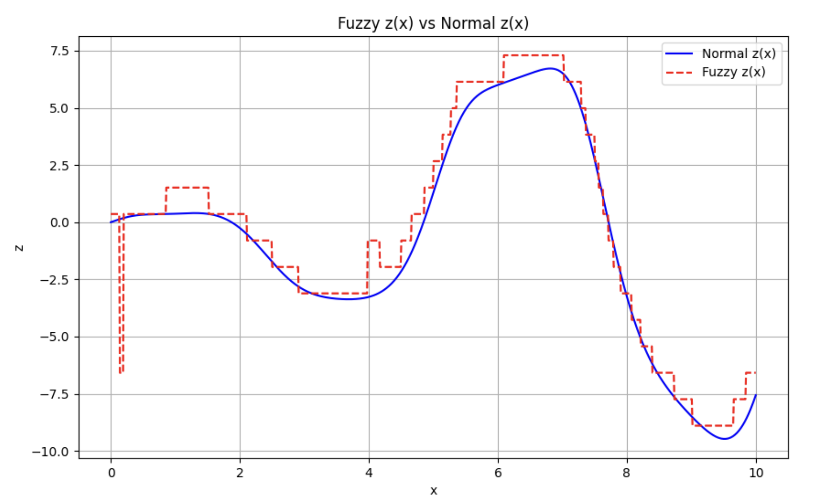

# Лабораторна робота №1

## Тема

Моделювання об'єкта керування з двома входами і одним виходом засобами нечіткої математики

## Мета

Засобами моделювання нечіткої логіки отримати модель функції двох змінних за варіантом. Провести дослідження форми функції приналежності на якість моделювання, а також залежність кількості правил і якості моделювання.

## Автор

Михайло Молчанов ІА-12

## Виконання

Для виконання цієї роботи я використав python та сам реалізував методи нечіткої математики.

Весь код знаходиться у файлі [[fuzzy.py]](./fuzzyFunc/fuzzy.py)

### Моделяція функції

Для того щоб зрозуміти з чим я працюю я зробив графіки функцій y та z


### Функції належності

Зазвичай для розподілу функції на класи використовуються функції належності, основні з них це гаусівська, трикутноподібна та трапецієподібна, вони виглядають наступним чином


### Розподіл на класи

Для того щоб розподілити всію функцію на класи використовується кілька функцій належності одна біля одної, для прикладу ось функції належності для x кожного типу


### Визначення меж

Щоб оптимально визначати класи, треба знати область значень функцій, щоб будувати функції належності відповідним чином, тому я порахував мінімуми та максимуми для y та z


### Набор правил

Далі я автоматично за допомогою реальних функцій побудуав набори правил належності,тобто до якого класу буде відноситись вихідна функція відовідно до вхідних


### Результати

Тепер за цими правилами можна моделювати функцію




Це функції трикутної, трапецієподібної та гаусівських моделей, та їх похибки

```
Integral of absolute error: 6.1557
Integral of absolute error: 5.7631
Integral of absolute error: 5.7631
```

Вийшло, що трапецієподібна співпала з гаусівською, а трикутна виявилась трохи гірна

## Висновок

На цій лабораторній роботі я використав методи нечіткої логіки щоб моделювати функцію двох змінних, та дослідив вплив типу функції належності на якість моделювання
