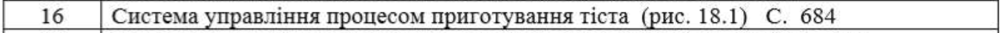
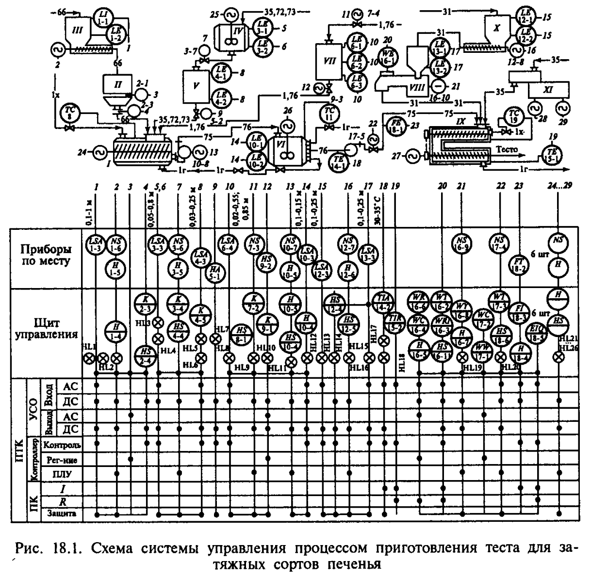

# АСУТП Виробництва Затяжних Видів Печива

## Варіант 16

## Вступ

Однією з основних операцій виробництва затяжних сортів печива є процес приготування тіста (рис. 18.1). Основні задачі управління, що випливають з місця і ролі цього процесу у виробництві печива, полягають у забезпеченні заданого складу тіста і його приготування в кількості, що відповідає потребам виробництва.

Система управління процесом приготування тіста може бути реалізована за допомогою АСУТП (супервізорний режим) за модулем 8 (див. рис. 15.3).

## Схема Управління

### Об'єкти Управління

- Емульсатор 1
- Автоваги 2
- Бункер цукру 3
- Збірник інвертного сиропу 4
- Мірник інвертного сиропу 5
- Збірник емульсії 6
- Мірник меланжу 7
- Транспортер для замішування борошна 8
- Тістомісильна машина 9
- Бункер борошна 10
- Пластифікатор 11

### Основні Компоненти Системи

- Контролери KP-300 з 100%-м резервуванням — 3
- АРМ оператора-технолога, начальника відділення та лабораторії на базі ЕОМ (Pentium I промислового виконання) й 20" монітори з підвищеним захистом від електромагнітних впливів.
- Мережеве обладнання — 10 Мбіт Ethernet з 100%-м резервуванням, архівна станція зі змінними магнітооптичними дисками (640 Мб).
- Сервер баз даних, принтери, пакети програм Trace Mode, шафа 19" (RITTAL).

Інформаційна потужність АСУТП (див. рис. 18.1): загальна кількість входів та виходів 29/29, тобто 58. Серед них:

- Контрольовані аналогові сигнали (рівень, температура, маса, хід) — 17
- Контрольовані дискретні сигнали (з урахуванням запірної арматури) — 15
- Дискретні управляючі — 12
- Контури регулювання — 3
- Запірна арматура — 3
- Противаварійний захист і блокування — 67

Система управління реалізована з гарячим резервуванням у трьох комплектах.

## Динаміка Роботи АСУТП

- Максимальний період опитування датчиків на контролері:
  - Дискретний вхід — 100 мкс
  - Аналоговий вхід — 1 мс
- Максимальний час реакції на аварійні сигнали:
  - Обробка у ланцюгах аварійного захисту на рівні контролера — 20 ± 100 мс
  - Передача на пульти оператора — 200 мс
  - Час повного перезапуску системи після відключення живлення — 20 с

Інформаційна потужність контролера аналогових/дискретних входів/виходів — 190/304, контурів регулювання — 32.

## Опис Процесу Підготовки Тіста

### Основні Компоненти

- Цукор-пісок, інвертний сироп, жир, молоко, меланж і борошно.

1. Цукор-пісок подається у бункер III, де встановлені датчики верхнього (1-1) і нижнього (1-2) рівнів. Сигнали надходять через АЦП (ADAM-5017H) на операторський пульт.
2. Інвертний сироп надходить із бака IV в мірник V, де встановлені датчики рівнів верхнього (3-1) і нижнього (3-2) рівнів.
3. Вода і меланж дозуються в мірник VII з контролем рівня води й меланжу.

### Контроль і Регулювання

- Компоненти у емульсаторі змішуються за допомогою електродвигуна, а стабілізація температури маси здійснюється логіко-програмним каналом контролера.
- Після приготування емульсія перекачується насосом в збірник VI, де підтримується температура 30–35 °C.
- Заміс тіста відбувається в тістомісильній машині IX, де суміш із бункера X дозується в певному співвідношенні з емульсією і жиром. Сигнали про подачу борошна й емульсії надходять на контролер для забезпечення постійного співвідношення.

### Додаткові Контрольні Елементи

- Емульсія контролюється на основі аналогових і дискретних сигналів з використанням АЦП (ADAM-5017H).
- Нормування і подача компонентів відбувається за допомогою виконавчих механізмів, що забезпечує точне дозування компонентів в емульсатор і тістомісильну машину.

## Алгоритм роботи

### Основні компоненти тіста

- Складові для приготування затяжного тіста включають цукор-пісок, інвертний сироп, жир, молоко, меланж і борошно.

### Крок 1: Дозування цукру-піску

1. Надходження цукру-піску: Цукор-пісок надходить у бункер III, де встановлені датчики верхнього (1-1) та нижнього (1-2) рівнів.
2. Сигналізація рівня: Дані з датчиків подаються на операторський пульт через АЦП (ADAM-5017H).
3. Запуск шнека: При досягненні верхнього рівня оператор активує шнек (1-4 або 1-5) для подачі цукру в автоваги II.
4. Подача в емульсатор: Виконавчий механізм (2-3) відкриває заслінку, і дозована порція цукру надходить в емульсатор I.

### Крок 2: Дозування інвертного сиропу

1. Надходження сиропу: Інвертний сироп подається з бака IV до мірника V.
2. Сигналізація рівня: Датчики верхнього (3-1) і нижнього (3-2) рівнів подають сигнал через АЦП на пульт оператора.
3. Подача сиропу: При досягненні верхнього рівня активується виконавчий механізм (3-7) для дозованої подачі сиропу в емульсатор.

### Крок 3: Дозування води та меланжу

1. Надходження у мірник VII: Вода та меланж надходять у мірник VII, де контролюються рівні верхній (6-1) та нижній (6-3).
2. Подача в емульсатор: Інгредієнти змішуються в емульсаторі за допомогою лопатевого електродвигуна 24.
3. Контроль температури: Стабілізація температури маси досягається через логіко-програмний канал контролера КП-300.

### Крок 4: Транспортування емульсії

1. Переміщення емульсії: Емульсія перекачується насосом 13 у збірник VI, де підтримується температура 30–35 °C.
2. Стабілізація температури: Контролер КП-300 підтримує стабільність температури у збірнику VI.

### Крок 5: Заміс тіста

1. Подача компонентів: Борошно з бункера X, емульсія та жир подаються у тістомісильну машину IX.
2. Встановлення пропорцій: Задавач (16-5) встановлює пропорції подачі борошна.
3. Контроль дозування: Сигнал з електромеханічного перетворювача (16-1) йде до АЦП для точного дозування.

### Крок 6: Контроль витрат емульсії та борошна

1. Витрати емульсії: Сигнал про витрати надходить до контролера для перевірки пропорцій.
2. Регулювання подачі: У разі відхилень сигнал спрямовується до виконавчого механізму для коригування подачі емульсії.

Цей алгоритм забезпечує послідовне дозування і контроль кожного інгредієнта в процесі приготування тіста, що гарантує стабільну якість кінцевого продукту.

### Опис Елементів Схеми

1. Бункер цукру (III) – Контейнер для зберігання цукру-піску, оснащений датчиками рівня (верхній та нижній) для контролю обсягу цукру.
2. Автоваги (II) – Вагове обладнання для точної дозировки інгредієнтів, таких як цукор, перед подачею їх до наступного етапу процесу.
3. Шнек для подачі цукру – Транспортує цукор із бункера III до автоваг для подальшої обробки.
4. Датчики рівня (верхній та нижній) для інвертного сиропу – Датчики, розташовані у баку для інвертного сиропу (IV), які сигналізують про рівень сиропу.
5. Мірник інвертного сиропу (V) – Контейнер для точного дозування інвертного сиропу перед його додаванням до емульсії.
6. Збірник емульсії (VI) – Збірник, у якому здійснюється контроль і підтримка температури емульсії (30–35 °C) для стабілізації її властивостей.
7. Датчики температури – Система датчиків, яка підтримує задану температуру в збірнику VI.
8. Мірник меланжу – Контейнер для дозування меланжу та води, оснащений датчиками для контролю рівня рідини.
9. Тістомісильна машина (IX) – Обладнання для замішування тіста, яке об’єднує борошно, емульсію та інші інгредієнти у певних пропорціях.
10. Транспортер для замішування борошна (VIII) – Обладнання для транспортування борошна з бункера X у тістомісильну машину.
11. Контролер KP-300 – Основний контролер системи, який відповідає за управління й регулювання основних процесів, включаючи підтримку температури та дозування компонентів.
12. АЦП (ADAM-5017H) – Аналого-цифровий перетворювач для збору даних з аналогових датчиків рівня, температури тощо.
13. Насос для емульсії – Обладнання для перекачування емульсії з емульсатору до збірника VI.
14. Вхідний клапан інвертного сиропу – Клапан, який забезпечує подачу інвертного сиропу в емульсатор.
15. Бункер борошна (X) – Контейнер для зберігання борошна, що надходить у тістомісильну машину.
16. Пластифікатор (XI) – Обладнання для додавання жиру та інших компонентів у тісто, що підвищує еластичність.
17. Електродвигун лопатевого мішалки – Використовується для змішування інгредієнтів у емульсаторі.
18. Дискретні виходи контролера – Контролюють включення/виключення різних виконавчих механізмів і механізмів захисту.
19. Система аварійного захисту – Модуль, який захищає систему від перевантаження та несправностей.
20. Сигналізація рівня інгредієнтів – Система сигналізації, яка повідомляє операторів про рівень різних компонентів у бункерах і резервуарах.
21. Контур регулювання подачі борошна – Система, що контролює подачу борошна у тістомісильну машину для підтримання пропорцій.
22. Суматор – Виконує функцію підрахунку і зведення інформації для контролю балансу компонентів.
23. Аналого-цифровий підсилювач – Підсилювач, що використовується для точного дозування компонентів у процесі приготування тіста.
24. Панель управління (ПТК та АРМ) – Панель для контролю та моніторингу процесів оператором.
