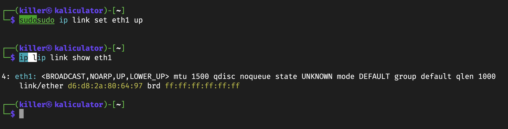
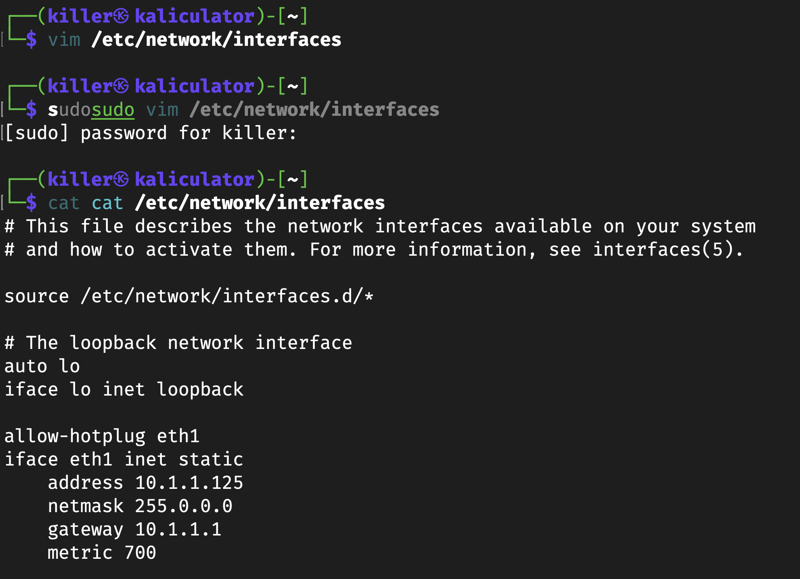
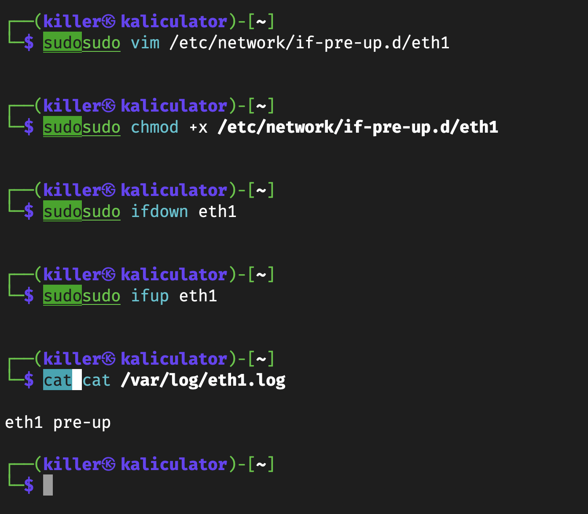

# Лабораторна робота №1

## Тема

Мережеві конфігураційні файли в операційних системах на основі Debian

## Мета

Ознайомитись з мережевими конфігураційними файлами в операційних системах на основі Debian, навчитись налаштовувати мережу з використанням консольного текстового редактору Vim.

## Автор

Молчанов Михайло Валерійович, ІА-12

## Виконання

### Опис машини

Для виконання завдання я викорстаю свій Kali Linux, до якого я під'єднаюсь за допомогою ssh. Він базується на Debian і використовує ту ж саму файлову структуру, пакунки та команди керування системою. Це дозволяє застосовувати ті самі методи конфігурації системних файлів, які підходять для Debian. В мене чогось автодоповнення неправильно працювало через те що я підключався через zsh, а там налаштування для bash, тому деякі команди будуть починатись з літери, підказки та далі продовжуватись, не звертайте уваги.


### Налаштування інтерфейсу

#### Створення фіктивного інтефейсу

Додамо фіктивний інтерфейс, на якому будемо експерементувати, за допомогою команди `ip link add eth1 type dummy`


Як бачимо, після виконання команди помилок не було, отже його було створено успішно.

#### Увімкнення інтерфейсу

Тепер увімкнемо наш фіктивний інтерфейс за допомогою команди:

```bash
sudo ip link set eth1 up
```

Після цього перевіримо його статус командою:

```bash
ip link show eth1
```

Якщо інтерфейс увімкнено успішно, ми побачимо статус **UP**.



Бачимо що намисано статус **UP**, отже його було увімкнено успішно.

#### Додавання конфігурації для інтерфейсу

Для цього відкриємо та налаштуємо файл `/etc/network/interfaces`, щоб додати статичну IP-конфігурацію для інтерфейсу `eth1`.

Виконємо наступну команду для редагування конфігураційного файлу:

```bash
sudo vim /etc/network/interfaces
```

Додаємо наступні рядки:

```bash
allow-hotplug eth1
iface eth1 inet static
    address 10.1.1.125
    netmask 255.0.0.0
    gateway 10.1.1.1
```


Після внесення змін, зберігаємо зміни та виходимо(я використовую vim вже 4 роки, тому пояснювати його не буду)

Після цього перезавантажимо мережевий сервіс командою:

```bash
sudo service networking restart
```


#### Перевірка конфігурації інтерфейсу

Щоб переконатися, що інтерфейс `eth1` має правильну конфігурацію IP-адреси, виконаємо наступну команду:

```bash
ip a show eth1
```

Ця команда покаже деталі налаштувань для інтерфейсу `eth1`, включно з IP-адресою, мережевою маскою та іншими параметрами.


Як бачимо на рисунку, інтерфейс отримав IP-адресу `10.1.1.125/8`, а також має відповідні параметри мережевої маски та широкомовної адреси.

#### Перевірка підключення до мережі

Спробуємо пропінгувати публічний DNS-сервер Google `8.8.8.8`. Виконаємо команду:

```bash
ping -c 3 8.8.8.8
```

Як бачимо на рисунку, усі пакети були втрачені, що вказує на проблему з маршрутизацією.


#### Перевірка таблиці маршрутизації

Перевіримо таблицю маршрутизації, щоб зрозуміти, через який інтерфейс проходить маршрут за замовчуванням. Для цього використаємо команду:

```bash
ip route show
```

Як бачимо, за замовчуванням використовується інтерфейс `eth0` з метрикою 600, що може створювати конфлікт з інтерфейсом `eth1`.


#### Додавання метрики для інтерфейсу `eth1`

Щоб виправити цю проблему, додамо параметр метрики для інтерфейсу `eth1`. Відкриємо файл `/etc/network/interfaces` і додамо наступний рядок:

```bash
metric 700
```



Після цього збережемо зміни і перезапустимо мережевий сервіс командою:

```bash
sudo service networking restart
```

#### Повторна перевірка таблиці маршрутизації

Після внесення змін перевіримо таблицю маршрутизації знову:

```bash
ip r s
```


Як бачимо, тепер маршрутизація відбувається коректно через інтерфейс `eth1`.

#### Повторна перевірка підключення

Після внесення змін виконаємо команду пінгу знову:

```bash
ping -c 3 8.8.8.8
```

Як бачимо, тепер пакети успішно проходять, і втрат пакетів немає.


### Налаштування скріптів

#### Налаштування скрипта для інтерфейсу `eth1`

Для налаштування скрипта, який виконується перед підключенням інтерфейсу `eth1`, створимо скрипт у директорії `/etc/network/if-pre-up.d/eth1`.

Виконаємо команду для створення та редагування скрипта:

```bash
sudo vim /etc/network/if-pre-up.d/eth1
```

Додаємо наступний вміст:

```bash
#!/bin/sh
if [ "$IFACE" = eth1 ]; then
    echo "eth1 pre-up" >> /var/log/eth1.log
fi
```

Після збереження скрипта надамо йому права на виконання:

```bash
sudo chmod +x /etc/network/if-pre-up.d/eth1
```

#### Перевірка роботи скрипта

Щоб перевірити роботу скрипта, виконаємо команди для вимкнення та ввімкнення інтерфейсу `eth1`:

```bash
sudo ifdown eth1
sudo ifup eth1
```

Після цього перевіримо вміст лог-файлу:

```bash
cat /var/log/eth1.log
```

Як бачимо, скрипт успішно записав рядок `eth1 pre-up` у лог-файл після підключення інтерфейсу.



### Блокування ICMP пакетів

Заборонимо ICMP пакети, щоб система не відповідала на пінги. Для цього потрібно змінити значення відповідного параметра в системному файлі `/proc/sys/net/ipv4/icmp_echo_ignore_all`.

Перевіримо поточне значення параметра:

```bash
cat /proc/sys/net/ipv4/icmp_echo_ignore_all
```

За замовчуванням значення параметра має бути `0`, що означає дозволені ICMP пакети.


#### Зміна значення параметра

Щоб заблокувати ICMP пакети, змінимо значення параметра на `1`. Виконаємо наступну команду:

```bash
sudo bash -c 'echo 1 > /proc/sys/net/ipv4/icmp_echo_ignore_all'
```

Після цього перевіримо, що значення параметра змінилось на `1`:

```bash
cat /proc/sys/net/ipv4/icmp_echo_ignore_all
```


#### Перевірка блокування ICMP пакетів

Тепер спробуємо виконати пінг, щоб переконатися, що система більше не відповідає на ICMP пакети:

```bash
ping 127.0.0.1
```

Я почекав хвилини 2, та жоден пакет не прийшо, що свідчить про їх успішне блокування.


### Зміна значення TTL параметра IPv4

Перевизначимо значення TTL (time to live) для пакетів IPv4, змінивши параметр `ip_default_ttl`. Це значення визначає, скільки хопів (вузлів) можуть пройти пакети до їхнього відкидання.

Спочатку перевіримо поточне значення параметра TTL:

```bash
cat /proc/sys/net/ipv4/ip_default_ttl
```


#### Аналіз трафіку за допомогою `tcpdump`

Для перевірки того, що пакети надсилаються із зазначеним значенням TTL, використаємо інструмент `tcpdump`. Спочатку виконаємо пінг і зафіксуємо трафік:

```bash
sudo tcpdump -nvi wlan0 host 8.8.8.8 and icmp
```

Як бачимо, пакети надсилаються з TTL `64`.


#### Зміна значення TTL

Змінимо значення TTL на `118`, виконавши наступну команду:

```bash
sudo bash -c 'echo "118" > /proc/sys/net/ipv4/ip_default_ttl'
```

Після цього перевіримо, що значення TTL було змінено:

```bash
cat /proc/sys/net/ipv4/ip_default_ttl
```


#### Перевірка результату після зміни

Після зміни TTL виконаємо пінг знову і проаналізуємо трафік за допомогою `tcpdump`:

```bash
sudo tcpdump -nvi wlan0 host 8.8.8.8 and icmp
```

Як бачимо, тепер пакети надсилаються з TTL `118`.


---

### Контрольні запитання

#### Які мережеві конфігураційні файли існують

- `/etc/network/interfaces` — основний файл конфігурації інтерфейсів
- `/etc/network/interfaces.d/` — директорія для додаткових файлів конфігурацій
- `/etc/hostname` — файл, який містить назву хоста
- `/etc/resolv.conf` — файл налаштувань DNS
- `/etc/hosts` — файл для локального відображення IP-адрес у доменні імена

#### Опишіть процес конфігурування інтерфейсу

Процес конфігурування мережевого інтерфейсу полягає в тому, щоб додати відповідну конфігурацію у файл `/etc/network/interfaces` або у файли в директорії `/etc/network/interfaces.d/`. Для статичної конфігурації потрібно вказати тип підключення (`static`), IP-адресу, маску підмережі та шлюз. Для динамічної конфігурації використовується DHCP. Після внесення змін інтерфейс можна активувати командою `ifup` або перезавантажити мережевий сервіс.

#### Яка відмінність між ключовими словами auto/allow-hotplug при конфігуруванні інтерфейсу

- `auto` — інтерфейс піднімається автоматично під час завантаження системи.
- `allow-hotplug` — інтерфейс піднімається автоматично тільки тоді, коли система виявляє підключення пристрою.

#### Для чого можуть бути корисні скрипти, які знаходяться в if-pre-up (та аналогічних директоріях)

Скрипти в директоріях `if-pre-up`, `if-up`, `if-post-down`, та інших дозволяють виконувати певні команди на різних етапах роботи інтерфейсу:

- `if-pre-up` — скрипти, які виконуються перед підйомом інтерфейсу.
- `if-up` — скрипти, які виконуються після підйому інтерфейсу.
- `if-post-down` — скрипти, які виконуються після вимкнення інтерфейсу.

Це корисно для налаштування додаткових функцій, таких як налаштування мережевих служб, моніторинг або логування подій.

#### Опишіть будь-які 5 опцій, які знаходяться в директорії /proc/sys/net/ipv4

- `ip_forward` — вмикає або вимикає форвардинг пакетів між інтерфейсами.
- `icmp_echo_ignore_all` — блокує або дозволяє відповіді на ICMP echo (ping).
- `tcp_syncookies` — вмикає використання SYN cookies для захисту від SYN-флуд атак.
- `ip_default_ttl` — визначає значення TTL за замовчуванням для IPv4 пакетів.
- `conf/all/rp_filter` — налаштовує зворотну перевірку шляхів для всіх інтерфейсів.

#### Чи збережуться зміни в файлах директорії /proc/sys/net/ipv4 після перезавантаження системи?

Зміни в директорії `/proc/sys/net/ipv4` є тимчасовими і зникнуть після перезавантаження системи. Щоб зберегти ці зміни назавжди, їх потрібно додати до файлу `/etc/sysctl.conf` або до окремих конфігураційних файлів у директорії `/etc/sysctl.d/`, після чого застосувати командою `sysctl -p`.

## Висновок

На цій лабораторній роботі я ознайомився з мережевими конфігураційними файлами в операційних системах на основі Debian, навчився налаштовувати мережу з використанням консольного текстового редактору Vim.
