# Лабораторна робота №2

## Тема

Інструменти конфігурування мережі в Linux системах

## Мета

Ознайомитись з мережевими інструментами в Linux, які використовуються для відладки & налаштування мережі.

## Автор

Молчанов Михайло Валерійович, ІА-12

## Виконання

### Підготовка середовища

#### Створити Dockerfile

Для початку необхідно створити Dockerfile, який базується на образі Ubuntu 20.04 і містить всі необхідні інструменти для роботи з мережею.

```bash
FROM ubuntu:20.04
ARG DEBIAN_FRONTEND=noninteractive
RUN apt-get update && apt-get install -y vim iproute2 iputils-ping \
nmap net-tools ethtool ifupdown \
netcat iptables tcpdump bridge-utils arping
```

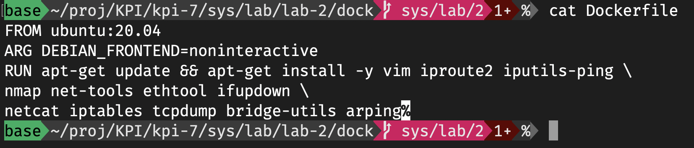

#### Створити docker-compose.yml

Створимо файл `docker-compose.yml`, який описує налаштування для двох контейнерів (host1 і host2), які будуть використовуватись для налаштування та тестування мережевих інструментів. Кожен контейнер буде базуватись на раніше створеному Dockerfile.

```yaml
services:
  host1:
    build:
      context: .
      dockerfile: Dockerfile
    image: mutap_ubuntu
    hostname: host1
    container_name: host1
    tty: true
    networks:
      default:
        ipv4_address: 10.10.0.2
    privileged: true

  host2:
    build:
      context: .
      dockerfile: Dockerfile
    image: mutap_ubuntu
    hostname: host2
    container_name: host2
    tty: true
    networks:
      default:
        ipv4_address: 10.10.0.3
    privileged: true

networks:
  default:
    driver: bridge
    ipam:
      config:
        - subnet: 10.10.0.0/24
```

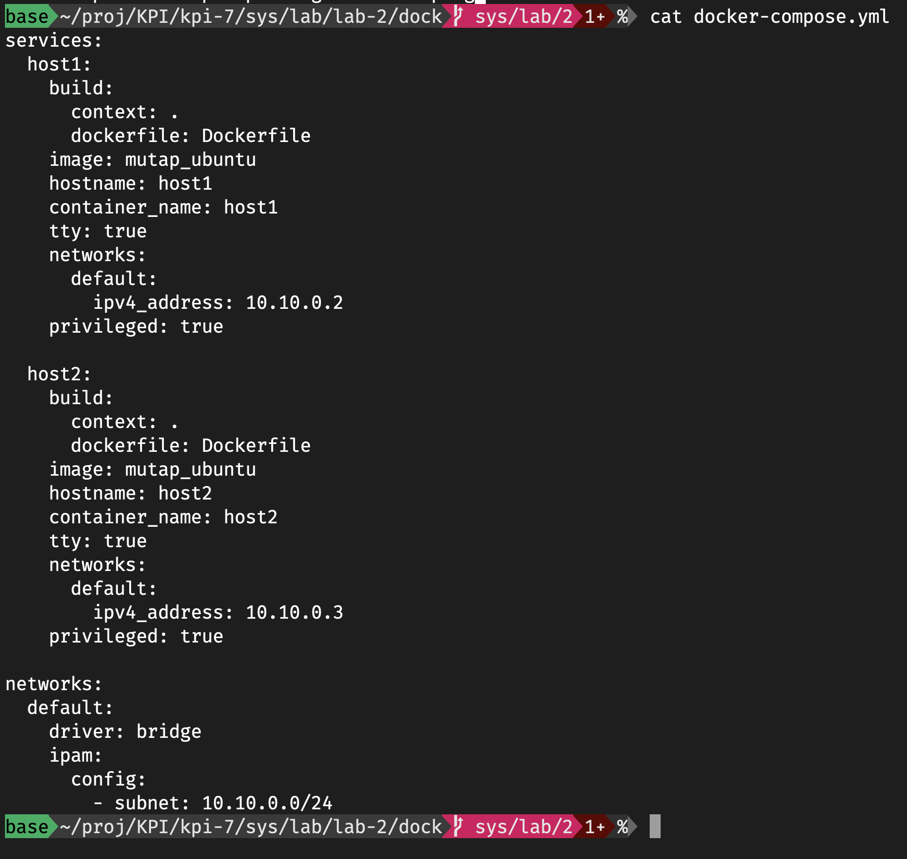

#### Перевірити, що контейнери працюють

Запустимо створені контейнери за допомогою `docker compose`. Для цього виконаємо команду:

```bash
docker compose up -d
```

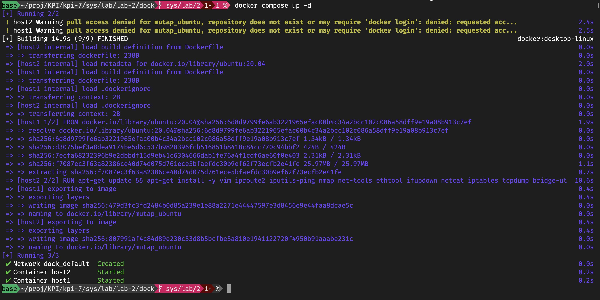

Після цього перевіримо, чи вони працюють, виконавши команду:

```bash
docker compose ps
```

Ця команда покаже статус контейнерів. У разі успішного запуску контейнери host1 і host2 будуть у стані "Up":

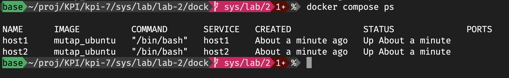

Таким чином, ми успішно запустили обидва контейнери та перевірили їхній статус.

#### Підключитись до контейнеру та спробувати пропінгувати host2

Після успішного запуску контейнерів перевіримо з'єднання між ними. Підключимось до контейнера `host1` та спробуємо пропінгувати контейнер `host2`.

Для цього виконаємо наступні команди:

```bash
docker container exec -ti host1 bash
ping host2
```

Ці команди дозволяють відкрити bash-сесію всередині контейнера `host1` та виконати команду `ping` для перевірки доступності контейнера `host2`.

На скріншоті бачимо успішний результат пінгу:

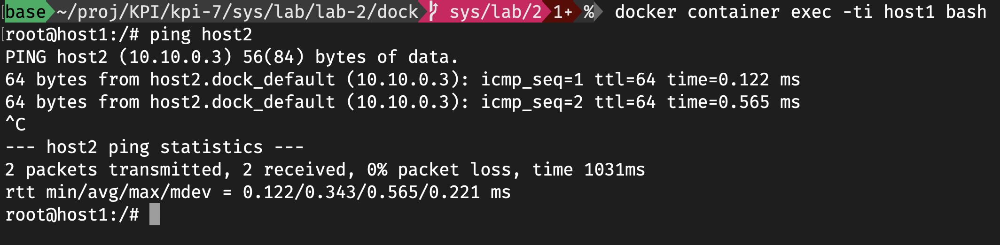

### Налаштування зв'язку вручну

#### Створення бріджів

Щоб налаштувати зв'язок вручну між контейнерами, почнемо з налаштування бріджу та інтерфейсів на `host1`. Для цього виконаємо наступні команди:

```bash
brctl addbr br0
brctl show
ip link add eth1.1 type veth peer name eth1.2
ip a s
```

Після цього побачимо інформацію про брідж `br0` та інтерфейси `eth1.1` та `eth1.2`.

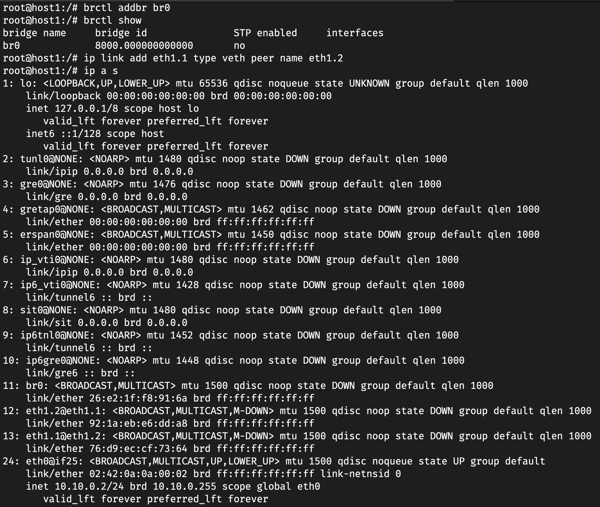

Додамо інтерфейси до бріджу:

```bash
brctl addif br0 eth0
brctl addif br0 eth1.1
brctl show
```

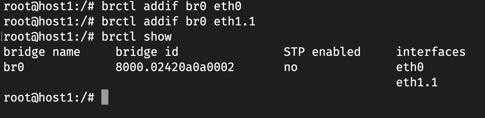

Після налаштування бріджу налаштуємо IP-адреси для інтерфейсів. Додамо IP-адресу до інтерфейсу `eth1.2`:

```bash
ip a a 10.11.0.1/24 dev eth1.2
ip a s eth1.2
```

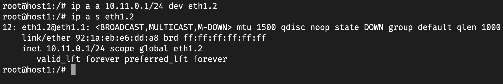

Так само і на іншому хості

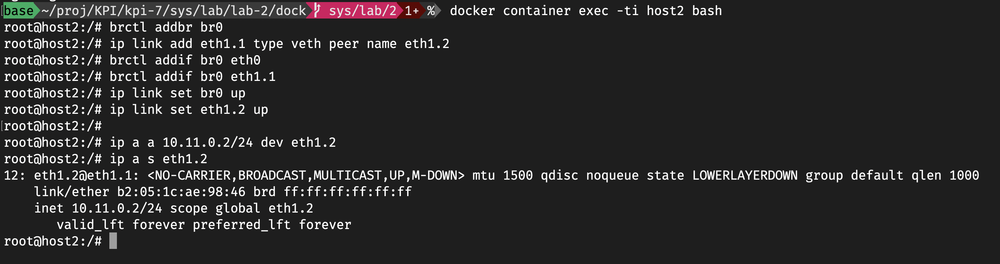

#### Включаємо інтерфейси eth1.1 та eth1.2 в обох контейнерах

Для того, щоб активувати інтерфейси `eth1.1` та `eth1.2` в обох контейнерах, використовуємо наступні команди:

```bash
ip link set eth1.1 up
ip link set eth1.2 up
```

Після цього перевіримо статус активованих інтерфейсів:

```bash
ip a s eth1.1
ip a s eth1.2
```

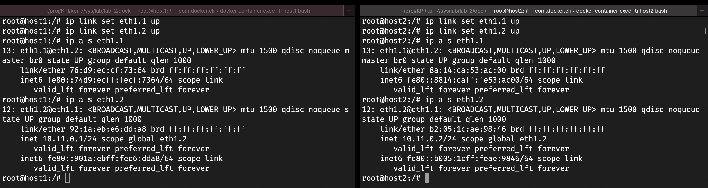

#### Спробуємо пропінгувати 10.11.0.1 з host2

Для того, щоб перевірити з'єднання між контейнерами, спробуємо виконати пінг з контейнера `host2` на адресу `10.11.0.1`, що відповідає інтерфейсу `eth1.2` на `host1`.

```bash
root@host2:/# ping 10.11.0.1
PING 10.11.0.1 (10.11.0.1) 56(84) bytes of data.
From 10.10.0.3 icmp_seq=1 Destination Host Unreachable
From 10.10.0.3 icmp_seq=2 Destination Host Unreachable
From 10.10.0.3 icmp_seq=3 Destination Host Unreachable
```

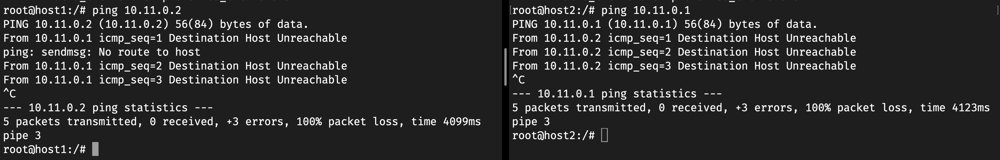

Як видно з результату, пінг до 10.11.0.1 не проходить, оскільки немає маршруту для передачі пакетів між мережевими інтерфейсами.

Для виправлення проблеми потрібно налаштувати відповідну маршрутизацію між контейнерами або перевірити налаштування мережі.

#### Включити брідж на обох контейнерах

Пінг між контейнерами відсутній, оскільки необхідно включити бріджі в обох контейнерах. Для цього виконаємо команду:

```bash
ip link set br0 up
```

Після цього перевіряємо статус бріджа, щоб переконатися, що він увімкнений:

```bash
ip a s br0
```

Як результат, бачимо, що брідж знаходиться в стані `UP`, що вказує на те, що він увімкнений і готовий до використання.

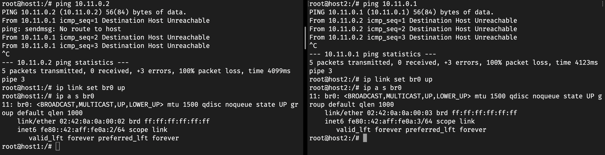

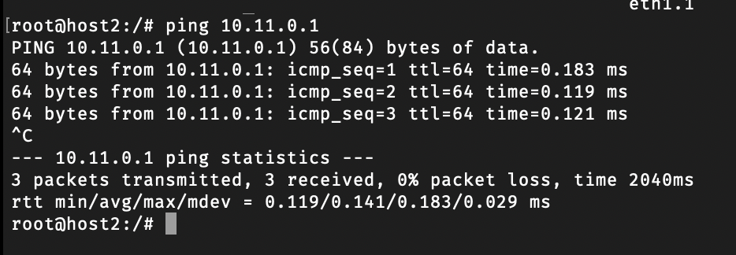

### Блокування icmp

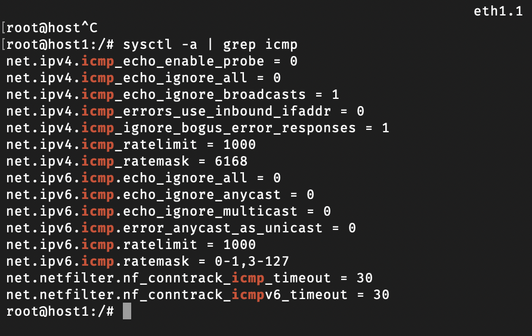

Встановвимо значення 1, щоб заблокувавти всі icmp запити.

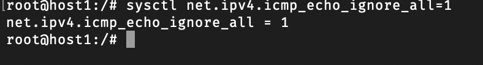

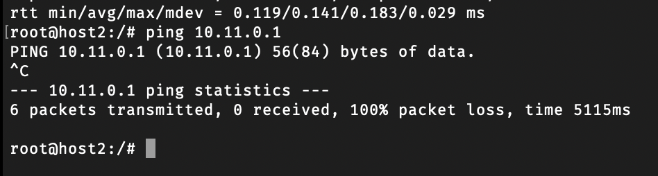

### Використання веб серверу

Створемо файл зі сторінкою

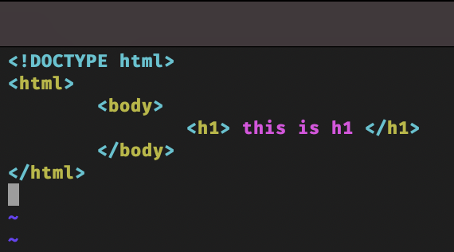

І створимо скріпт для хосту

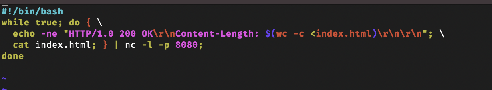

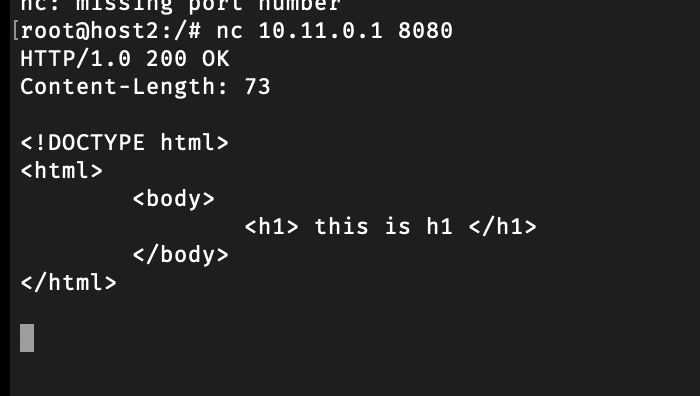

## Висновок

На цій лабораторній роботі я ознайомися з мережевими інструментами в Linux, які використовуються для відладки & налаштування мережі.
