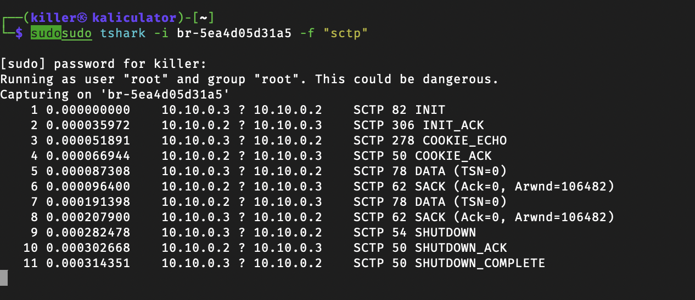
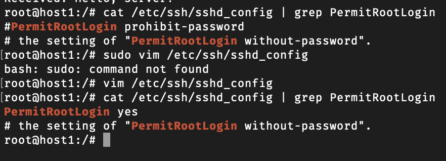
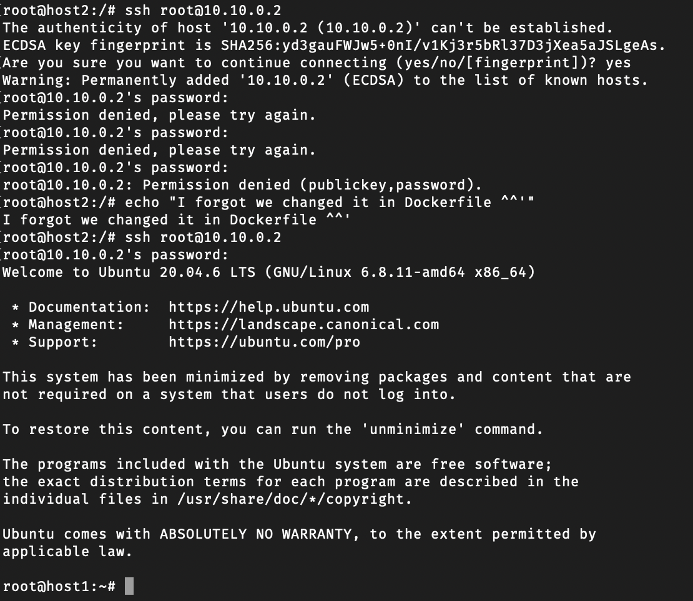
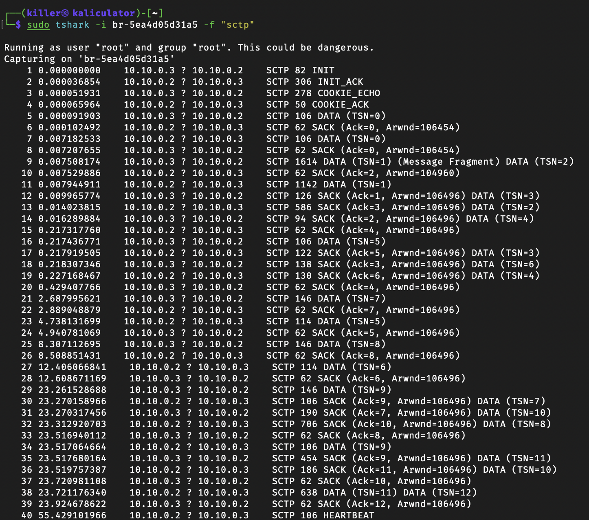
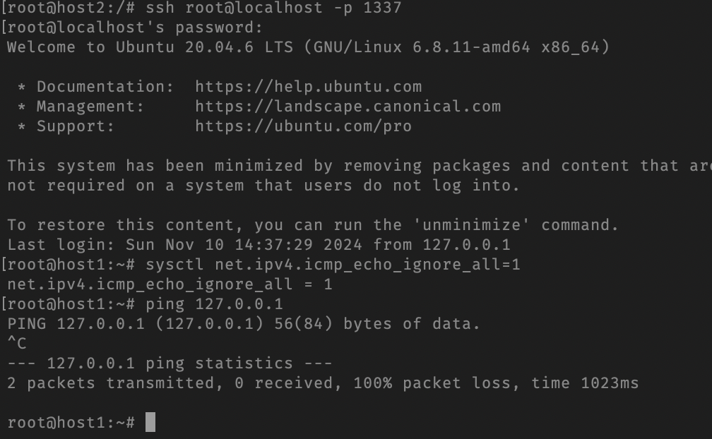

# Лабораторна робота №2

## Тема

Віддалене налаштування мережі з використанням SSH-over-SCTP

## Мета

Розібрати протокол SCTP, його переваги у порівнянні з TCP; навчитися встановлювати SSH з’єднання.

## Автор

Молчанов Михайло Валерійович, ІА-12

## Виконання

### Налаштування середовища

Налаштуємо середовище, щоб ми могли виконати лабораторну роботу. Для цього ми створимо Docker-контейнери із необхідними інструментами.

#### Dockerfile

Для налаштування середовища створимо Dockerfile, який встановить всі необхідні утиліти та налаштування для запуску контейнерів.

```Dockerfile
FROM ubuntu:20.04
ARG DEBIAN_FRONTEND=noninteractive
RUN apt-get update && apt-get install -y vim iproute2 iputils-ping \
    nmap net-tools ethtool ifupdown \
    netcat iptables tcpdump bridge-utils \
    arping socat openssh-server

RUN apt-get install -y python3-pip
RUN pip3 install psutil==0.7.2

RUN echo 'root:12345' | chpasswd
ENTRYPOINT ["/usr/sbin/init"]
```

* У Dockerfile ми:
  * Встановлюємо основні утиліти для роботи з мережею, такі як `nmap`, `netcat`, `tcpdump`, та інші.
  * Встановлюємо `python3-pip` та `psutil` для додаткових можливостей моніторингу.
  * Встановлюємо та налаштовуємо `openssh-server` для підтримки SSH.

#### docker-compose.yml

Далі налаштуємо файл `docker-compose.yml` для створення двох контейнерів, які будуть працювати на віртуальній мережі з певними IP-адресами.

```yaml
services:
  host1:
    build:
      context: .
      dockerfile: Dockerfile
    image: mutap_ubuntu
    hostname: host1
    container_name: host1
    tty: true
    networks:
      default:
        ipv4_address: 10.10.0.2
    privileged: true

  host2:
    build:
      context: .
      dockerfile: Dockerfile
    image: mutap_ubuntu
    hostname: host2
    container_name: host2
    tty: true
    networks:
      default:
        ipv4_address: 10.10.0.3
    privileged: true

networks:
  default:
    driver: bridge
    ipam:
      config:
        - subnet: 10.10.0.0/24
```

### Завдання Отримати дамп з SCTP пакетами

#### Створити скрипт `server.py` на `host1`

Для створення сервера на `host1` напишімо скрипт `server.py`, який відкриває SCTP-з'єднання, чекає підключення клієнта, приймає та відправляє назад отримані дані.

```python
#!/usr/bin/python3.8
import socket
import sctp

server = sctp.sctpsocket_tcp(socket.AF_INET)
server.bind(('0.0.0.0', 12345))
server.listen(1)

print("Server listening ...")
connection, address = server.accept()
print(f"Connected by: {address}")

while True:
    data = connection.recv(1024)
    if not data:
        break
    print(f"Received: {data.decode('utf-8')}")
    connection.send(data)  # Echo the received data

connection.close()
```

*Цей серверний скрипт налаштований на прослуховування порту `12345` та приймає підключення по SCTP. Він отримує дані від клієнта та відправляє їх назад.*

#### Створити скрипт `client.py` на `host2`

На `host2` створімо клієнтський скрипт `client.py`, який підключається до `host1`, відправляє повідомлення та виводить відповідь сервера.

```python
#!/usr/bin/python3.8
import socket
import sctp

client = sctp.sctpsocket_tcp(socket.AF_INET)
client.connect(('10.10.0.2', 12345))

message = "Hello, server!"
client.send(message.encode('utf-8'))

response = client.recv(1024)
print(f"Server Response: {response.decode('utf-8')}")

client.close()
```

Цей клієнтський скрипт підключається до сервера за IP-адресою `10.10.0.2` і відправляє тестове повідомлення "Hello, server!".

#### Запустити Wireshark на прослуховування бриджа

1. Запустімо **Wireshark** на комп’ютері з доступом до мережі контейнерів.
2. Виберімо інтерфейс, що відповідає бриджовій мережі Docker.
3. Задамо фільтр для захоплення лише **SCTP** трафіку.

#### Запустити `server.py`

На `host1` запустімо `server.py`:

```bash
python3 server.py
```

Скрипт почне прослуховування на порту `12345` для вхідних підключень.

#### Запустити `client.py`

На `host2` запустімо `client.py` для підключення до сервера та відправки повідомлення:

```bash
python3 client.py
```

Клієнт відправить повідомлення, яке сервер прийме та відправить назад.

#### Описати процедуру передачі даних з використанням отриманого дампу та зазначенням основних повідомлень



1. **Ініціація з'єднання (Handshake)**:
   * Клієнт (`10.10.0.3`) починає встановлення з'єднання з сервером (`10.10.0.2`) через SCTP, відправляючи пакет `INIT`.
   * Сервер відповідає на `INIT` клієнта пакетом `INIT_ACK`, який підтверджує готовність до встановлення з'єднання.
   * Клієнт відправляє `COOKIE_ECHO` для підтвердження своєї сторони з'єднання.
   * Сервер відповідає `COOKIE_ACK`, завершуючи процес встановлення з'єднання.

2. **Передача даних (Data Transfer)**:
   * Після встановлення з'єднання клієнт (`10.10.0.3`) відправляє дані у вигляді SCTP пакета з позначкою `DATA (TSN=0)` до сервера.
   * Сервер (`10.10.0.2`) підтверджує отримання цього пакета за допомогою `SACK (Ack=0)`, повідомляючи клієнта про успішний прийом даних.
   * Клієнт знову відправляє `DATA (TSN=0)`, а сервер знову підтверджує отримання за допомогою `SACK (Ack=0)`.

3. **Завершення з'єднання (Connection Teardown)**:
   * Коли передача даних завершена, клієнт ініціює завершення з'єднання, відправляючи серверу пакет `SHUTDOWN`.
   * Сервер відповідає `SHUTDOWN_ACK`, підтверджуючи початок завершення з'єднання.
   * Клієнт надсилає `SHUTDOWN_COMPLETE`, після чого обидві сторони закривають з'єднання.

### Налаштувати SSH-over-SCTP

#### Дозволити root login

Відкриймо файл конфігурації SSH `sshd_config` на `host1` та встановімо `PermitRootLogin` на `yes`, щоб дозволити вхід для користувача root.

```bash
cat /etc/ssh/sshd_config | grep PermitRootLogin
# PermitRootLogin prohibit-password
PermitRootLogin yes
```



#### Перезапустити sshd

Перезапустімо службу SSH для застосування змін:

```bash
systemctl restart sshd
systemctl status sshd
```

#### Спробувати підключитись по SSH до host1

Перевірмо можливість підключення до `host1` з `host2` за допомогою SSH:

```bash
ssh root@10.10.0.2
```



#### Прокладати тунель через SCTP

Налаштуймо прослуховування на порту `11111`/SCTP на `host1` та перенаправлення трафіку на порт `22`/TCP, щоб забезпечити SSH-з'єднання через SCTP:

```bash
socat SCTP-LISTEN:11111,fork TCP:localhost:22 &
```

#### Налаштувати порт форвардінг на host2

На `host2` запустімо `socat` для встановлення тунелю з використанням SCTP, щоб перенаправити трафік з локального порту `1337` до порту `11111` на `host1`:

```bash
socat TCP-LISTEN:1337,fork SCTP:10.10.0.2:11111 &
```

#### Запускаємо Wireshark на прослуховування бриджа

Запустімо **Wireshark** для моніторингу трафіку на Docker-інтерфейсі `br-5ea4d05d31a5` та встановимо фільтр для захоплення SCTP-пакетів.

#### Підключаємося по SSH до host1 з host2

Підключімося до `host1` з `host2`, використовуючи порт `1337` для доступу до SSH через SCTP-тунель:

```bash
ssh root@localhost -p 1337
```

#### Перевіряємо, чи дійсно встановлено з’єднання через Wireshark


У **Wireshark** можна побачити обмін SCTP пакетами між `host2` та `host1`, що підтверджує встановлення SSH-з’єднання через SCTP.

#### 3.3.9. Заблокуємо ICMP пакети на host1

На `host1` заблокуємо ICMP (ping) пакети, щоб перевірити, як працює SSH через тунель SCTP:

```bash
sysctl net.ipv4.icmp_echo_ignore_all=1
ping -c 3 localhost
```



### Контрольні запитання

1) **Що таке SCTP?**  
   SCTP (Stream Control Transmission Protocol) — це транспортний протокол, який забезпечує надійну передачу даних. Він поєднує деякі особливості TCP (надійність та контроль потоку) і UDP (підтримка мультимедійного трафіку) та забезпечує багатопоточність, що дозволяє відправляти кілька потоків даних паралельно.

2) **Які ключові відмінності між SCTP та TCP?**  
   * **Багатопоточність**: SCTP підтримує багатопоточність, дозволяючи відправляти кілька незалежних потоків даних у межах одного з'єднання, тоді як TCP працює з одним потоком.
   * **Контроль зв'язності (multi-homing)**: SCTP підтримує використання декількох IP-адрес для одного з'єднання, що підвищує надійність, тоді як TCP використовує одну IP-адресу для кожного з'єднання.
   * **Процес встановлення з'єднання**: SCTP використовує 4-крокову процедуру встановлення з'єднання (четвертний "handshake") для забезпечення більшої безпеки, тоді як TCP використовує 3-крокову процедуру.
   * **Порядок передачі**: SCTP дозволяє передавати повідомлення без жорсткого порядку, що зменшує затримки при втраті окремих пакетів, тоді як TCP гарантує передачу всіх пакетів у строгому порядку.

3) **Чому SCTP не набув широкого використання?**  
   Основними причинами є обмежена підтримка SCTP у мережевому обладнанні, операційних системах та додатках. TCP і UDP стали стандартами інтернет-комунікацій, і більшість мережевих інфраструктур налаштовані на них, що робить перехід до SCTP складним та непрактичним.

4) **Чому є необхідність прокладання тунелю?**  
   Тунелювання може забезпечити додаткову безпеку, обхід мережевих обмежень або несумісність. У випадку з SCTP тунелювання через TCP може знадобитися, коли мережа не підтримує SCTP напряму або блокує його трафік.

5) **Яку роль може відігравати SCTP для задачі конфігурування мережі?**  
   SCTP може забезпечити надійне і багатопотокове передавання даних, що корисно при конфігуруванні складних мережевих структур або у випадках, коли потрібно передавати декілька потоків даних паралельно (наприклад, для віддаленого управління та моніторингу). SCTP також може забезпечити високу надійність за допомогою multi-homing, що знижує ризики відмов у зв'язку.

## Висновок

На цій ларбораторній роботі я розібрав протокол SCTP, його переваги у порівнянні з TCP; навчився встановлювати SSH з’єднання.
