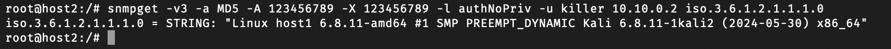

# Лабораторна робота №4

## Тема

Використання SNMP протоколу для керування та моніторингу мережі

## Мета

Отримати навички роботи з протоколом SNMP, його конфігурування та розібрати приклади використання.

## Автор

Молчанов Михайло Валерійович, ІА-12

## Виконання

### Завдання Налаштувати середовище

#### Dockerfile

Для створення середовища для роботи з SNMP, підготуймо Dockerfile, що встановлює всі необхідні пакети для мережевого аналізу та управління, включаючи `snmp`, `snmpd`, та інші утиліти.

```dockerfile
FROM ubuntu:20.04
ARG DEBIAN_FRONTEND=noninteractive
RUN apt-get update && apt-get install -y vim iproute2 iputils-ping \
    nmap net-tools ethtool ifupdown \
    netcat iptables tcpdump bridge-utils \
    arping socat openssh-server python3-pip
RUN echo 'root:12345' | chpasswd
RUN apt-get install -y snmp snmpd libsnmp-dev
ENTRYPOINT ["/usr/sbin/init"]
```

*Цей Dockerfile створює середовище на базі Ubuntu 20.04 з усіма необхідними інструментами для роботи з протоколом SNMP.*

#### docker-compose.yml

Налаштуймо `docker-compose.yml` для запуску двох контейнерів (`host1` і `host2`) у спільній мережі, що дозволить їм взаємодіяти за допомогою SNMP.

```yaml
services:
  host1:
    build:
      context: .
      dockerfile: Dockerfile
    image: mutap_ubuntu
    hostname: host1
    container_name: host1
    tty: true
    networks:
      default:
        ipv4_address: 10.10.0.2
    privileged: true

  host2:
    build:
      context: .
      dockerfile: Dockerfile
    image: mutap_ubuntu
    hostname: host2
    container_name: host2
    tty: true
    networks:
      default:
        ipv4_address: 10.10.0.3
    privileged: true

networks:
  default:
    driver: bridge
    ipam:
      config:
        - subnet: 10.10.0.0/24
```

*Файл `docker-compose.yml` створює два контейнера з фіксованими IP-адресами в підмережі `10.10.0.0/24`, що дозволяє їм комунікувати через протокол SNMP.*

### Запуск середовища

1. Побудуймо образи Docker і запустімо контейнери:

   ```bash
   docker-compose up -d --build
   ```

2. Перевірмо, чи обидва хости (`host1` і `host2`) успішно працюють і готові до подальших налаштувань.

### Налаштування SNMP

#### Створюємо користувача

Щоб забезпечити безпеку при доступі до SNMP, створимо користувача SNMPv3 з автентифікацією і шифруванням.

```bash
net-snmp-config --create-snmpv3-user -A 123456789 -X 123456789 -a MD5 -x AES killer
```

Ця команда створить користувача `killer` з паролями для автентифікації (`-A`) та шифрування (`-X`).


#### Робимо сервіс доступним на всіх інтерфейсах

Змінимо конфігурацію SNMP, щоб зробити сервіс доступним на всіх інтерфейсах.

Відкриймо файл `/etc/snmp/snmpd.conf` і змінімо параметр `agentaddress`, закоментувавши `127.0.0.1` та додавши `udp:161`.

```plaintext
#agentaddress 127.0.0.1,[::1]
agentaddress udp:161
```


#### Перезапускаємо сервіс та перевіряємо статус

Після змін у конфігурації перезапустимо SNMP-сервер і переконаємося, що він працює.

```bash
systemctl restart snmpd
systemctl status snmpd
```

Сервіс має бути в стані `active (running)`.


### Команди для роботи з SNMP на host2

#### Читання всіх параметрів

На `host2` виконаємо команду `snmpwalk`, щоб отримати всі параметри з `host1`.

```bash
snmpwalk -v3 -a MD5 -A 123456789 -X 123456789 -l authNoPriv -u killer 10.10.0.2
```

#### Читання інформації про операційну систему

```bash
snmpget -v3 -a MD5 -A 123456789 -X 123456789 -l authNoPriv -u killer 10.10.0.2 iso.3.6.1.2.1.1.1.0
```



#### Читання інформації про IP-адреси

```bash
snmpwalk -v3 -a MD5 -A 123456789 -X 123456789 -l authNoPriv -u killer 10.10.0.2 iso.3.6.1.2.1.4.20.1.1
```


#### Читання процесів

```bash
snmpwalk -v3 -a MD5 -A 123456789 -X 123456789 -l authNoPriv -u killer 10.10.0.2 iso.3.6.1.2.1.25.4.2.1.4
```


#### Встановлення `snmp-mibs-downloader`

Для зручності читання MIBs виконаємо команду:

```bash
apt-get install snmp-mibs-downloader
sed -i 's/mibs :/# mibs :/g' /etc/snmp/snmp.conf
snmptranslate iso.3.6.1.2.1.4.1.0
```


#### Призначення alias

Призначимо alias для інтерфейсу:

```bash
snmpset -v3 -a MD5 -A 123456789 -X 123456789 -l authNoPriv -u killer 10.10.0.2 IF-MIB::ifAlias.1 s "hello"
```


#### Зміна імені хосту

```bash
snmpset -v3 -a MD5 -A 123456789 -X 123456789 -l authNoPriv -u killer 10.10.0.2 SNMPv2-MIB::sysName.0 s "host3"
```


Ці команди завершують налаштування SNMP і демонструють можливості управління мережею за допомогою SNMP.

### Контрольні запитання

1) **Що таке SNMP?**  
   SNMP (Simple Network Management Protocol) — це мережевий протокол для управління та моніторингу пристроїв у мережі, таких як маршрутизатори, комутатори, сервери та інші мережеві елементи. Він дозволяє адміністраторам отримувати інформацію про стан мережевих пристроїв і змінювати їх конфігурацію.

2) **Яка різниця між MIB та OID?**  
   - **MIB** (Management Information Base) — це база даних, яка описує структуру ієрархії керованих об'єктів у мережі, що підтримуються SNMP. Вона містить набір об'єктів, які можуть бути контрольовані або моніторені.
   - **OID** (Object Identifier) — це унікальний ідентифікатор конкретного об'єкта в MIB. Він представляє адресу в ієрархічній структурі MIB, за допомогою якої можна отримати доступ до певної змінної або ресурсу на пристрої.

3) **Як розшифрувати MIB iso.3.6.1.2?**  
   - `iso` (1) — початок ієрархії OID.
   - `3` — організація (org).
   - `6` — DOD (Department of Defense).
   - `1` — інтернет (internet).
   - `2` — об'єкти, що керуються управлінням (mgmt).

   Отже, `iso.3.6.1.2` відповідає гілці управління мережею в ієрархії MIB.

4) **Назвіть будь-які 3 SNMP команди та поясніть їх призначення**  
   - **GET** — використовується для отримання значення певного OID з MIB, щоб дізнатися стан об'єкта або змінної.
   - **SET** — використовується для встановлення значення певного OID, дозволяючи змінювати конфігурацію або властивості об'єкта.
   - **WALK** — виконує "проходження" по OID і отримує значення кількох змінних, що починаються з певного OID, дозволяючи отримати великий обсяг інформації з MIB.

5) **Які ключові відмінності між SNMPv1, SNMPv2c та SNMPv3?**  
   - **SNMPv1** — перша версія SNMP, яка використовує прості спільні паролі (community strings) для доступу та має низький рівень безпеки.
   - **SNMPv2c** — вдосконалена версія, яка підтримує bulk transfer для швидшого отримання даних, але також використовує спільні паролі для автентифікації, що робить її менш захищеною.
   - **SNMPv3** — найновіша версія, яка додає вдосконалені засоби безпеки, такі як автентифікація та шифрування. Вона підтримує повний контроль доступу і є більш безпечною порівняно з попередніми версіями.

## Висновок

На цій рабораторній роботі я отримав навички роботи з протоколом SNMP, його конфігурування та розібрав приклади використання.
