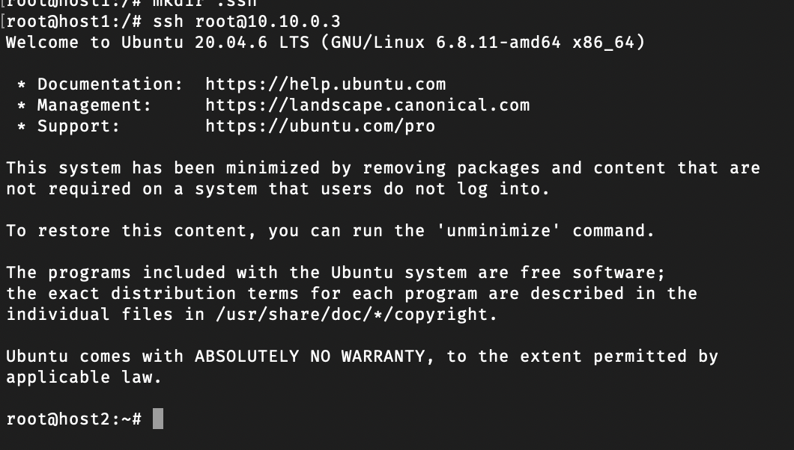

# Лабораторна робота №5

## Тема

Віддалене конфігурування мережі з використанням Ansible

## Мета

Отримати навички конфігурування мережі із використанням Ansible, навчитися створювати playbooks.

## Автор

Молчанов Михайло Валерійович, ІА-12

## Виконання

### Налаштувати середовище

#### Dockerfile

```Dockerfile
FROM ubuntu:20.04
ARG DEBIAN_FRONTEND=noninteractive
RUN apt-get update && apt-get install -y vim iproute2 iputils-ping \
    nmap net-tools ethtool ifupdown \
    netcat iptables tcpdump bridge-utils \
    arping

RUN apt-get install -y python3-pip
RUN apt-get install -y openssh-server
RUN echo 'root:12345' | chpasswd
RUN apt-get install -y software-properties-common network-manager

ENTRYPOINT ["/usr/sbin/init"]
```

#### docker-compose.yml

```yaml
services:
  host1:
    build:
      context: .
      dockerfile: Dockerfile
    image: mutap_ubuntu
    hostname: host1
    container_name: host1
    tty: true
    networks:
      default:
        ipv4_address: 10.10.0.2
    privileged: true

  host2:
    build:
      context: .
      dockerfile: Dockerfile
    image: mutap_ubuntu
    hostname: host2
    container_name: host2
    tty: true
    networks:
      default:
        ipv4_address: 10.10.0.3
    privileged: true

networks:
  default:
    driver: bridge
    ipam:
      config:
        - subnet: 10.10.0.0/24
```

### Завдання Налаштування Ansible

Додамо офіційний PPA проекту в список джерел системи:

```bash
apt-add-repository ppa:ansible/ansible
apt-get update
```


Встановимо Ansible:

```bash
apt-get install ansible
```

Додамо інформацію про вузли:

Відкриваємо файл `/etc/ansible/hosts` і додаємо наступну інформацію:

```plaintext
[servers]
server1 ansible_host=10.10.0.3

[all:vars]
ansible_python_interpreter=/usr/bin/python3
```


Перевіримо конфігурацію:

```bash
ansible-inventory --list -y
```


Пробуємо пропінгувати `host2`:

```bash
ansible all -m ping -u root
```


#### Конфігурація SSH по ключу

1. Створюємо SSH ключі на `host1`:

   ```bash
   ssh-keygen
   ```

   

2. Додаємо публічний ключ з `host1` до `authorized_keys` на `host2`:

   ```bash
   cat ~/.ssh/id_rsa.pub | ssh root@10.10.0.3 "cat >> ~/.ssh/authorized_keys"
   ```

3. Змінюємо деякі опції в `sshd_config` на `host2`:

   Відкриваємо `/etc/ssh/sshd_config` на `host2` і змінюємо:

   ```plaintext
   PermitRootLogin yes
   PasswordAuthentication no
   ```

   Після цього перезапускаємо службу `sshd`:

   ```bash
   systemctl restart sshd
   ```

4. Підключаємося по SSH з `host1` до `host2` для перевірки:

   ```bash
   ssh root@10.10.0.3
   ```

   

5. Перевіряємо зв’язок знову:

   ```bash
   ansible all -m ping -u root
   ansible all -a "df -h" -u root
   ```

   

Цей розділ дозволяє налаштувати Ansible для віддаленого конфігурування серверів через SSH, забезпечуючи автоматизацію і зручність у налаштуванні мережевих параметрів.

### Завдання Налаштування файлу interfaces

#### Додаємо інтерфейс eth1 та його конфігурацію в interfaces

Щоб додати новий інтерфейс `eth1`, виконаємо наступні команди:

```bash
ip link add eth1 type dummy
vim /etc/network/interfaces
```

Додаємо вміст конфігурації для інтерфейсу `eth1`:

```
allow-hotplug eth1
iface eth1 inet static
    address 10.1.1.125
    netmask 255.0.0.0
    gateway 10.1.1.1
```

#### Створюємо playbook

Щоб автоматизувати налаштування мережевої конфігурації, створимо playbook з назвою `playbook.yml`. Він виконує такі завдання:

- Оновлює IP-адресу інтерфейсу
- Оновлює маску підмережі
- Перезапускає мережевий сервіс після внесення змін

```yaml
- name: Automated operations
  hosts: all
  vars:
    new_ip_address: 10.1.1.128
    netmask: 255.255.0.0
  tasks:
    - name: Update network config file
      ansible.builtin.lineinfile:
        path: /etc/network/interfaces
        regexp: '.+address.+'
        line: '    address {{ new_ip_address }}'
      notify:
        - Restart Network Service

    - name: Update netmask
      ansible.builtin.lineinfile:
        path: /etc/network/interfaces
        regexp: '.+netmask.+'
        line: '    netmask {{ netmask }}'
      notify:
        - Restart Network Service

  handlers:
    - name: Restart Network Service
      ansible.builtin.service:
        name: networking
        state: restarted
```


#### Запускаємо на виконання playbook

Для виконання playbook використаємо команду:

```bash
ansible-playbook playbook.yml -l server1 -u root -k
```

Очікуваний результат виконання:

```
PLAY [Automated operations] ***************************************************

TASK [Gathering Facts] *********************************************************
ok: [server1]

TASK [Update network config file] **********************************************
changed: [server1]

TASK [Update netmask] **********************************************************
changed: [server1]

RUNNING HANDLER [Restart Network Service] **************************************
changed: [server1]

PLAY RECAP *********************************************************************
server1                    : ok=4    changed=3    unreachable=0    failed=0    skipped=0    rescued=0    ignored=0
```


Цей playbook автоматизує процес налаштування мережі, роблячи його зручним для масштабованого конфігурування в середовищах з багатьма вузлами.

### Завдання Налаштування інтерфейсу eth1

Для видалення конфігурації інтерфейсу `eth1` з файлу `interfaces` та самого інтерфейсу `eth1` на `host2`, виконаємо наступне:

1. **Видалимо запис про `eth1` у файлі `/etc/network/interfaces`** на `host2`.

   ```bash
   # Відкриваємо файл для редагування
   vim /etc/network/interfaces

   # Знаходимо і видаляємо конфігурацію для eth1
   ```

2. **Видаляємо сам інтерфейс `eth1`**:

   ```bash
   ip link delete eth1
   ```

### Створюємо playbook для налаштування інтерфейсу eth1 на `host2`

Playbook для створення інтерфейсу `eth1`, додавання IP-адреси, блокування ICMP та перевірки кожного кроку.

#### Playbook: `configure_eth1.yml`

```yaml
- name: Automated operations
  hosts: all
  vars:
    new_ip_address: 10.11.0.2
    gateway: 10.11.0.1
  tasks:
    - name: Create eth1
      ansible.builtin.shell: |
        ip link add eth1 type dummy
      args:
        executable: /bin/bash

    - name: Check existance of eth1
      ansible.builtin.shell: |
        ip link show eth1 &> /dev/null
        if [ $? -eq 0 ]; then
          echo "Interface exists"
          exit 0
        else
          echo "Interface does not exist"
          exit 1
        fi
      args:
        executable: /bin/bash

    - name: Add IPv4 address to the eth1
      ansible.builtin.shell: |
        ip addr add 10.11.0.2/24 dev eth1
      args:
        executable: /bin/bash

    - name: Check existance of IPv4 address on eth1
      ansible.builtin.shell: |
        if [ $(ip -o -4 addr show dev eth1 | wc -l) -gt 0 ]; then
          echo "Interface has an IP address"
          exit 0
        else
          echo "Interface does not have an IP address"
          exit 1
        fi
      args:
        executable: /bin/bash

    - name: Block ICMP
      ansible.builtin.shell: |
        bash -c "echo 1 > /proc/sys/net/ipv4/icmp_echo_ignore_all"
      args:
        executable: /bin/bash

    - name: Check ICMP is blocked
      ansible.builtin.shell: |
        if [[ $(cat /proc/sys/net/ipv4/icmp_echo_ignore_all) -eq "1" ]]; then
          echo "Pinging is blocked"
          exit 0
        else
          echo "Pinging is not blocked"
          exit 1
        fi
      args:
        executable: /bin/bash
```

### Переконуємося, що інтерфейс `eth1` на `host2` сконфігуровано

Запускаємо `ansible-playbook configure_eth1.yml` і перевіряємо результат виконання для впевненості, що всі етапи конфігурації пройшли успішно.


### Контрольні питання

1) **Що таке Ansible?**
   Ansible — це інструмент для автоматизації, який використовується для управління конфігураціями, автоматизації розгортання додатків, а також для оркестрації ІТ-інфраструктури. Ansible працює без агентів, використовуючи SSH для підключення до вузлів, що робить його легким у налаштуванні та використанні.

2) **Як встановити Ansible на Linux?**
   Щоб встановити Ansible на Linux, можна скористатися такими командами:
   - Додати репозиторій: `sudo add-apt-repository ppa:ansible/ansible`
   - Оновити список пакетів: `sudo apt-get update`
   - Встановити Ansible: `sudo apt-get install ansible`

3) **Що таке playbook?**
   Playbook — це файл YAML, що містить сценарії для автоматизації завдань в Ansible. У playbook визначаються завдання, які слід виконати на певних вузлах, а також конфігурації і дії для досягнення бажаного стану системи.

4) **Який процес створення playbook?**
   - Визначте мету автоматизації.
   - Створіть файл з розширенням `.yml`.
   - Додайте до playbook опис вузлів, на яких він буде виконуватись (hosts).
   - Окресліть змінні (vars) та завдання (tasks), які необхідно виконати.
   - Запустіть playbook за допомогою команди `ansible-playbook <ім'я_playbook.yml>`.

5) **Для автоматизації чого б ви використовували Ansible?**
   Ansible можна використовувати для автоматизації розгортання додатків, управління конфігураціями серверів, налаштування мережевого обладнання, оркестрації контейнерів, а також для забезпечення відповідності політикам безпеки та оновлення програмного забезпечення на серверах.

## Висновок

На цій лабораторній роботі я отримав навички конфігурування мережі із використанням Ansible, навчився створювати playbooks.
