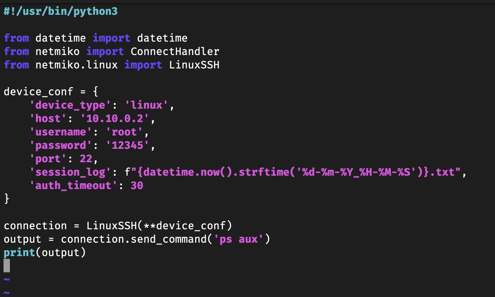
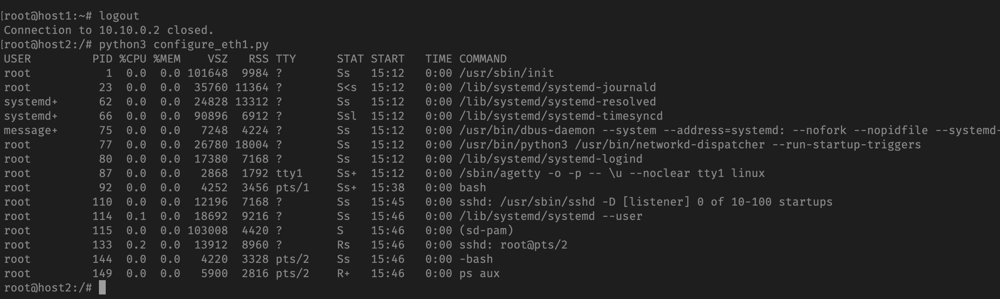
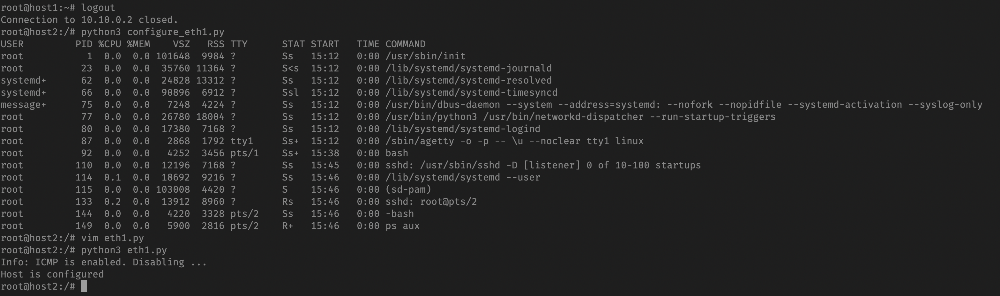
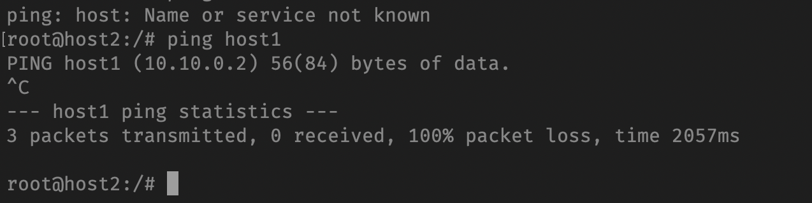

# Лабораторна робота №6

## Тема

Віддалене конфігурування мережі з використанням Netmiko

## Мета

Отримати навички конфігурування мережі із використанням Netmiko.

## Автор

Молчанов Михайло Валерійович, ІА-12

## Виконання

### Налаштувати середовище

#### Dockerfile

```plaintext
$ cat Dockerfile
FROM ubuntu:20.04
ARG DEBIAN_FRONTEND=noninteractive
RUN apt-get update && apt-get install -y vim iproute2 iputils-ping \
    nmap net-tools ethtool ifupdown \
    netcat iptables tcpdump bridge-utils \
    arping

RUN apt-get install -y python3-pip

RUN apt-get install -y openssh-server
RUN echo 'root:12345' | chpasswd

RUN pip3 install NetMiko==3.4.0

ENTRYPOINT ["/usr/sbin/init"]
```

#### docker-compose.yml

```plaintext
$ cat docker-compose.yml
services:
  host1:
    build:
      context: .
      dockerfile: Dockerfile
    image: mutap_ubuntu
    hostname: host1
    container_name: host1
    tty: true
    networks:
      default:
        ipv4_address: 10.10.0.2
    privileged: true

  host2:
    build:
      context: .
      dockerfile: Dockerfile
    image: mutap_ubuntu
    hostname: host2
    container_name: host2
    tty: true
    networks:
      default:
        ipv4_address: 10.10.0.3
    privileged: true

networks:
  default:
    driver: bridge
    ipam:
      config:
        - subnet: 10.10.0.0/24
```

У цьому розділі було створено середовище для подальшої роботи з використанням Docker та Docker Compose.

### Взаємодія із сервером

#### Створимо скрипт, який підключається до host1 з host2 та отримує список процесів

```python
#!/usr/bin/python3

from datetime import datetime
from netmiko import ConnectHandler
from netmiko.linux import LinuxSSH

# This won't work guys, I would never let something like this happen, you gotta look harder!
device_conf = {
    'device_type': 'linux',
    'host': '10.10.0.2',
    'username': 'root',
    'password': '12345',
    'port': 22,
    'session_log': f"{datetime.now().strftime('%d-%m-%Y_%H-%M-%S')}.txt",
    'auth_timeout': 30
}

connection = LinuxSSH(**device_conf)
output = connection.send_command('ps aux')
print(output)
```



#### Запускаємо скрипт і повинні отримати наступний вивід

```
USER       PID %CPU %MEM    VSZ   RSS TTY      STAT START   TIME COMMAND
root         1  0.0  0.0 167252 10700 ?        Ss   09:27   0:00 /usr/sbin/init
root        23  0.0  0.0  35764 12176 ?        Ss   09:27   0:00 /lib/systemd/systemd-journald
...
```

Треба було дозволити логін під рутом на host1



Скрипт підключається до `host1`, виконує команду `ps aux` для отримання інформації про процеси та виводить результати на екран.

### Налаштування eth1 та відключення ICMP

#### Підготовка скрипту

Для автоматизації процесу налаштування інтерфейсу eth1 та відключення ICMP використовуємо наступний Python-скрипт `configure_eth1.py`, який виконується через SSH за допомогою бібліотеки `Netmiko`:

```python
#!/usr/bin/python3
from datetime import datetime
from netmiko import ConnectHandler
from netmiko.linux import LinuxSSH

device_conf = {
    'device_type': 'linux',
    'host': '10.10.0.2',
    'username': 'root',
    'password': '12345',
    'port': 22,
    'session_log': f"{datetime.now().strftime('%d-%m-%Y_%H-%M-%S')}.txt",
    'auth_timeout': 30
}

connection = LinuxSSH(**device_conf)
connection.send_command('ip link add eth1 type dummy')

output = connection.send_command('ip link show eth1')
if 'does not exist' in output:
    print('Error: could not create eth1')
    exit(1)

connection.send_command('ip addr add 10.11.0.2/24 dev eth1')
output = connection.send_command('ip addr show eth1')
if '10.11.0.2' not in output:
    print('Error: could not set 10.11.0.2 to the eth1')
    exit(1)

output = connection.send_command('cat /proc/sys/net/ipv4/icmp_echo_ignore_all')
if '0' in output:
    print('Info: ICMP is enabled. Disabling ...')
    connection.send_command('bash -c "echo 1 > /proc/sys/net/ipv4/icmp_echo_ignore_all"')
    output = connection.send_command('cat /proc/sys/net/ipv4/icmp_echo_ignore_all')
    if '0' in output:
        print('Error: could not disable ICMP')
        exit(1)

print('Host is configured')
```

Цей скрипт виконує наступні кроки:

- Створює інтерфейс `eth1`.
- Призначає IP-адресу `10.11.0.2` інтерфейсу `eth1`.
- Перевіряє наявність ICMP і відключає його, якщо він увімкнений.

#### Запуск скрипту та перевірка результату

Після запуску скрипту отримуємо список команд, що виконуються для налаштування інтерфейсу та відключення ICMP.





### Контрольні запитання

1) **Що таке Netmiko?**  
Netmiko — це Python-бібліотека, яка полегшує автоматизацію мережевого управління через SSH. Вона надає зручний інтерфейс для роботи з мережевими пристроями та дозволяє автоматизувати виконання команд на них.

2) **Як Netmiko встановлює з'єднання?**  
Netmiko встановлює з'єднання через протокол SSH, використовуючи бібліотеку `paramiko` для аутентифікації та зв'язку з мережевими пристроями.

3) **Які задачі Netmiko може виконувати?**  
Netmiko дозволяє виконувати такі задачі, як:
   - Віддалене виконання команд на мережевих пристроях.
   - Налаштування інтерфейсів та інших параметрів мережевих пристроїв.
   - Збір інформації про стан пристроїв та інтерфейсів.
   - Автоматизація рутинних завдань адміністрування.

4) **Як ви думаєте, чому був створений Netmiko?**  
Netmiko був створений для спрощення автоматизації управління мережевими пристроями, зокрема для роботи з такими пристроями, які мають різні командні інтерфейси (CLI). Він зменшує складність коду та забезпечує стабільний інструмент для SSH-з'єднання з мережевими пристроями.

5) **Для автоматизації чого б ви використовували Netmiko?**  
Netmiko можна використовувати для автоматизації конфігурації мережевих пристроїв, регулярного моніторингу, збору даних про стан мережі, налаштування інтерфейсів та зміни конфігураційних параметрів пристроїв через SSH.

## Висновок

На цій лабораторній роботі я отримав навички конфігурування мережі із використанням Netmiko.
