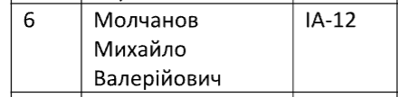

# Модульна контрольна 1

## Варіант

## Кваліфікаційне завдання №6

1. До якого класу служби Fibre Channel відноситься клас, аналогічний Класу 1, але є виключно однонаправленим. Використовується для широкомовних і багатоадресних розсилок через відповідний сервер:
    - Клас 1 — Acknowledged Connection Service (виділені канали з підтвердженням);
    - Клас 2 — Acknowledged Connectionless Service (передачі без організації з’єднання з підтвердженням);
    - Клас 3 — Unacknowledged Connectionless Service, іноді називається Datagram Connectionless Service (передачі без організації з’єднання і без підтвердження);
    - Клас 4 — Fractional Bandwidth Connection-oriented Service (з’єднання з дробовою смугою пропускання) між N_Ports;
    - Клас 5 — Isochronous Service (ізохронне з’єднання);
    - Клас 6 — Unidirectional Connection Service (однонаправлене з’єднання);
    - Змішаний клас — Intermix;
    - Клас F.

2. Протокол DCCP (Datagram Congestion Control Protocol).

3. Сервер протоколу DHCP може працювати в різних режимах, включаючи:
    - Динамічний розподіл;
    - Статичний розподіл;
    - Автоматичне виділення;
    - Напівавтоматичне виділення.

4. Стек протоколів NetBIOS / SMB.

5. Вимога при створенні ГПІ - «доступність», це:
    - ефективність використання ресурсів підприємствами, організаціями і споживачами у визначений період часу;
    - ступінь доступності до визначеного ресурсу чи групи ресурсів;
    - здатність двох чи більше систем і допоміжних програмних продуктів обмінюватися інформацією і спільно використовувати інформацію, що стала предметом обміну;
    - можливість для кожного підприємства, організації і визначеного споживача контролювати розміщення і використання своїх ресурсів;
    - можливість доступу до послуг з різних місць і навіть під час руху, здатність мережевих визначати і локалізувати джерело надходження запиту;
    - здатність працювати з різними за швидкістю, ємністю і ціною прикладними платформами і середовищами.

## Відповіді

### Завдання 1

Для цього завдання правильна відповідь — Клас 6 (
Unidirectional Connection Service)

Завдання говорить про "аналогічний Класу 1", але виключно однонаправлений і призначений для широкомовних та багатоадресних розсилок.

1. Клас 1 — це сервіс із підтвердженням і виділеними каналами для з'єднання, але він двонаправлений, тобто передає дані в обидві сторони між джерелом та отримувачем, що не відповідає вимозі "виключно однонаправлений".

2. Клас 6 — це однонаправлене з’єднання, тобто дані передаються тільки в одному напрямку. Саме це робить його ідеальним для широкомовних і багатоадресних розсилок, оскільки для таких типів передачі не потрібно зворотного зв’язку. Це якраз і відповідає опису в завданні.

3. Інші класи (2, 3, 4, 5, F та Intermix) не підходять, оскільки вони мають інші характеристики. Наприклад:
   - Клас 3 — передача без підтвердження, але не є виключно однонаправленою.
   - Клас 5 — ізохронний сервіс, який використовується для забезпечення передачі даних у визначені моменти часу, але це не однонаправлений тип з’єднання.
   - Клас F та Intermix використовуються для інших специфічних застосувань і не відповідають вимогам однонаправленої передачі для багатоадресних розсилок.

Отже, Клас 6 — це саме той тип з'єднання, який є аналогом Класу 1 (виділений канал) і має однонаправлену передачу, що підходить для широкомовних і багатоадресних розсилок.

### Завдання 2

Протокол DCCP (Datagram Congestion Control Protocol) — це транспортний протокол, який використовується для управління передачею даних у мережах із контрольованим рівнем перевантаження.

DCCP поєднує переваги UDP та TCP. Як і UDP, він забезпечує швидку доставку даних без встановлення постійного з’єднання. Але на відміну від UDP, DCCP додає механізми контролю перевантаження, схожі на TCP. Це означає, що DCCP адаптує швидкість передачі залежно від умов мережі, зменшуючи ймовірність перевантаження каналів.

Основна сфера використання DCCP — це мультимедійні застосунки, де важлива низька затримка, наприклад, потокове відео або голосові виклики. Для таких застосунків втрата окремих пакетів менш критична, ніж затримка, і DCCP допомагає підтримувати стабільний рівень якості, регулюючи швидкість передачі.

### Завдання 3

DHCP (Dynamic Host Configuration Protocol) — це протокол, який використовується для автоматичного призначення IP-адрес та інших конфігураційних параметрів пристроям у мережі. Він працює за схемою "клієнт-сервер": коли пристрій під'єднується до мережі, він відправляє запит DHCP-серверу, який у відповідь надає IP-адресу та необхідні мережеві налаштування. Це значно спрощує управління мережею, оскільки не потрібно вручну задавати адреси кожному пристрою.

Протокол DHCP підтримує такі режими роботи:

- Динамічний розподіл — автоматичне призначення IP-адрес із пулу на певний час (оренда).
- Автоматичне виділення — призначення IP-адреси з пулу з можливістю повторного використання тієї ж адреси для конкретного клієнта.
- Статичний розподіл — призначення IP-адреси відповідно до MAC-адреси клієнта, закріпленої адміністратором.

Не підтримує:

- Напівавтоматичне виділення — такого режиму в DHCP немає, це не стандартна функція цього протоколу. Це зазвичай реалізується в протоколі BOOTP.

### Завдання 4

Стек протоколів NetBIOS / SMB забезпечує обмін даними та доступ до ресурсів у локальних мережах, особливо в продуктах IBM і Microsoft.

- NetBIOS (Network Basic Input/Output System) надає базові мережеві служби та використовує логічні імена для ідентифікації комп'ютерів у мережі.
- SMB (Server Message Block) забезпечує доступ до файлів, принтерів та інших ресурсів, дозволяючи обмінюватися даними та керувати ресурсами на інших пристроях у мережі.
- NetBEUI (NetBIOS Extended User Interface) — розширення для ефективного обміну в невеликих мережах (до 200 пристроїв), але без підтримки маршрутизації.

Переваги: Простота налаштування, швидкий доступ до ресурсів. Недоліки: Обмеження NetBEUI для великих мереж.

### Завдання 5

Доступність — це ступінь доступності до визначеного ресурсу чи групи ресурсів.

І ось інші:

- Прийнятність — ефективність використання ресурсів підприємствами, організаціями і споживачами у визначений період часу.

- Взаємодія — здатність двох чи більше систем і допоміжних програмних продуктів обмінюватися інформацією і спільно використовувати інформацію, що стала предметом обміну.

- Управління — можливість для кожного підприємства, організації і визначеного споживача контролювати розміщення і використання своїх ресурсів.

- Мобільність — можливість доступу до послуг з різних місць і навіть під час руху, здатність мережевих визначати і локалізувати джерело надходження запиту.

- Сумісність — здатність працювати з різними за швидкістю, ємністю і ціною прикладними платформами і середовищами.
